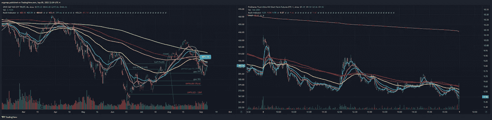
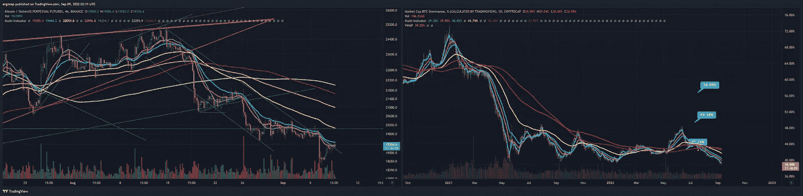
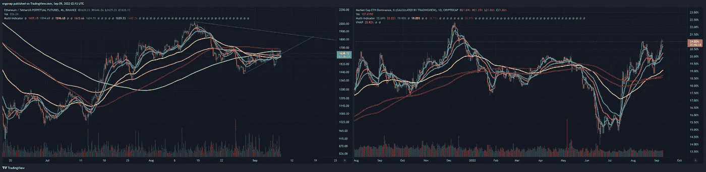

# 这是什么声音？

> 原文：<https://medium.com/coinmonks/what-is-this-noise-96881d19fb3b?source=collection_archive---------42----------------------->

## 比特币/加密货币市场分析 9/8

我昨天请了一天假，因为生活太累了。生活。总之，还是看行情吧。

首先，股市在周五开盘，这通常意味着一件事——一个爆炸性的周五即将到来，这取决于早上的情况。通过 ES 期货，隔夜的$SPY 约为 403，但可能会在早上自然反弹或走得更远。时间会证明一切。

fancy ultrawide double screen views [https://www.tradingview.com/x/Uv8LtlWJ/](https://www.tradingview.com/x/Uv8LtlWJ/)

BTC 方面:BTC 继续崛起为 BTC。d 继续下降。到目前为止，反弹背后几乎为零的成交量非常能说明问题，因为人们非常不确定。我认为很多人都想在周五获得一个看涨的高点，这很好。现在这一切都只是噪音，真的没有什么可说的。

[https://www.tradingview.com/x/jckEfwXC/](https://www.tradingview.com/x/jckEfwXC/)

$ETH side: $ETH 回到大乱三角里面，ETH。d 正在攀升至高点。我现在不会寻找任何职位。

around 90% of the time when I have to draw an ugly triangle it turns bearish [https://www.tradingview.com/x/qW15iQE4/](https://www.tradingview.com/x/qW15iQE4/)

在 crypto 中没有什么真正改变。考虑到即将到来的周末和仅今天就有超过 1.15 亿美元的看跌资金流入，现在任何看涨的人都是相当疯狂的。总有一天，我们会迎来牛市，这只是一种可能性。一天 1000 BTC 或大约 2000 万美元？是的，没什么大不了的。一天 5000+ BTC？这些是**大退出日**。这是人们在往山上跑。

> 密码量子警报，[2022 年 9 月 8 日上午 12:15]
> 🐳🐳🐳3，082.18 # BTC(＄59，574，218)
> 流入#币安
> CryptoQuant Alert，[9/8/2022 3:35 AM]
> 🐳1，855.47 # BTC(＄35，623，083)
> 流入#币安
> CryptoQuant Alert，[2022 年 9 月 8 日下午 3:51]
> 🚨1，051.61 # BTC(＄20，369，445)
> 流入#比特币基地 Pro 的总额

女王今天去世是唯一的荣誉奖。🪦

rip, queenie

> 交易新手？尝试[加密交易机器人](/coinmonks/crypto-trading-bot-c2ffce8acb2a)或[复制交易](/coinmonks/top-10-crypto-copy-trading-platforms-for-beginners-d0c37c7d698c)