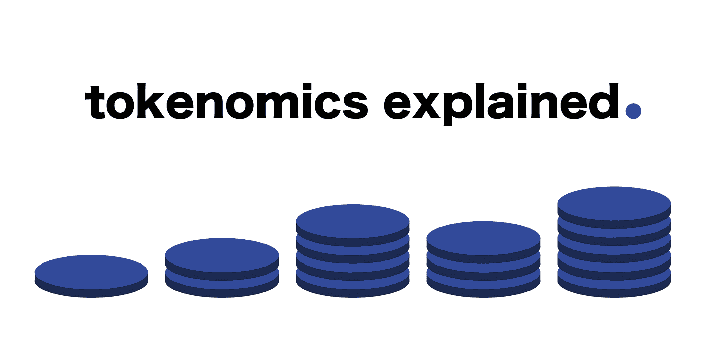
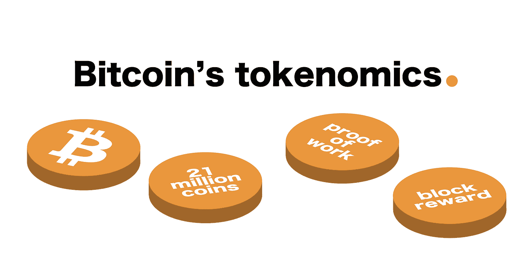
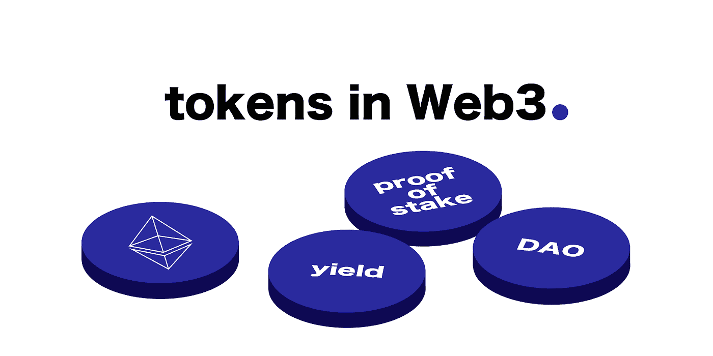
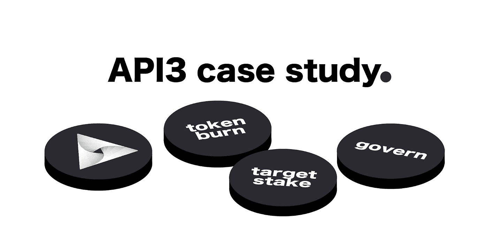
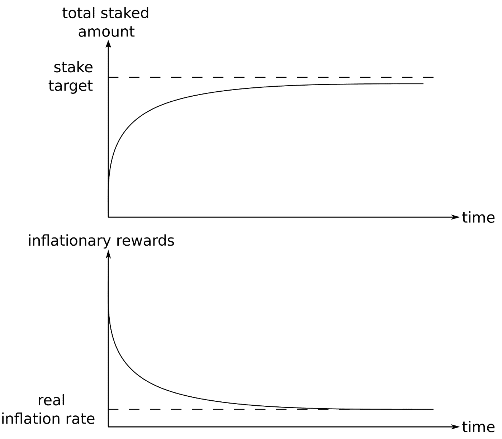
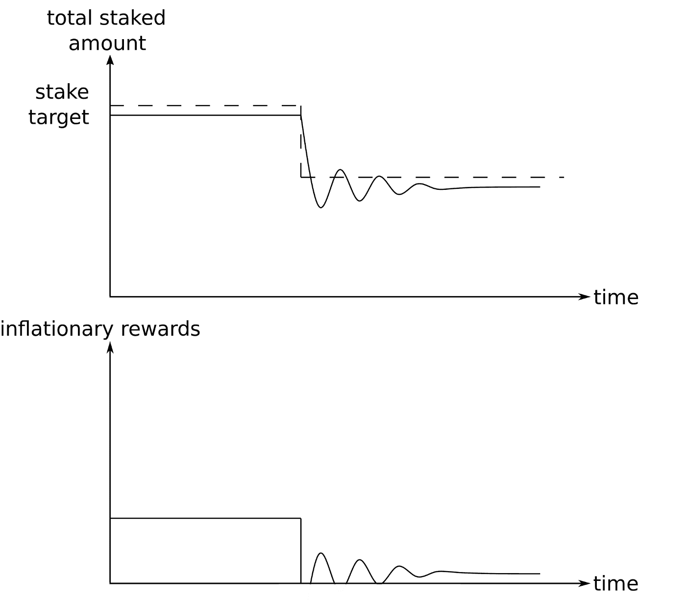

# 什么是令牌组学？

> 原文：<https://medium.com/coinmonks/what-is-tokenomics-7685e4f76494?source=collection_archive---------10----------------------->

虽然令牌经济学最初指的是区块链项目中令牌的发行率和总供应量，但随着技术的采用，用于激励区块链项目参与者采取越来越微妙行动的令牌机制的范围已经扩大。

# 什么是令牌组学？

令牌经济学结合了“令牌”和“经济学”来描述如何在区块链项目中管理令牌以实现目标。因为我们可以指望人类按照自己的最佳利益行事，所以当令牌持有者采取有利于协议的行动时，良好的令牌组学设计会增加协议令牌的价值，从而使其长期价值超过恶意行动的短期收益。

> 好的象征经济学能确保友善地继续玩游戏比为了短期利益而变得吝啬获得更大的回报。

依赖于发行率和代币总供应量的代币组学的最初例子来自第一个区块链。比特币通过三种令牌机制激励不同甚至潜在敌对的人保护网络并维护协议的核心租户，这三种令牌机制协同导致 BTC 的价格随着时间的推移而上涨:

*   **工作证明**用比特币支付矿工，让他们解答为区块链增加一个街区所需的谜题。链中的块越多，攻击者需要花费越多的能量来伪造网络上的任何交易。
*   支付给矿工的比特币(**区块奖励**)是创造新比特币的唯一手段。这些奖励每 4 年减少一半，造成供应冲击，从而提高价格，吸引更多人关注该协议。
*   2100 万代币的最大供应量意味着(除其他外)早期采用者因在未经证实的技术上冒险而获得奖励，并为后来的采用者铺平道路。

> 因为 BTC 的价值是通过维持这些因素而增加的，所以符合自身最大利益的比特币创造者也符合网络的最大利益。

# Web3 和 Dao 的转移标记组学

在分散自治组织(Dao)中，没有等级制度，但许多人一起工作，令牌组学需要经过深思熟虑才能长期成功。项目的生存性取决于令牌持有者和项目贡献者的目标是否一致，特别是当项目的规模随着时间的推移而增加时。

尽管比特币主要使用 3 tokenomic 机制，但 Web3 项目正在尝试其他机制，因为它们将人们组织起来完成更多样化的任务，并从工作证明转向利益证明。

## 立桩标界

许多智能合约平台的 tokenomic 设计的核心是赌注。下注就像把你的代币锁在储蓄账户里——在你的资金下注期间，回报会逐渐增加。

利益相关证明网络使用利益相关机制来支持验证器节点，验证器节点投票决定哪些交易应该被纳入区块链。这些节点的影响力越大，向它们下注的代币就越多，并且通过验证真实交易，这些节点为选择与它们下注的用户赢得奖励。如果一个节点验证了一个恶意交易，则该节点的一部分标记令牌会被烧掉。这激励用户对哪些节点进行尽职调查，哪些节点只验证真实交易。

> 一些不需要风险投资的验证组件的项目仍然可以利用该机制，通过提供风险投资奖励来增加可用资本。

# 令牌组学案例研究:API3

尽管特定项目代币的一个初始功能是为它们的国债播种，但对于好的代币激励机制，肯定还有额外的效用。

[API3 令牌](https://coinmarketcap.com/currencies/api3/)的有趣之处在于，它的一个实用程序是充当由 API3 DAO 启用和管理的数据馈送上的独特服务覆盖范围的抵押品。因此，这个项目的 tokenomic 激励机制不仅需要鼓励人们持有 API3 令牌，还需要对其进行投资，以使服务覆盖更大范围的智能合约开发人员。

在 [API3 白皮书](https://drive.google.com/file/d/1b8QsGPCJJC1pQOcg83-knD1IAOIgCtZZ/view)中，API 令牌的**治理**、**安全**和**价值捕获**实用程序被强调为令牌机制，尽管联合创始人 Burak Benligiray 澄清了价值捕获的其他措施，如**令牌烧录、**，我们将详细解释。

## 管理

治理是一个很酷的象征性激励，因为它鼓励那些看到项目的长期潜力并分享整体愿景的人的参与。

> API3 使用这种机制，允许持有股份的令牌持有者参与 DAO 的开放和直接治理模型。

这些贡献者通过交易令牌流动性(随时出售其令牌的能力)来换取对影响 DAO 方向的提案进行表决的能力，包括对令牌授权和 DAO 治理合同本身的参数更新的直接功能调用，从而激励他们长期留下来。由于提案直接与 DAO 合同交互，令牌利益相关者不依赖于多签名或第三方操作来履行有效通过的提案。

提案讨论在 [API3 论坛](https://forum.api3.org/)上进行，您可以通过访问 [API3 DAO](https://dao.api3.org/) 查看目前正在投票的详细提案。

## 赌注代币的收益率

赌注伴随着直接的经济回报，以补偿服务范围抵押风险和锁定资本。这些回报(有时称为收益)就像利息一样，以浮动利率有计划地为赌注地址铸造新的令牌。这种发行新代币的奖励被称为*通货膨胀奖励*。

因为 API3 的赌注池是 datafeed 服务范围的抵押品，所以通货膨胀奖励发放率与池中资金与目标赌注金额的比率相关联。目标份额由 DAO 设定，并基于服务覆盖计划的成本。

Inflationary rewards converge to a stake target above what the collateral pool holds already.

较低的风险池价值和较高的目标价值之间的差异越大，DAO 设定的发行率就应该越大。这要么会激励新资本进入资金池，利用利率上升的机会，要么通胀回报本身会在足够长的时间内自行达到目标。

以上涵盖了目标股份大于赌注池中包含的资本的情况，但如果目标股份降至现有水平以下会发生什么？

Ideal scenario when target stake is dropped below what the collateral pool holds.

如果 DAO 提案获得通过，将目标股份降至低于已有股份池的水平，奖励将按每周线性时间表减少:每周 1%，直到达到平衡或通胀奖励下限 2.5%。

因为可以通过 DAO 治理投票来监控和调整通货膨胀报酬率，所以可以灵活地改变条件，而不需要集中干预。此外，这种设计不会不成比例地奖励早期采用者，并随着时间的推移导致更广泛的令牌分布，因为通胀奖励只会随着对 API3 提供的服务覆盖范围的需求增长而增加。

为了平衡积极和消极的供应机制，API3 结合了收入分配和令牌燃烧的思想。

## 收入分配和代币燃烧

平坦的收入分配有其自身的一系列缺点，例如造成赌注代币总量的波动，以及富人利用分配事件的攻击媒介(参见[红利获取策略](https://www.investopedia.com/articles/stocks/11/dividend-capture-strategy.asp))。为了打击这种行为，API3 使用 dApp 使用数据馈送或服务覆盖产生的利润来购买和烧毁 API3 令牌。

这有几个好处:

*   赌注者只需要获得通货膨胀的奖励。
*   当服务被“支付”时，代币价值与被消耗的代币数量成比例增加(当需求保持不变时，供应减少)。
*   如果按月或按年分享收入，供应变化会更加平稳，而不是出现周期性的峰值。
*   简化治理:DAO 只需调整与服务覆盖需求相关的目标份额。

# 胜利的博弈论

看到每个项目的具体目标如何直接影响可以采用的象征性激励的类型是很有趣的。如果 API3 没有使用 API3 数据馈送向智能合约提供服务覆盖，令牌燃烧和产出的机制将不会很好地协同工作。

在评估一个 Web3 项目或加入一个 DAO 时，重要的是要看到它们的 tokenomics 如何与其路线图和目标保持一致。在脑海中模拟各种场景，看看能否找到漏洞。比特币的格言“不要相信，验证”用在 Web3 环境中是很漂亮的，由于开源文化，在 web 3 环境中可以随时访问信息。

有了好奇心作为我们的向导，通过一点挖掘和脑力劳动，我们没有什么不能学到的。

# 关于记号组学的更多文章

[外交辞令的好、坏、丑](/enjinstarter/the-good-the-bad-and-the-ugly-of-tokenomics-91da6d3ff62c)——[T3 里什·兰哈瓦](https://medium.com/u/4ef0b942a421?source=post_page-----7685e4f76494--------------------------------)

[代币经济学:代币使用、效用和价值的商业指南](/@wmougayar/tokenomics-a-business-guide-to-token-usage-utility-and-value-b19242053416) — [**威廉·穆加耶**](https://medium.com/u/f826ec76344e?source=post_page-----7685e4f76494--------------------------------)

> 如果你喜欢这篇文章，请与另一个好奇的人分享，并在这里和 Twitter 上关注我。