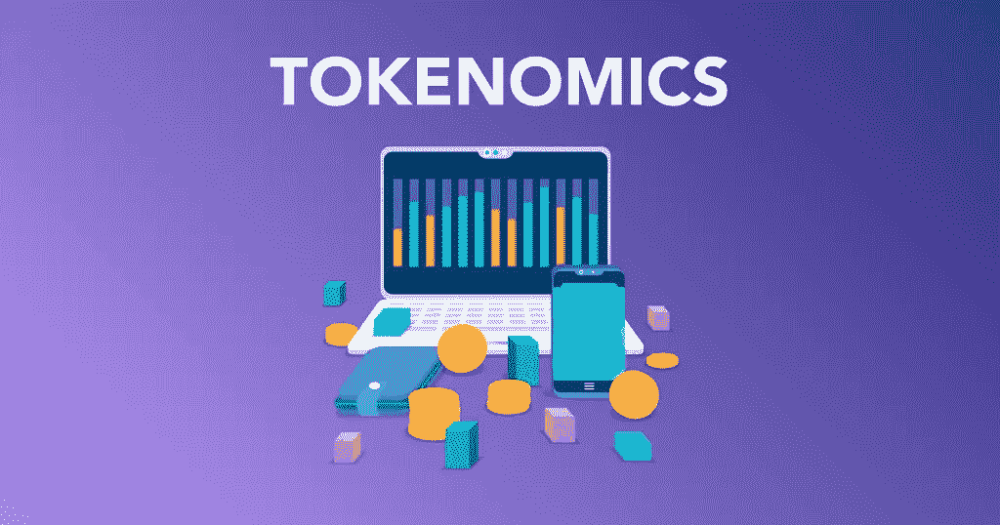

# 什么是令牌组学，为什么它很重要？

> 原文：<https://medium.com/coinmonks/what-is-tokenomics-and-why-does-it-matter-8a8a9364ac37?source=collection_archive---------36----------------------->

**TL；博士**

代币经济学是一个描述代币经济学的术语。它描述了影响令牌使用和价值的因素，包括但不限于令牌的创建和分发、供应和需求、激励机制以及令牌刻录计划。对于加密项目，设计良好的令牌组学是成功的关键。对投资者和利益相关者来说，在决定参与之前评估一个项目的象征经济学是至关重要的。

# 介绍

令牌组学是“令牌”和“经济学”的组合，是对加密项目进行基础研究的关键组成部分。除了查看白皮书、创始团队、路线图和社区增长，记号经济学对于评估区块链项目的未来前景至关重要。加密项目应仔细设计其令牌组学，以确保可持续的长期发展。

# 令牌组学一瞥

区块链项目围绕其令牌设计令牌组学规则，以鼓励或阻止各种用户行为。这类似于中央银行如何印刷货币并实施货币政策来鼓励或抑制支出、贷款、储蓄和货币的流动，注意这里的“token”一词既指硬币也指代币。你可以在这里了解两个[的区别](https://academy.binance.com/en/glossary/coin)。与法定货币不同，代币组学的规则是通过代码实现的，是透明的、可预测的、难以改变的。

我们以比特币为例来看。比特币的总供应量预编程为 2100 万个币。比特币的创造和进入流通的方式是通过挖矿。每 10 分钟左右开采一个区块，矿工就会得到一些比特币作为奖励。

奖励也叫区块补贴，每 21 万块减半。按照这个时间表，每四年减半一次。自 2009 年 1 月 3 日，第一个区块，或称[创世纪区块](https://academy.binance.com/en/glossary/genesis-block)在比特币网络上创建以来，区块补贴[已经减半三次](https://academy.binance.com/en/glossary/halving)，目前从 50 BTC 到 25 BTC、12.5 BTC 和 6.25 BTC。

基于这些规则，通过将一年的总分钟数除以 10(因为每 10 分钟开采一个区块)，然后乘以 6.25(因为每个区块给出 6.25 BTC 作为奖励)，很容易计算出 2022 年将开采约 328，500 个比特币。因此可以预测每年开采的比特币数量，预计 2140 年左右开采出最后一个比特币。

比特币的令牌组学还包括交易费的设计，当一个新的区块通过验证时，矿工会收到交易费。该费用将随着交易规模和网络拥塞的增加而增加。它有助于防止垃圾交易，并激励矿商继续验证交易，即使大宗补贴不断减少。

简而言之，比特币的令牌经济学简单而巧妙。一切都是透明的，可预测的。围绕比特币的激励措施让参与者获得报酬，以保持网络的稳健，并提升其作为加密货币的价值。

# 令牌组学的关键要素

作为影响加密货币价值的各种因素的总称，“令牌经济学”首先指的是加密货币的创造者设计的加密货币经济结构。以下是在研究加密货币的令牌组学时需要考虑的一些最重要的因素。

# 代币供应

供给和需求是影响任何商品或服务价格的主要因素。加密也是如此。有几个衡量代币供应量的关键指标。

第一个叫做[最大供应量](https://academy.binance.com/en/glossary/maximum-supply)。这意味着在这种加密货币的生命周期内存在最大数量的编码令牌。比特币的最高供应量为 2100 万个币。莱特币的硬上限为 8400 万枚，BNB 的最高供应量为 2 亿枚。

一些代币没有最大供应量。以太坊网络的以太供应量每年都在增加。像 USDT、美元硬币(USDC)和币安美元(BUSD)这样的稳定硬币没有最大供应量，因为这些硬币是根据支持硬币的储备发行的。理论上，它们可以无限制地增长。Dogecoin 和 Polkadot 是另外两个无上限供应的密码。

第二个是[流通供应量](https://academy.binance.com/en/glossary/circulating-supply)，指流通中的代币数量。代币可以铸造和焚烧，或者以其他方式锁定。这对代币的价格也有影响。

查看令牌供应可以很好地了解最终会有多少令牌。

# 令牌实用程序

令牌实用程序是指为令牌设计的用例。例如，BNB 的公用事业包括为 BNB 链供电，支付交易费并在 BNB 链上享受交易费折扣，以及作为 BNB 链生态系统上的社区公用事业令牌。用户还可以在生态系统内用各种产品来投资 BNB，以赚取额外收入。

令牌还有许多其他的用例。治理令牌允许持有者对令牌协议的更改进行投票。稳定的硬币被设计用来作为一种货币。另一方面，安全令牌代表金融资产。例如，一家公司可以在首次发行硬币(ICO)期间发行令牌化股票，授予持有者所有权和股息。

这些因素可以帮助您确定令牌的潜在用例，这对于理解令牌的经济可能如何发展至关重要。

# 分析令牌分发

除了供给和需求之外，还有必要看看代币是如何分配的。大型机构和个人投资者的行为不同。了解什么类型的实体持有代币将使您了解他们可能如何交易代币，这将反过来影响代币的价值。

通常有两种方式来启动和分发令牌:公平启动和开采前启动。公平启动是指在令牌被铸造并分发给公众之前，没有提前访问或私人分配。BTC 和多格科恩就是这一类的例子。

另一方面，预挖掘允许一部分密码在提供给公众之前被铸造并分发给选定的组。以太坊和 BNB 就是这种令牌分发的两个例子。

一般来说，您需要注意令牌分布的均匀程度。少数持有超大份额代币的大型机构通常被认为风险更高。一个主要由耐心的投资者和创始团队持有的令牌意味着利益相关者的利益能够更好地保持一致，以获得长期成功。

您还应该查看代币的锁定和释放时间表，以了解是否会有大量代币进入流通，这会给代币的价值带来下行压力。

# 检查标记烧伤

许多加密项目定期烧毁令牌，这意味着令牌将永久退出流通。

例如， [BNB 采用焚烧硬币](https://academy.binance.com/en/articles/what-is-bnb-auto-burn)的方式，让硬币退出流通，减少代币的总供应量。截至 2022 年 6 月，BNB 预开采了 2 亿 BNB，总供应量为 165，116，760。BNB 将燃烧更多硬币，直到总供应量的 50%被销毁，这意味着 BNB 的总供应量将减少到 1 亿 BNB。同样，以太坊在 2021 年开始燃烧 ETH，以减少其总供应量。

当代币的供应量减少时，就被认为是通货紧缩。相反，当代币的供应持续扩张时，就被认为是通货膨胀。

# 激励机制

代币的激励机制至关重要。代币如何激励参与者确保长期可持续性是代币经济学的核心。比特币如何设计其大宗补贴和交易费用，是一个优雅模型的完美例证。

[利益证明](https://academy.binance.com/en/articles/what-is-staking)机制是另一种越来越流行的验证方法。这种设计允许参与者锁定他们的令牌以验证交易。一般来说，锁定的代币越多，被选为验证者并因验证交易而获得奖励的机会就越高。这也意味着，如果验证者试图损害网络，他们自己的资产价值将处于危险之中。这些特征激励参与者诚实地行动并保持协议的健壮性。

许多 DeFi 项目使用创新的激励机制来实现快速增长。 [Compound](https://academy.binance.com/en/articles/what-is-compound-finance-in-defi) ，一个密码借贷平台，让投资者在复合协议中存放密码，收取利息，并获得红利代币作为额外奖励。此外，COMP 令牌充当复合协议的治理令牌。这些设计选择使所有参与者的利益与化合物的长期前景一致。

# 令牌组学的下一步是什么

自 2009 年比特币网络的创世区块(genesis block)创建以来，代币组学已经发生了显著的演变。开发人员已经探索了许多不同的记号组学模型。有成功也有失败。比特币的令牌经济学模型仍然经久不衰，经受住了时间的考验。其他令牌组学设计不佳的公司则步履蹒跚。

基于数字稀缺性，不可替代令牌(NFT)提供了一个不同的令牌组学模型。房地产和艺术品等传统资产的记号化可能会在未来产生记号经济学的新创新。

# 结束语

如果你想进入加密领域，记号组学是一个需要理解的基本概念。这个术语描述了影响代币价值的主要因素。值得注意的是，没有一个单一的因素能提供一把神奇的钥匙。你的评估应该基于尽可能多的因素，并作为一个整体来分析。令牌组学可以与其他[基本面分析](https://academy.binance.com/en/articles/a-guide-to-cryptocurrency-fundamental-analysis)工具相结合，对项目的未来前景及其令牌价格做出明智的判断。

最终，令牌的经济性将对其使用方式、构建网络的难易程度以及是否会对令牌的使用案例产生重大影响。

> 交易新手？尝试[加密交易机器人](/coinmonks/crypto-trading-bot-c2ffce8acb2a)或[复制交易](/coinmonks/top-10-crypto-copy-trading-platforms-for-beginners-d0c37c7d698c)