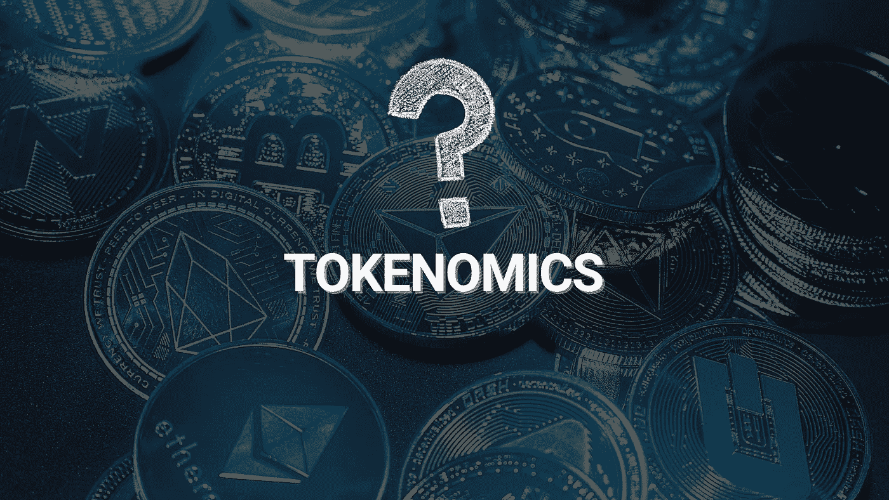

# 什么是令牌组学？分散金融的基石。

> 原文：<https://medium.com/coinmonks/what-is-tokenomics-the-bedrock-of-decentralized-finance-dca8c4d3a27d?source=collection_archive---------8----------------------->

Image Source: [Sun Zu Lab](https://sunzulab.com/wp-content/uploads/2022/06/What-Are-Tokenomics-and-Why-Do-They-Matter-1-1.png)

> 每个成功启动的项目背后都有坚实的令牌组学。

“我怎么知道这枚硬币是不是一项明智的投资？”“这是匿名开发者的又一个拉地毯骗局吗？”
“我该如何证明这枚新硬币的真实性？”

我相信你在研究投资新硬币时会问这样的问题，到目前为止，你可能还没有这些问题的答案。

对一些人来说，加密货币是获取合法财富的最快方式。对其他一些人来说，从流动性池到熊市波动，他们在加密市场损失了数百万美元。

尽管这些不可信的交易是透明的，这是由区块链技术使之成为可能的，但在加密市场上仍然有地毯拉骗局的受害者。

理解和验证每一个项目背后的象征经济学是从地毯拉骗局中辨别明智、有利可图的投资的唯一途径。

在这篇文章中，我们将揭开令牌组学的复杂性，如何验证硬币的真实性，以及为什么你应该关心。

随着 2020 年疫情以来全球通胀飙升，投资资产一直是防止货币贬值的热门方式。金融知识分子、投资者和风险资本家更喜欢将资金投资于资产，以抵御全球和国内的通货膨胀。

区块链技术的创新将投资范围扩大到了股票、公司股票、政府债券和大宗商品之外，催生了加密货币，第一个此类货币是比特币(由中本聪在 2009 年创造)。

不仅仅是投资组合的多样化，区块链技术和加密货币交易重新定义了金融投资的结构和概念。

通过倡导去中心化的概念，投资者和交易者不必依赖中间人(如商业银行或国有银行)将数字货币从一个人转移到另一个人。

取消中间商和中央集权机构(如银行)给无信任交易带来了透明度，并削减了中间商收取的中介费，降低了交易成本。

然而，就像所有其他创新一样，分散融资有好有坏。不利的一面是地毯拉骗局。在这里，开发人员创建一个“一文不值”的加密货币项目，吸引投资者，并在他们建立项目之前撤出。

许多投资者和密码交易者陷入了从可靠的项目中识别和辨别无价值的项目的困境。这就是记号经济学的用武之地。

理解令牌经济学——或者更好地表达，加密货币的用例——是区分 rug pull 骗局和有价值、有利可图的项目的唯一方法。

## 深潜-象征经济学。

Image Source: [Huobi Global](https://www.huobi.com/learn/wp-content/uploads/2021/12/Huobi-Learn-Lesson-Cover-Tokenomics.png)

tokenomics 这个词是由两个英文单词“token”和“economics”创造出来的。哈佛大学心理学家 B. F .斯金纳提出了代币经济学理论。

Tokenomics 解释了为区块链项目或协议创建的数字令牌的周期和用例，允许开发者和投资者在没有第三方干预的情况下创建和管理自己的微观经济。

这涉及到代币的创造、分配和通过供求策略调节市场价格(用有限的供给创造高需求，从而增加这些代币的金融和经济价值)。

代币经济学(token economics)是政府政策和战略的数字/区块链版本，用于监管世界不同国家使用的法定货币的创造、发行和市场价值。

然而，在象征经济学中，区块链的交易消除了第三方(国有银行)的干预，鼓励交易中的信任和透明。

## 令牌组学是如何工作的？

**令牌创建**

它从创建在网络上使用的数字令牌开始。令牌是使用令牌标准(BEP20、ERC20)在现有区块链网络上创建的资产。

令牌的例子包括 MATIC、SHIB、LINK 等。这些代币是在以太坊区块链网络上创建和运行的。

与代币不同，硬币是区块链网络的固有资产。硬币的例子包括以太坊和比特币。硬币有自己的本地区块链网络，而代币是在硬币的区块链上构建和操作的。

在创建这些代币之后，通过初始硬币发行(ICO)，开发者创建意识和宣传，以吸引投资者和风险资本家进行筹资。

开发人员使用这些资本来构建和扩展项目，实现它的用例并解决它要解决的问题。

**令牌分配——案例研究:智囊团。**

令牌分配就是将令牌分配给网络用户。没有这一点，令牌就无法使用，项目就变得毫无价值。

令牌分配描述了分配给网络上各类用户的令牌百分比。一个很好的例子就是智囊团令牌的令牌分配。

在 2.5 亿 BTRST 令牌的总固定供应量中，22%留给早期令牌买家，19%留给早期贡献者，5%用于硬币上市，还有高达 54%(最大份额)用于激励网络用户的亲社区行为。

激励他们可以鼓励他们为网络的发展做出贡献。一个很好的例子就是给客户和人才推荐和新批准的人才代币。

这创造了对令牌的需求，因为网络用户努力工作以将更多的人推荐到网络(导致网络的增长)，人才努力工作以获得批准(导致人才基础的增加和随着网络的使用总服务价值的整体增加)。

创造和调节对具有固定供应的代币的需求增加了这些代币和整个网络的经济和金融价值，使其成为一个获取价值、自我维持的网络。

下面是令牌效用和需求增加导致的令人信服的增长和网络扩展飞轮:

Braintrust Flywheel created by Charlie Heinemann

理解项目的表征组学有助于理解此类项目的潜力。回答了“该不该买这枚硬币，为什么买”的问题。

任何项目的令牌组学都会暴露其用例，帮助投资者和个人决定是否值得购买。这消除了陷入拉地毯骗局或投资于没有长期潜力的项目的机会。

## 如何验证硬币的真实性——使用案例和路线图

在投资代币或项目之前，有三个主要因素需要考虑，以避免上当受骗:

*   一个有价值的代币或硬币应该有一个强有力的用例。硬币背后的项目应该提供一个使用区块链技术解决问题的方案。没有可证明用例的硬币几乎总是以另一种方式来液化不知情的投资者的资产而告终。
*   令牌的开发者必须具有经过证明的公共身份。如果你不能在任何公共平台上追踪到令牌的开发者，就不要把你的钱投资到那个项目中。
*   路线图。它们展示了项目的潜力、想要实现的目标(它是为了解决问题而创建的解决方案)、执行策略和具体的期限。路线图也用作衡量增长的指标，说明增长是如何开始的以及进展如何。

## 结论

随着加密货币和区块链技术成为最新的流行语，个人和投资者在投入资金之前了解他们将进入的是什么非常重要。

通过适当的研究、正确的知识和心态、精心规划的策略和合理的风险，任何人都可以从加密货币市场中发财。

当你有大量的知识，像这篇文章一样的资源，遍布互联网来指导你做什么，什么时候做，以及如何去做的决定时，你就不必陷入市场亏损的循环中。

你学到新东西了吗？如果你这样做了，请点击拍手按钮 50 次。这鼓励了算法将这个故事推送给更多的读者。

我对区块链公司和 Web3 社区的内容和技术写作角色持开放态度。如果你的 crypto、Web3 或 NFT 项目需要技术或内容作者，请随时给 munachimsoolehi@gmail.com 发电子邮件。

我也很感激推荐和推荐。

> 交易新手？试试[加密交易机器人](/coinmonks/crypto-trading-bot-c2ffce8acb2a)或者[复制交易](/coinmonks/top-10-crypto-copy-trading-platforms-for-beginners-d0c37c7d698c)