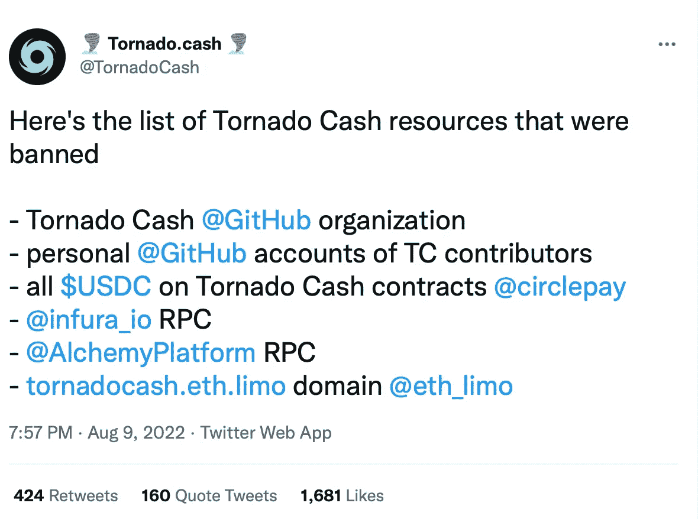
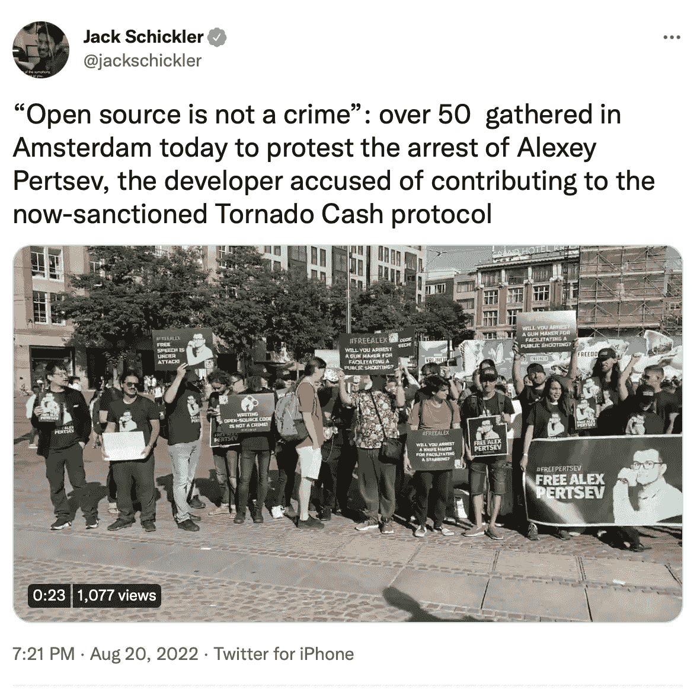
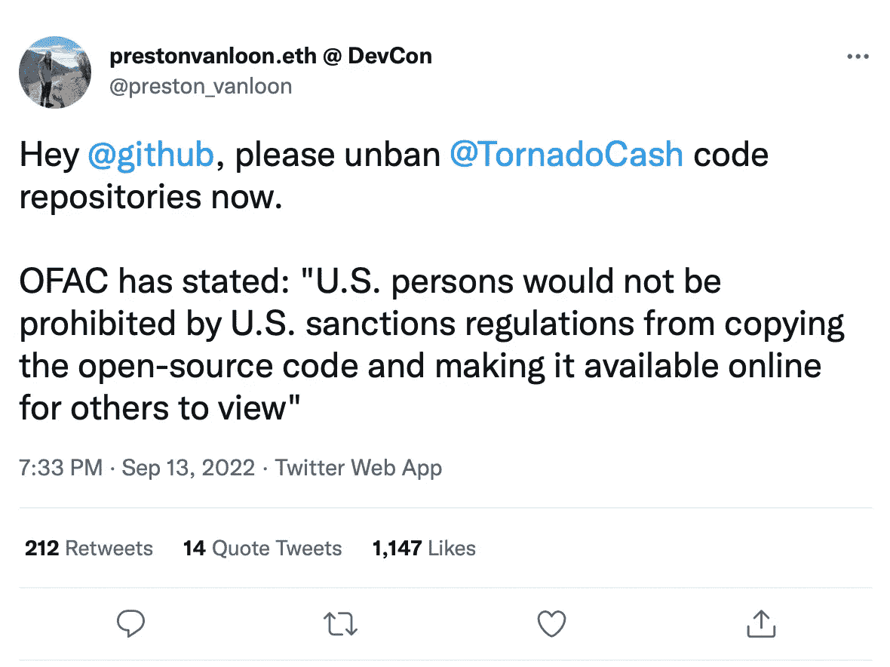

# 什么是龙卷风现金，为什么被封？

> 原文：<https://medium.com/coinmonks/what-is-tornado-cash-and-why-was-it-blocked-5c95102c92b5?source=collection_archive---------3----------------------->

***Tornado Cash 是一种分散式协议，支持以太坊网络和其他区块链交易的匿名化。它的目的是什么？它怎么了？一起来了解一下吧！***

据研究公司称，该协议是一种受欢迎的与网络犯罪相关的加密货币洗钱方法。结果，Tornado Cash 于 2022 年 8 月在**受到美国制裁，该服务的联合创始人**阿列克谢·佩尔采夫**在荷兰被捕。GitHub 上的 Tornado 现金库被移除，用户价值超过 4 . 3 亿美元的加密资产被冻结。**

**2022 年 9 月**，在社区抗议后，美国官方允许个人用户从被封锁的地址提取加密货币，如果他们能证明其来源的合法性。

一群龙卷风现金用户在德克萨斯州法院对美国当局提起诉讼，指控他们滥用职权。人权活动家和密码行业代表也强调了这一点。

# 谁创造了龙卷风现金？

Tornado Cash 是由开发者 **Roman Storm** 、 **Roman Semenov** 和 **Alexey Pertsev** 创建的一个去中心化服务。他们是网络安全公司 PepperSec 的联合创始人，并声称之前有区块链项目的经验。

龙卷风现金协议于 2019 年 8 月**在区块链以太坊上线**。该项目的第三方投资未知。此外，没有举行象征性的销售来资助这项服务。

最初，开发者通过多重签名钱包保持对协议的控制。然而，在 2020 年 5 月**发布协议的第二个版本后，该团队烧毁了智能合同的访问密钥，以提高权力下放的水平。包括**维塔利克·布特林**和**加文·安德森**在内的 1100 多名用户参与了所谓的可信安装程序。**

**Tornado Cash 用户界面代码存储在 IPFS，这降低了数据删除的风险，即使在法律禁止的情况下也是如此。只要至少有一个用户保存了该界面，它就会起作用。**

# **撕裂的目的是什么？**

****

**龙卷风现金有自己的 ERC-20 管理令牌，撕裂，这是在以太网上发行的。**

**在**2021 年 2 月**通过空投的方式向早期用户发放了 50 万撕。超过 7500 个地址参与了分发。早期用户平均收到 38 条撕。在交易所首次公开交易时，代币的价值超过了 7700 美元。**

**被撕裂的控制令牌有三个功能:**

*   **с中继器的外侧；**
*   **堆叠；**
*   **参与分散组织龙卷风现金道。**

**要在 Tornado Cash DAO 中出价，您必须至少有 1000 枚 Tornado Cash DAO。只有 1 撕就够投票了。每个代币代表一票。**

**这些建议可能涉及:**

*   **添加新池；**
*   **报酬率的变化；**
*   **道国库资金的分配。**

**每项提案都要经过 5 天的投票，至少需要 25000 张选票才能通过。**

# **龙卷风现金是如何运作的？**

**匿名加密货币转账有多种混合方式。然而，其中大多数都是集中式服务，可以通过窃取用户的资金或个人数据来利用用户的信任。**

**另一方面，Tornado Cash 协议建立在去中心化原则的基础上，也就是说，它是一组用户通过 Web3 钱包与之交互的智能合约。合同接受存款，并使用 zk-SNARK 技术将它们合并成一个单一的池。也就是说，交易发生时没有透露任何关于付款本身的信息，所有资产都是匿名的，与特定的所有者没有联系。**

**对于用户来说，一切都非常简单:他们从一个地址向智能合约发送加密资产，然后将其输出到与发送地址无关的另一个地址。在资金转移之后，私人票据被创建。它的功能相当于一个私钥，需要这个私钥才能将资金提取到另一个地址。**

**对于六种资产，协议使用了匿名池:ETH、戴、cDAI、、和。从资金池中提取资产的手续费为转账金额的 0.3%，但部分流动性较低的资金池不收取手续费。**

# **项目历史**

**纵观其历史，龙卷风现金协议已经处理了价值超过 35 亿美元的资产，并收取了超过 1770 万美元的佣金。同时，它被超过 57，000 个不同的用户使用。**

**在 **2021** 期间，龙卷风现金智能合约在其他受欢迎的区块链部署:BNB 链、[多边形](/sunflowercorporation/what-is-polygon-matic-916f4fa2afee)、[雪崩](/sunflowercorporation/what-is-avalanche-5de8f06e2bca)、Gnosis、Arbitrum 和[乐观](/the-capital/what-is-optimism-op-487d3f13b750)。然而，最大数量的存款仍然是在以太坊网络中累积的。**

****

****2021 年 12 月**，Tornado Cash 宣布推出一项重大的 Nova 更新，该更新在 Gnosis 网络上运行，与最初的协议不同，它允许存入和提取任意数量的乙醚，保持机密性，并提供“屏蔽”的资金池转移。**

# **Tornado Cash 在加密资产洗钱中扮演什么角色？**

**加密货币混合器的创始人声称在保护用户和投资者隐私方面发挥了重要作用。据执法部门称，此类服务经常被用于清洗有组织犯罪的收益。**

**Tornado Cash 在运营期间被用作被盗加密资产的“洗衣房”的例子不胜枚举。下面举几个 **2022** 的例子。**

*   **在 2022 年 1 月的**，价值 1500 万美元的**4600 个 ETH 从新加坡服务[Crypto.com](https://crypto.com/)被盗，然后[通过 Tornado Cash 滚动](https://gizmodo.com/hackers-launder-15-million-stolen-from-crypto-com-usin-1848382047)。**
*   **在 3 月 8 日，朝鲜黑客据称从流行的 P2E 游戏《出租车无限》中窃取了价值 6 . 25 亿美元的资产，这是加密行业历史上最大的黑客攻击之一。其中至少有一部分是通过 Tornado Cash 进行洗钱的。**
*   ****6 月**来自和谐生态系统的地平线跨链桥被黑。攻击者窃取了价值约 1 亿美元的资产，其中大部分进入了 Tornado Cash。**
*   **在**7 月**，价值超过 1300 ETH(约 148 万美元)的资产从 Omni lending protocol 中被盗，并被送往 mixer。**

**据一家从事区块链交易分析的公司 Chainalysis 估计，在 Tornado Cash 的运作过程中，超过 35 亿美元通过这个混合器，其中高达 12 亿美元直接[与盗窃、闯入和其他非法操作](https://www.vice.com/en/article/k7bqb9/tornado-cash-is-crypto-hackers-favorite-way-to-cash-out-but-experts-say-it-can-be-traced)有关。**

**椭圆专家声称，龙卷风现金被积极用于清洗从 NFT 诈骗收到的钱。**

# **为什么龙卷风现金会受到制裁？**

****2022 年 8 月**，该搅拌机连同相关以太坊和 USDC 地址于 2022 年 8 月被添加到 OFAC 制裁名单中。被没收的钱包里有价值约 4 . 37 亿美元的斯塔伯·科恩斯、WBTC 和 ETH。混合器地址上的 USDC 后来被它们的发行者美国公司 Circle 屏蔽了。**

**封锁的原因是使用 Tornado Cash 进行洗钱:据美国当局称，自该服务成立以来，攻击者已经通过该服务洗钱超过 70 亿美元。来自朝鲜 Lazarus 集团的黑客积极使用该混音器。**

**制裁的结果是，所有 Tornado 现金财产、用户资金和源代码在美国和海外被封锁，该国居民和公民被禁止使用该服务。**

**Tornado Cash 及其创始人的 Github 仓库、RPC Infura 和 Alchemy 平台，以及一些域，除了加密货币之外都被屏蔽了(事实上是删除了)。结果，Tornado Cash 网站和相关服务无法运行。分散式 exchange Uniswap 在前端阻止了 250 多个地址。**

****

**Source: [Twitter](https://twitter.com/TornadoCash/status/1557048526986780677?ref_src=twsrc%5Etfw%7Ctwcamp%5Etweetembed%7Ctwterm%5E1557048526986780677%7Ctwgr%5E54bdfc0aaf2c60f58e91069ef0b91ae5977d9598%7Ctwcon%5Es1_&ref_url=https%3A%2F%2Fforklog.com%2Fcryptorium%2Fchto-takoe-tornado-cash-i-kak-on-rabotaet)**

# **Tornado Cash 联合创始人被捕及其与 FSS 的可能联系**

****2022 年 8 月 12 日，**开发者 Alexey Pertsev，混音器的创造者之一，在阿姆斯特丹被捕。他被怀疑使用龙卷风现金来清洗通过犯罪手段获得的金钱。**

****8 月 20 日**阿姆斯特丹举行集会，参加者要求释放佩尔采夫。根据抗议组织者的说法，Pertsev 的被捕为将开源软件开发者绳之以法树立了一个危险的先例，如果他们的产品被滥用的话。**

****

**Source: [Twitter](https://twitter.com/jackschickler/status/1561025750094041091?ref_src=twsrc%5Etfw%7Ctwcamp%5Etweetembed%7Ctwterm%5E1561025750094041091%7Ctwgr%5E54bdfc0aaf2c60f58e91069ef0b91ae5977d9598%7Ctwcon%5Es1_&ref_url=https%3A%2F%2Fforklog.com%2Fcryptorium%2Fchto-takoe-tornado-cash-i-kak-on-rabotaet)**

**Telegram 开设了一个由 750 多人组成的 [FreeAlex 公众群](https://t.me/+0tKJW0Xoolo3M2Ri)，致力于争取释放佩尔采夫和解除对该项目的制裁。**

**【2022 年 8 月底，分析公司 Kharon 发布了一份研究报告，根据该报告，佩尔采夫可能与俄罗斯特工部门有关联。**

**据研究人员称，2017 年 *2017 年*龙卷风现金的未来创造者为数字安全公司工作，该公司为 FSS 提供物质和技术支持。佩尔采夫的妻子克塞尼亚·马利克否认了这一信息。**

# **加密社区对“龙卷风现金”制裁合法性的反应和评估**

**在制裁实施后不久，一份提案出现在“旋风现金道”上，控告 OFAC 滥用权力对调酒师施加限制。九月初，六名搅拌机的用户在德克萨斯西部地区对财政部提起诉讼，其中包括 OFAC。他们得到了比特币基地交易所的帮助。**

**人权组织硬币中心也指出官员滥用职权:**

**制裁是完成一些非常不同的事情；它说美国人甚至不能利用作者没有经济利益的知识产权。首先，有争议的软件是在开源许可下发布的，所以美国人过去没有，将来也不会有软件的拷贝已经存在于任何连接到以太坊网络的人的家庭电脑上。因此，对这种制裁的恰当比喻是，好像一位伊朗作家受到了制裁，因此，已经拥有他的书的美国人必须避免阅读这本书。**

**密码行业的其他代表也批评了当局。Cardano 加密货币的创始人查尔斯·霍斯金森(Charles Hoskinson)表示，如果他们的程序被犯罪分子使用，开发者不应该承担责任:**

***这就像写一本关于烹饪氰化物或制造炸弹的书。作者无法控制如何使用这些信息[…]。因此，通过为协议创建代码，开发人员不应被视为帮凶。他只是编写了技术上被攻击者使用的代码。***

**北海巨妖交易所首席执行官**杰西·鲍威尔**称针对龙卷风现金的行动是“违宪的”**

**比特币基地首席执行官 Brian Armstrong [补充道](https://blog.coinbase.com/defending-privacy-in-crypto-e09db33dece8)实施制裁侵犯了隐私权。执法人员没有追捕和惩罚真正的罪犯，而是简单地关闭了他们正在使用的服务，惩罚了所有不想暴露身份但没有从事非法活动的用户。**

# **允许从龙卷风现金中提取加密货币**

**迫于公众压力，美国财政部允许被屏蔽的服务用户从被屏蔽的地址提取资金。这将需要一份特别许可证。它可以通过向官员提供有关发送者和接收者的钱包、交易、散列和转账金额以及他们行为的日期和时间的信息来获得。**

**OFAC 还表示，如果交互不涉及非法交易，“开放源码交互本身[……]不被禁止”。根据硬币中心的说法，这种让步是一种“得不偿失的胜利”，因为监管机构将继续封锁特定的地址。与此同时，加密社区敦促 GitHub 恢复龙卷风现金仓库。**

****

**Source: [Twitter](https://twitter.com/preston_vanloon/status/1569726055736397825)**

> **如果你对龙卷风现金话题有任何补充，欢迎评论！
> 在跟踪更新方面，订阅我们的 [Medium Feed。](/@SunflowerCorpAdmin)**
> 
> **您也可以在我们的平台[向日葵公司](https://sunflowercorp.com)上尝试使用加密货币。
> 敬请期待！**

****

> **交易新手？试试[密码交易机器人](/coinmonks/crypto-trading-bot-c2ffce8acb2a)或者[复制交易](/coinmonks/top-10-crypto-copy-trading-platforms-for-beginners-d0c37c7d698c)**