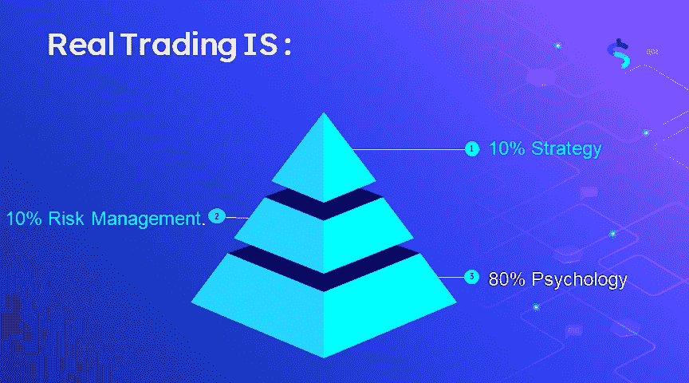

# 什么是交易心理

> 原文：<https://medium.com/coinmonks/what-is-trading-psychology-527040c1ede4?source=collection_archive---------66----------------------->

[交易心理学](https://www.nasdaqstrategy.com/2022/12/what-is-trading-psychology.html)是对影响金融市场交易决策和行为的心理和情感因素的研究。这个领域研究交易者如何思考、感觉和行为，以及这些因素如何影响他们的交易表现。

交易者会受到各种心理因素的影响，如恐惧、贪婪、乐观和过度自信，这些因素会导致糟糕的决策，并最终影响他们实现财务目标的能力。通过理解和管理这些[心理因素](https://www.nasdaqstrategy.com/2022/12/what-is-trading-psychology.html)，交易者可以改善他们的纪律、风险管理和整体交易表现。

> 交易新手？在[最佳加密交易](/coinmonks/crypto-exchange-dd2f9d6f3769)上尝试[加密交易机器人](/coinmonks/crypto-trading-bot-c2ffce8acb2a)或[复制交易](/coinmonks/top-10-crypto-copy-trading-platforms-for-beginners-d0c37c7d698c)

交易者可以使用各种技术和策略来改善他们的交易心理，例如设定明确的交易目标和目的，制定交易计划，使用风险管理技术来减少损失。一些交易者也发现寻求金融教练或治疗师的指导很有帮助，他们可以帮助他们理解和管理自己的情绪，改善他们交易的心理方法。