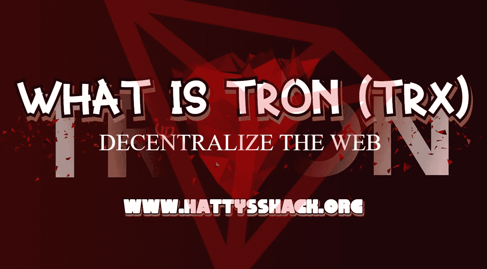

# 什么是创(TRX)

> 原文：<https://medium.com/coinmonks/what-is-tron-trx-bb026732f602?source=collection_archive---------8----------------------->

[Tron (TRX)](https://coinmarketcap.com/currencies/tron/) 是一个加密货币和去中心化平台，旨在利用区块链和分布式存储技术构建一个免费的全球数字内容娱乐系统。该平台允许用户发布、存储和拥有数据，以及自由享受其他用户创建的内容。