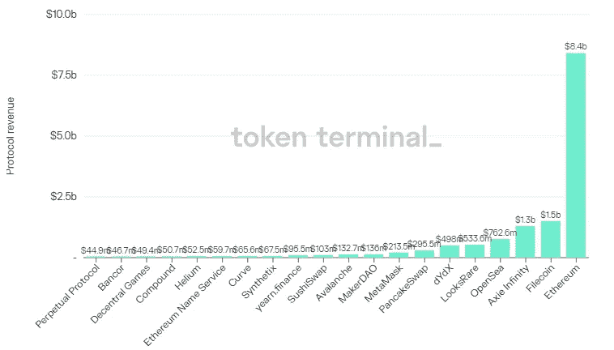
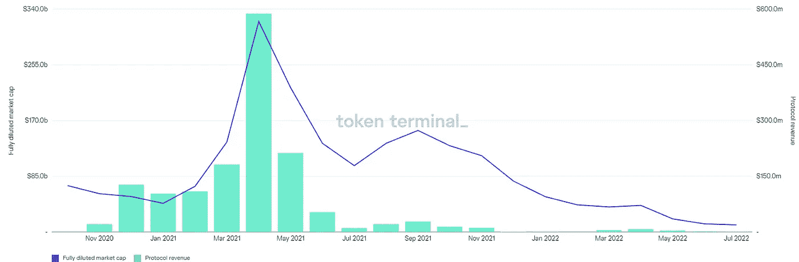
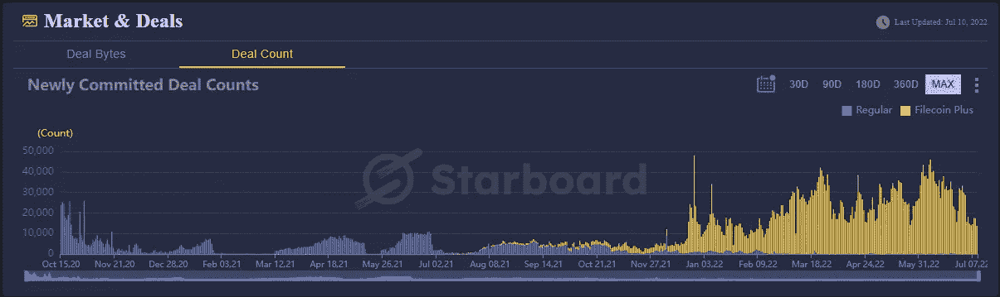
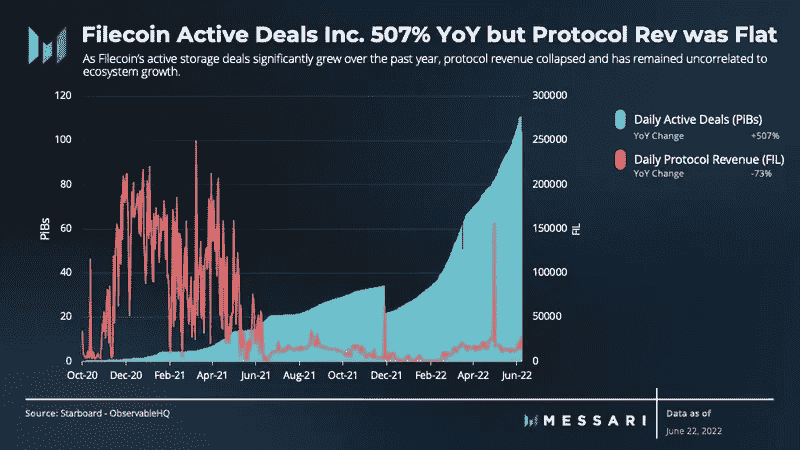
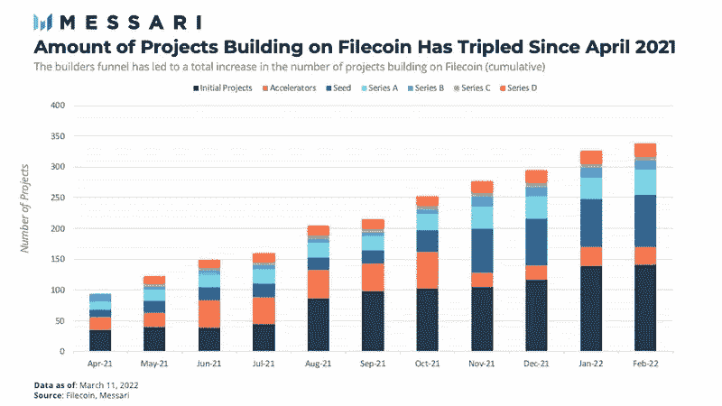

# Filecoin ($FIL)死了吗？

> 原文：<https://medium.com/coinmonks/what-is-up-with-filecoin-fil-84a34ba186c7?source=collection_archive---------1----------------------->

*本文并不涉及 Filecoin ($FIL)是什么，而是讨论 Filecoin 的现状，特别是其收入大幅下滑的原因。*

要了解 Filecoin ($FIL)是什么，请查看他们的[文档](https://docs.filecoin.io/)。

> TL；T4 博士 Filecoin 是一个在线 P2P 存储服务。存储提供商因向网络用户提供存储空间而获得奖励(报酬)。尽管网络活动不断增加，但它的收入一直在下降，这是由于一种新产品的推出:Filecoin Plus。
> 
> 不，它没有死，事实上，它的支点可以被证明是成功的，我们将拭目以待。

# 暗示 Filecoin 衰落的数据

看看 [Token Terminal 的仪表板](https://tokenterminal.com/terminal)，Filecoin 是该领域收入第二高的协议，总收入为 15 亿美元，仅次于 Uniswap 的 84 亿美元

Figure 1: Graph of top protocols by cumulative revenue [1]

然而，仔细观察，Filecoin 的收入自 2021 年 7 月以来相对不存在。哪里出了问题？

Figure 2: Graph of Filecoin’s monthly protocol revenue [2]

就像 DeFi 协议经常被“滥用”(想想$MIM degenbox to Anchor)，Filecoin 在其早期就被滥用了。存储提供商进行自我交易(托管他们自己的数据)以获得整体回报。这对存储提供商(他们获得了丰厚的报酬)和 Filecoin(使项目看起来在数量上很漂亮)来说都很有效。

然而，这意味着 Filecoin 网络上存储的大多数活跃存储都是没有任何用例的低质量垃圾。Filecoin 支付块奖励来解决冷启动效应，将用户引导到网络，这在 Web3 中相当常见。这是以未来销售压力增加为代价的，这是大多数协议(包括 Filecoin)都愿意接受的交易，因为他们认为用户粘性将推动需求，这可能超过销售压力。自我交易的参与者是雇佣军，是短期玩家，Filecoin 不得不改变其模式。

# 输入:Filecoin Plus

为了抵消非有益的活动，Filecoin 推出了一个新的产品线，Filecoin Plus。Filecoin Plus 是一家存储提供商(想想 AWS S3 深度归档等。)只有经过验证的用户(商家)才能访问，其引入是为了提高网络的存储质量和使用案例。

与 AWS 的产品相比，非分散化用户为什么会选择 Filecoin Plus？是免费的(嗯，基本免费)。

是的，Filecoin Plus 的用户可以免费在一个分散的网络上存储数据。这是可能的，因为 Filecoin 激励存储提供商为 Filecoin Plus 用户提供存储解决方案，并给予巨额奖励。10 倍于正常的 Filecoin 奖励)，并导致提供商之间的价格竞争以赢得奖励，最终以接近零的价格达到均衡。

不用说，这是成功的，改变了 Filecoin 的动态，Filecoin Plus 目前占交易的 99%以上。Filecoin Plus 获得了 1500 多个认证客户，活跃交易数量同比增长超过 500%[3]。

Figure 3: Graph showing Filecoin (Regular) vs Filecoin Plus by transaction count [4]

由于其非创收方案，Filecoin Plus 的成功没有反映在前两个收入图中(令牌终端)。除此之外，HyperDrive 网络升级允许网络扩展 10-25 倍，这使得交易费用更少。导致 Filecoin 的整体收入大幅下降。

Figure 4: Graph showing Filecoin active deals and protocol revenue [3]

在未来 1-3 年内，Filecoin Plus 可能会成为他们的旗舰产品，同时还会探索分散存储的新用例。目前的模式适用于经过验证的用户(他们可以获得免费存储)、存储提供商(他们通过块奖励获得大量激励)和 Filecoin 协议(他们获得大量活动并搭载新的高质量用户)。

# 问题是

目前有价值 7 . 6 亿美元的 FIL 硬币被这些存储提供商作为抵押品，占流通供应量的 50 %[ 5，6]。然而，当前模型中对$FIL 硬币的需求纯粹是由存储提供商的抵押品和可忽略不计的交易费用驱动的。由于缺乏用例，这些$FIL 硬币的大量销售也会瓦解 Filecoin Plus 计划。

美元 FIL 硬币的销售压力越来越大，将导致美元 FIL 硬币的价格下降，这意味着存储提供商的积极性降低，可能会开始收费，这将对用户进行压力测试(他们会为 Filecoin Plus 服务付费吗？).尽管最终可能需要进行压力测试，但当前的市场条件可能不是进行压力测试的最佳条件，因为在这种悲观情绪下，很难重新获得失去的信任和存储(流动性)。

Filecoin Plus 的当前模式还限制只有经过验证的用户才能访问，尽管这是为了现有网络参与者的利益，但它违背了加密货币的价值观之一——无许可。

# 后续步骤

Filecoin 应该创新并专注于构建$FIL 硬币的用例及需求，以确保协议的可持续性。他们一直致力于网络级开发和应用程序引导，这显然显示了进展。

Figure 5: Graph showing the number of projects building on Filecoin [3]

开发 Filecoin 虚拟机(FVM) 将在 Filecoin 的存储网络上提供智能合同，这将最大限度地允许 Filecoin 上的永久存储解决方案。使 Filecoin 成为 Arweave 的有力竞争者，并进一步巩固其在分散存储解决方案领域的地位。

**感谢您的阅读！我们将会看到 Filecoin 的结果。祝团队和 Filecoin 的所有信徒一切顺利。**

# 参考

[1][https://tokenterminal.com/terminal](https://tokenterminal.com/terminal)

[2]https://tokenterminal.com/terminal/projects/filecoin

[3]https://messari.io/article/demystifying-filecoin-s-revenue

[https://dashboard.starboard.ventures/dashboard](https://dashboard.starboard.ventures/dashboard)

[5][https://observable HQ . com/@ starboard/a-primer-to-filecoin-circulating-supply/2](https://observablehq.com/@starboard/a-primer-to-filecoin-circulating-supply/2)

[https://www.coingecko.com/en/coins/filecoin](https://www.coingecko.com/en/coins/filecoin)