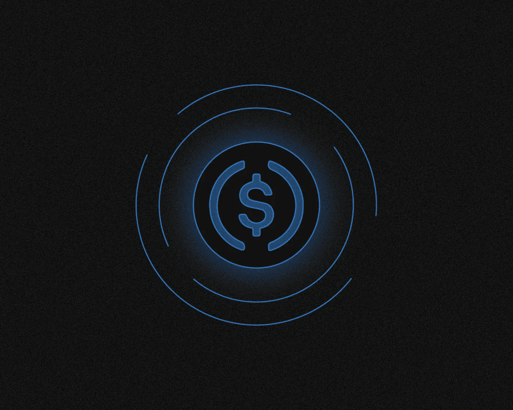
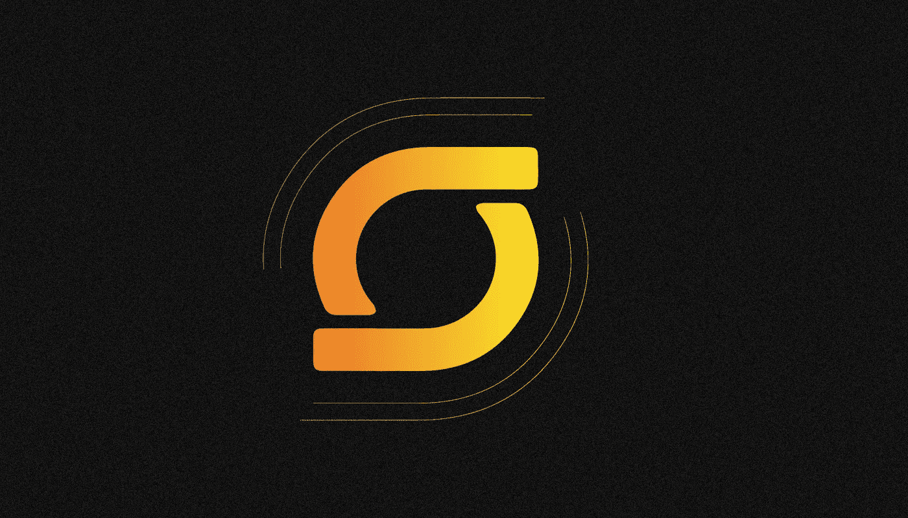
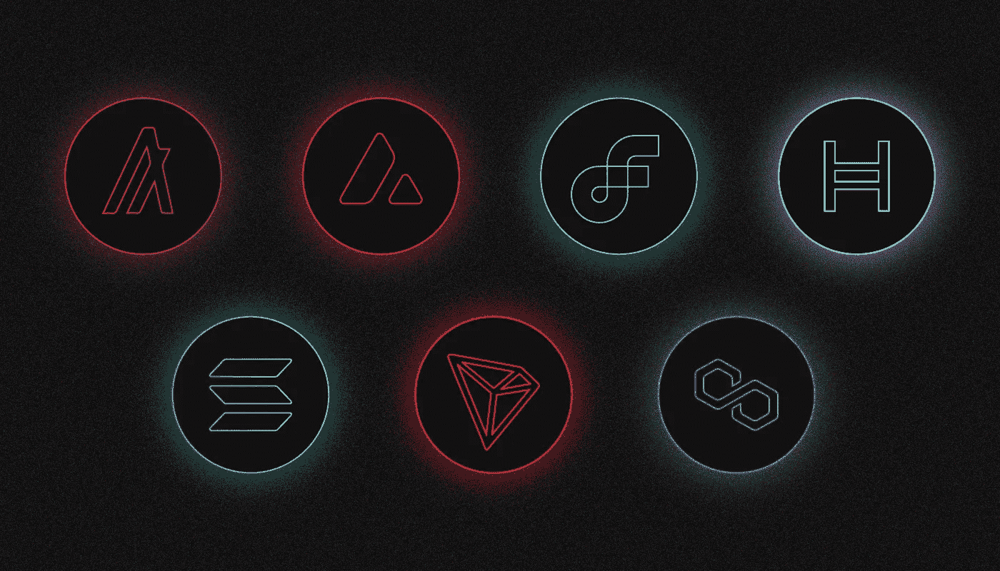
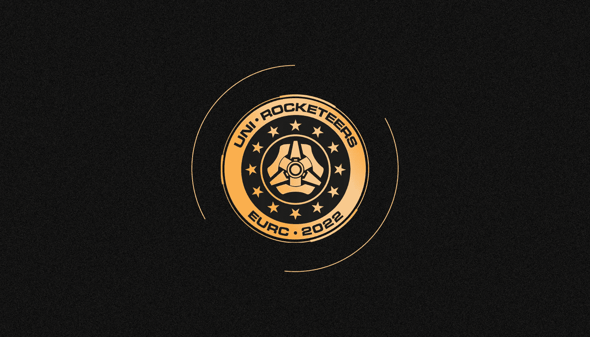

# 什么是 USDC？

> 原文：<https://medium.com/coinmonks/what-is-usdc-3b77bbf3829b?source=collection_archive---------34----------------------->

***美元币(USDC)是一种中央集权的稳定币，与美元挂钩。就市值而言，它是仅次于 Tether 的第二大加密货币，并且价格稳定(USDT)。我们真的需要它吗？USDC 和 USDT 有什么不同？让我们看看！***

自 **2020** 春季以来，1 USDC 的价格等于 1 美元，与目标水平的偏差极低(不到 1%)。

USDC 由债务证券和现金储备支持，这些证券和现金储备在美国受监管的金融机构的资产负债表上，并定期接受审计。

稳定币是由美国公司圈和比特币基地合作的中心发行的。

# 为什么 USDC 是一个受欢迎的城市？

USDC 令牌于 2018 年 9 月**发布**。由**比特币基地**和**圈子**成立的联合体[中心](https://www.centre.io/usdc)为发行人。

**截至 2022 年夏天**，USDC 是市值第二高的稳定货币，仅次于 USDT。根据 CoinGecko 的说法，该资产的市场价值在 2021 年增长了十倍以上，从 40 亿美元增加到 424 亿美元，预计到 2022 年 6 月 20 日结束时将达到近 550 亿美元。

USDC 是一种中央集权的稳定货币，广泛用于各种用途。市场参与者对该资产的发行者有信心:Circle 和比特币基地是大型、受监管的金融机构，它们保持着高标准的工作水平并遵守法律。

此外，他们还建立了一个透明的 USDC 储备报告系统，这是中央稳定账户的可靠性和可信度的基础。确保 USDC 价格所需的资金存在美国最大银行的资产负债表上，并由独立审计师定期审计。

# 我们为什么需要 USDC？

创建稳定货币是为了减轻与加密货币市场波动性相关的风险。因此，它们是网上交易和资本存储的好选择。

这些加密资产有益于投资者和交易者，因为它们可以用于在交易平台上结算交易，存储交易数字资产的利润，并作为投资组合的一部分。

稳定的国家，如 USDC，在分散融资领域有额外的好处。令牌用于各种交易协议，如 [Aave](/sunflowercorporation/what-is-aave-4ec79ad43a61) 、[摄氏度网](/sunflowercorporation/what-happened-to-celsius-cel-78fd971c49ed)、[大院](/@SunflowerCorpAdmin/what-is-compound-4b2614031ef5)等。

# USDC 支持哪个区块链？

USDC 最初是作为以太坊区块链的 ERC-20 代币推出的，但后来扩展到支持其他网络:

*   阿尔格兰德；
*   [雪崩](/sunflowercorporation/what-is-avalanche-5de8f06e2bca)；
*   流动；
*   海德拉；
*   [索拉纳](/sunflowercorporation/what-is-solana-fe6900bdf0c3)；
*   [恒星](/@SunflowerCorpAdmin/what-is-stellar-and-xlm-acb206563d3d)；
*   [TRON](/sunflowercorporation/what-is-tron-c82b3445cd6d)；
*   [多边形](/sunflowercorporation/what-is-polygon-matic-916f4fa2afee)(通过跨链桥)

# USDC 的后盾是什么？

储备由一个集中的 USDC 发行人管理。截至 2022 年 7 月，它们由四分之三的短期美国国债和四分之一的现金美元组成。所有这些资金都存在美国主要金融机构的账户中，包括贝莱德、BNY 梅隆、纽约银行等。

有关 USDC 储备的信息包含在 USDC 发行人的公开财务报表中。这些账目由美国会计公司均富 LLP 核实，该公司公开发布支持 USDC 与美元挂钩的外汇储备证明。审计核实准备金的准确性、完整性和构成，以及确保财务报表准确性的内部控制信息。

由于 Circle 打算在 2022 年年底成为一家上市公司，因此每月的储备报告都要提交给美国证券交易委员会(SEC)。

Terra 垮台后，Circle 首席执行官 Jeremy Allaire 发布了一系列信息，旨在培养对 USDC 的信任。在其中一封信中，他承诺未来将每天公布安全报告。

# **什么是欧元硬币(EUROC)？**

**2022 年 6 月底**，Circle 推出了一种新的稳定币，名为**欧元币(EURO)** ，其成本与欧元挂钩。

它在以太坊网络发布，并在 BitMart、Bitpanda、CEX.io、FTX и HitBTC 等平台上提供。这种资产也在曲线和分散交易所进行交易。根据 CoinGecko 的数据，截止到**8 月 15 日**，stablecoin 的资本化超过**530 万美元**。

欧元储备存在以欧元计价的账户中。这些基金的托管人是 Fireblocks、Anchorage Digital 和 CYBAVO。

# **项目为什么会被诟病？**

美国当局在 8 月初将 Tornado Cash 区块链 mixer 网站以及与之相关的加密货币地址添加到制裁名单中。

Circle 随后封锁了存放超过 **75，000 枚代币**的龙卷风现金钱包的美元地址。

加密社区对这一决定反应消极，MakerDAO DeFi 协议的联合创始人 Rune Christensen 提出用价值 35 亿美元的 USDC 换取以太坊，这是一种分散的 DAI stablecoin。维塔利克·布特林反对这个想法。

**2022 年**年初，黑客至少黑掉了 Circle 投资的两个区块链项目 Nomad 和 Slope。该公司排除了事故对 USDC 储备的影响。

> 如果你对 USDC 的话题有任何补充，欢迎评论！
> 在跟踪更新方面，订阅我们的 [Medium Feed。](/@SunflowerCorpAdmin)
> 
> 您也可以在我们的平台[向日葵公司](https://sunflowercorp.com)上尝试使用加密货币。
> 敬请期待！

> 交易新手？试试[加密交易机器人](/coinmonks/crypto-trading-bot-c2ffce8acb2a)或者[复制交易](/coinmonks/top-10-crypto-copy-trading-platforms-for-beginners-d0c37c7d698c)