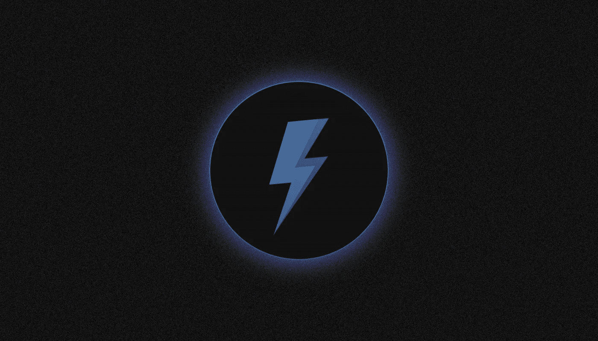

# 什么是 VeChain 和 VET？

> 原文：<https://medium.com/coinmonks/what-is-vechain-and-vet-ed4a0e71a27?source=collection_archive---------28----------------------->

VeChain 是一个区块链平台，为供应链管理、假冒产品检测和其他业务流程的自动化提供 B2B 解决方案。它是如何工作的，为什么它如此有益？让我们看看！

该项目使用两种加密货币:本地硬币 VeChain (VET)和需要支付交易费用的 VeThor (VTHO)。

VeChain 于 2015 年在**成立，是开发和实施用于跟踪商品和零售真实性的区块链解决方案的先驱，在中国、欧盟、美国、日本和新加坡设有办事处。该公司与宝马、比亚迪和沃尔玛等大型国际企业以及中国和其他国家的政府机构建立了长期合作伙伴关系。**

# 谁创建了 VeChain 并在资金上支持它？

2015 年**年**，路易威登中国前高级经理 Sunny Lu 和前德勤和普华永道雇员 Jen Zhang 在新加坡创立了 VeChain 创业公司。

在 **2017** 成立了 VeChain 基金会，作为一个非盈利组织，接管区块链平台的开发和支持，以及合作伙伴的参与和 VeChain 生态系统的发展。

在同年举行的 VET 土著硬币代币义卖中，VeChain 筹集了 2200 万美元。当时已经存在的几个主要合作伙伴，包括与德国汽车制造商宝马的合作，有助于吸引投资者的注意。

普华永道(PwC)、DNV GL、海涛资本、BlockVC、IOSG 创投在 **2018** 春季期间对 VeChain 进行了三轮企业投资。

VeChain 原型最初在以太坊网络上工作，但在 **2018** 年夏天，开发者发布了 VeChainThor。多年来，该项目在中国、欧盟、美国和日本建立了子公司。**2022 年 2 月**，VeChain 基金会总部在圣马力诺成立，强调了欧洲市场对公司的重要性。

# 为什么 VeChain 需要 2 种加密货币？

VeChain 的创造者于 2017 年在以太坊网络上发行了**10 亿**名为 VEN 的原生代币。面向早期投资者的封闭式股权出售卖出了 9%的股份，而开放式 ICO 募集了 2000 万美元。随着 VeChainThor 区块链的推出，文以 1:100 的比例兑换成当地的 VET 硬币。

目前，区块链的 VeChainThor 使用两种本地加密货币——VeChain Token(VET)和 VeThor Token (VTHO)。

VET 的总报价约为**867 亿 token**，其中近 70%分配给早期投资者和 tokensale 参与者，其余 30%用于开发 VeChain 生态系统和奖励开发者。

VeChain 硬币有四个基本功能:

*   **计算工具:** VET 用于 VeChainThor 区块链的转账；
*   **抵押品** —启动任何 VeChain 节点都需要该加密货币；
*   **Staking** —在节点 wallet 中，VET 生成一个 VTHO 令牌。对于每 10，000 个 VET，每天在节点地址产生 4.32 个 VTHOS
*   **管理** —节点根据持有的 VET 数量获得参与网络管理的机会。所有 101 个可信主节点共享总票数的 40%。

Source: [CoinMarketCap](https://coinmarketcap.com/currencies/vechain/)

VeThor 令牌(VTHO)用于支付 VeChainThor 网络上的转账费用。所有已付 VTHO 佣金的 70%被烧掉，剩下的 30%成为可信主节点的奖励。

VeChain Token (VET)是资本化程度最高的 50 种加密资产之一。这两种加密货币都在所有主要的加密货币交易所交易。

# 什么是 VeChainThor？

VeChainThor 区块链基于原始的授权证明共识机制，是所有 VeChain 解决方案的基础。这是一种改进的利害关系证明算法，其中网络节点被分配块生成和事务批准(节点)的任务。

VehainThor 的权威主节点不能匿名:在为区块链的稳定、安全和效率做出贡献之前，每个候选人都要接受 VeChain 基金会的检查，以确定是否符合技术要求和身份识别程序。VeChain 区块链支持 101 个这样的节点，每个节点需要 2 . 5 亿 VET 股份。

VeChainThor 有三种类型的经济节点和四种类型的 X 节点。它们不验证交易，不生成块，也不需要高性能设备，但它们确实保证了生态系统的稳定性，产生了 VTHO(生态系统的第二资产)。

最低牛排要求(从 60 万到 1500 万兽医)，VTHO 形式的奖励“成熟”时间(从 10 天到 90 天)，以及相关奖金根据节点类型的不同而不同。

节点数量有限:截至**8 月** **2022** 共有 1665 个经济节点和 2430 个 X 节点。维护节点的权利由相应的[NFT](/@SunflowerCorpAdmin/what-is-nft-part-1-4e86c04c1e79)确认，NFT 在[特殊市场上交易。](https://manager.vechainstats.com/vnt-marketplace/)

每 10 秒钟，就有新的区块被添加到区块链号航母上。据开发人员称，使用这些参数，网络性能可以达到每秒 10，000 次交易。但是，VeChain Foundation 将能够根据需要调整块生成时间和网络性能。

区块链号上有一个虚拟机。它建立在以太坊虚拟机(EVM)上，支持执行用 Solidity 编程语言编写的智能合约。该网络支持用户令牌(如 NFT)的发行，以及分散应用程序的运行。

# VeChain 解决方案如何帮助企业？

Vechain 已经成为开发和实施区块链物流解决方案的先锋，跟踪商品、零售和其他业务流程的真实性。

VeChain solutions 的运作基于物理对象的数字化:每个被跟踪的对象被分配一个唯一的标识符(Vechain ID)。智能合同在区块链的 VeChainThor 中生成相应的条目。在物体本身上，有一个带有记录的 Vechain ID 的载体(NFC 芯片、RFID 标签或二维码)，或记录物体位置和状态数据的物联网传感器..

通过 Vechain 向其合作伙伴提供的 API，可以与 VeChainThor 区块链和存储的数据进行交互。它允许您实时跟踪物品的路径，包括它们在分销商仓库中的移动、销售的日期和位置以及其他操作。

企业可以根据自己的需求选择不同类型的区块链产品:

*   需要自己开发应用的基础平台；
*   可以由现成的软件块组装而成的中级低代码平台；
*   一个现成的应用程序，完全适应客户的需求，并准备实施。

自成立以来，VeChain 已经与全球 200 多家公司完成了试点项目。以下是一些最令人印象深刻的例子:

*   与**宝马**合作开发了 VerifyCar 应用程序，记录区块链的车辆使用数据(里程、保险和服务标志)，这有助于与汽车服务中心的互动。
*   2018 年，**光明代码**平台在[推出](/vechain-foundation/cupids-farm-milk-produced-by-bright-food-became-the-first-product-to-go-live-on-brightcode-a-626cb33ee09d)，为光明食品公司在区块链建造。在二维码的帮助下，消费者可以收到关于食品原产地的验证信息。
*   2019 年，**沃尔玛中国**宣布了与 VeChain 的联合项目，旨在追踪食品的真实性和安全性。
*   同年，中国双江省当局批准使用 VeChain 网络追踪茶叶供应链；
*   2021 年初， **PuffBar** 电子烟的制造商决定使用 VeChain 平台打击假冒。
*   受中国内蒙古政府委托，VeChain 正在[开发](https://www.vechain.org/vechain-builds-government-traceability-platform-for-the-ongnuid-banner-region-inner-mongolia-china/)一个追踪农产品的平台。该地区的几家企业已经在使用这一系统。

# 有哪些去中心化的 app 是基于 VeChain 的？

虽然 VeChain 最初专注于 B2B 解决方案，但许多去中心化生态系统的出现刺激了基于 VeChainThor 的去中心化金融(DeFi)领域的发展，该领域具有高性能。

根据 [VeChainStats](https://vechainstats.com/) 服务，2022 年**8 月**时，在 VeChain 生态系统中发布了约 30 个用户令牌。VeChain 网络托管了许多 DeFi 应用程序，包括分散加密交换 [VexChange](https://vexchange.io/) ，以及虚拟世界 Vulcan Verse 和区块链游戏。VeChain 还发布了 30 多个 NFT 系列，其中许多是以太坊上流行系列的克隆。

**2022 年 5 月**，VeChain 与资产令牌化公司 Stable 合作[推出](https://www.vechain.org/what-is-veusd-everything-about-vechains-stablecoin/)VeUSD 原生 stablecoin，完全由美元支持。VeUSD 的证券存储在由 Prime Trust 管理的信托账户中。**截至 2022 年 8 月**，VeUSD 的资本总额约为 550 万美元。

# VeChain 是如何进化的？

自成立以来，VeChain 一直积极与世界各地的大学合作，为医疗保健和环境保护开发区块链解决方案。清华大学、斯坦福大学、麻省理工学院、牛津数学研究所和香港城市大学是研究合作者。

最显著的例子之一是在医疗部门使用区块链病毒来防止新冠肺炎病毒的传播。

【2020 年 9 月，VeChain 与 DNV GL、[合作推出](/vechain-foundation/vechain-and-dnv-gl-release-vetrust-a-new-blockchain-based-risk-self-assessment-application-to-d91fce3d41d1)VeTrust 应用程序。它包括一份确保清洁和安全的清单，酒店在处理场所和为客人烹饪时可以使用。在中国，已有 200 多家酒店和公共场所与该系统相连。

此外，中国多个省份[的市政当局使用](/vechain-foundation/vetrust-adopted-by-local-chinese-government-helping-300k-citizens-return-to-normalcy-deepening-fcc57487666) Ve Trust 对总人口超过 30 万的 95 个住宅小区的感染风险管理流程进行了可视化。

【2022 年初，VeChain 基金会[宣布](https://www.vechain.org/amazon-web-services-aws-becomes-technology-partner-to-vecarbon-enabling-international-scale-carbon-management-services/)推出用于计算和控制二氧化碳排放的 VeCarbon 平台。该产品帮助企业实现碳中和、减排目标和可持续发展目标。该产品已在多家企业使用。它也在中国汽车制造商比亚迪的电动汽车上进行了测试:车主可以通过出售他们的碳信用额获得小额奖励。

**自 2022 年 8 月**起，亚马逊网络服务(AWS) [云服务](/vechain-foundation/amazon-web-services-aws-becomes-technology-partner-to-vecarbon-enabling-inter-national-scale-162fbad6dd39)成为 VeChain 在 VeCarbon 项目上的合作伙伴。

> 如果你对 VeChain 主题有任何补充，欢迎评论！
> 在跟踪更新方面，订阅我们的 [Medium Feed。](/@SunflowerCorpAdmin)
> 
> 您也可以在我们的平台[向日葵公司](https://sunflowercorp.com)上尝试使用加密货币。
> 敬请期待！

> 交易新手？尝试[加密交易机器人](/coinmonks/crypto-trading-bot-c2ffce8acb2a)或[复制交易](/coinmonks/top-10-crypto-copy-trading-platforms-for-beginners-d0c37c7d698c)