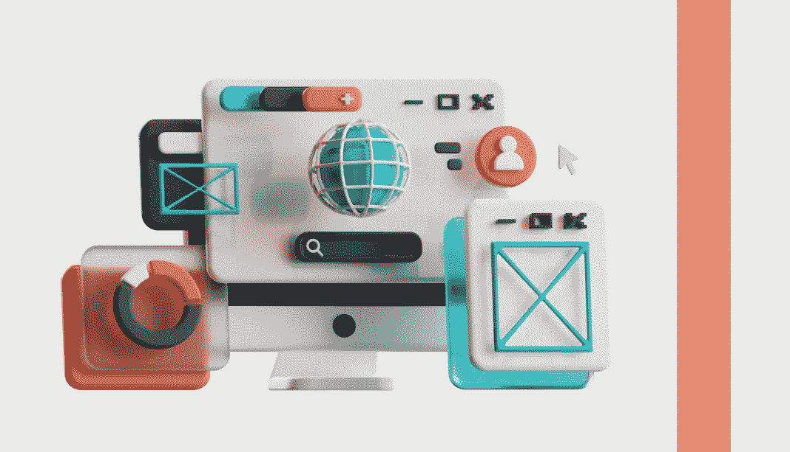

# 什么是 Web3？

> 原文：<https://medium.com/coinmonks/what-is-web3-602a9797e435?source=collection_archive---------34----------------------->

## Web3 是一个新的第三代互联网的概念，它是去中心化的，运行在区块链和令牌经济上。

它与万维网 Web2 相反，后者基于用户之间社交互动的集中式平台运行。

> 交易新手？试试[加密交易机器人](/coinmonks/crypto-trading-bot-c2ffce8acb2a)或者[复制交易](/coinmonks/top-10-crypto-copy-trading-platforms-for-beginners-d0c37c7d698c)

## 【web3 是如何工作的？

# Web 3.0 可以用公式 read + write + own 来描述。

当你使用脸书或 Youtube 这样的平台时，你的数据被这些公司收集、拥有和货币化。数据不是存储在企业服务器上，而是分布在用户设备上(去中心化)。在 web3 中，您的数据存储在您的加密钱包中。

在 web3 上，你的钱包就是你的身份，它不容易与你的真实身份联系起来。因此，虽然有人可能能够看到某人钱包的活动，但他们不会知道这是你的钱包。像数据所有权一样，隐私也是你钱包的一部分。

你可以通过钱包使用 web3 上的应用和社区，当你注销时，你可以随身携带你的数据。从理论上讲，既然你拥有这些数据，你也可以决定是否要将其货币化。

Web3 将能够创建无人控制的平台，但由于其底层算法和协议，每个人都可以信任。这一目标将在区块链、机器学习、大数据和人工智能等先进技术的帮助下实现。第三代互联网经济的燃料应该是独立于传统金融体系的代币和加密货币。

Web3.js 是一个库集合，允许您使用 HTTP、IPC 或 WebSocket 与本地或远程以太坊节点进行交互。Web3.js 允许您开发与区块链交互的网站或客户端。

例如，它允许您将以太网从一个帐户发送到另一个帐户，从智能合约中读取和写入数据，创建智能合约，等等。

Web3.php 是一个 PHP 接口，用于连接以太坊区块链并与之交互。它是开源的，可用于获取区块链数据并与已部署的合同进行交互。它内置了对以太坊的 eth、web3、net 和 shh JSON RPC 模块的支持。

联系我们，让我们一起开始你的项目！ [https://crypton.studio](https://crypton.studio/)