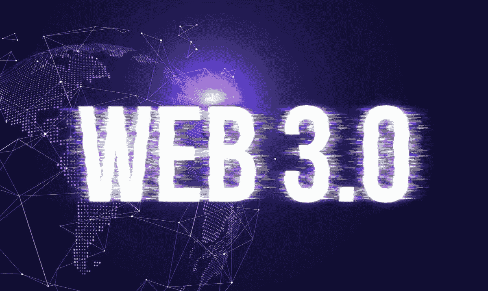

# 什么是 Web3？

> 原文：<https://medium.com/coinmonks/what-is-web3-d2b7702fef02?source=collection_archive---------40----------------------->

在过去的几年里，互联网发生了很大的变化。它现在比以往任何时候都更加融入我们的生活。社交媒体平台、移动应用和其他技术进步已经让互联网成为我们生活中不可或缺的一部分。然而，互联网正在经历另一场范式转变，这将进一步改变我们使用互联网的方式。

自从网络诞生以来，它已经发生了很大的变化。它现在分为三个部分:Web 1、Web 2 和 Web 3。

> 什么是 Web 1？

Web 1.0 是第一次使用互联网。人们只能阅读放在网站上的信息，没有办法与信息或其他人互动。这种情况从 1991 年持续到 2004 年。

> **什么是 Web 2？**

我们大多数人都经历过当前形式的 web，它被称为 web2。这是互动和社交网络。在 web2 中，您不必是开发人员就可以参与创建过程。许多应用程序都允许任何人成为创作者(例如 Youtube、脸书、Instagram)。

互联网上有很多应用程序，其中一些有坏人试图获取你的信息。有网站告诉你这种情况什么时候发生，你可以小心。一些应用程序归公司所有，这些公司可能会在你不知情的情况下跟踪你做了什么或去了哪里。在一些国家，政府不喜欢人们说他们不同意的事情，所以他们可能会关闭应用程序或拿走人们的钱。

> **什么是 Web 3？**

Web3 是在互联网上构建应用程序的一种新方式。这些应用程序是分散的，这意味着它们不在一个服务器上运行，也不存储在一个数据库中。相反，它们运行在区块链上，这是一个由许多服务器组成的分散式网络。加密货币通常用于这些应用中，这为人们参与网络提供了财务激励。

Web3 是使用互联网的一种新方式，更加安全和高效。web3 的其他一些附加特性是:

➖ 可验证的

*➖* 不可信

*➖* 自治

➖*无权限*

*➖* 分布式且健壮

*➖* 有状态

⚫在 web3 中，人们的身份通常与他们的钱包地址联系在一起。这与 web2 不同，在 web 2 中，人们的身份与他们的个人信息绑定在一起，比如他们的电子邮件地址或密码。

⚫代币是一种无边界、无摩擦的网上支付方式。你不需要泄露你的敏感信息来使用它们。像 MetaMask 这样的钱包使得匿名和安全地支付东西变得容易。像 Matic 这样的网络提供非常便宜的快速交易。

⚫:在目前的体制下，想创办软件公司的人必须将公司一定比例的股份交给风险投资家，才能获得资金。这可能会引入不一致的激励，即公司开发软件的目标(制造好的产品)与资助它的人的目标(赚钱)是不同的。在以太坊区块链正在建设的新系统中，任何人都可以购买代币来表示对项目的支持。项目工作人员也可以获得代币报酬，如果他们想赚钱，可以出售代币。相信一个项目的人可以购买并持有所有权，而认为项目走向错误方向的人可以出售他们的股份。

> 总之，对于用户和商业创造者来说，Web 3 代表了相对于 Web 1 和 Web 2 的指数级发展，允许在管理个人信息和参与新业务的方式上有更大的自由。

> 交易新手？试试[加密交易机器人](/coinmonks/crypto-trading-bot-c2ffce8acb2a)或者[复制交易](/coinmonks/top-10-crypto-copy-trading-platforms-for-beginners-d0c37c7d698c)