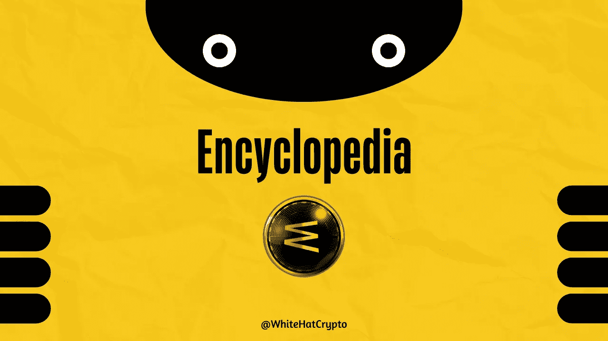

# 什么是 Web3 百科全书？

> 原文：<https://medium.com/coinmonks/what-is-web3-encyclopedia-129e1a08222d?source=collection_archive---------42----------------------->

关于百科全书 wTa:新兴的 Web3 百科全书！

Web3 已经被讨论了一段时间，但是当前加密市场的下滑已经停止了大多数主要的计划。远足变得平缓了一些，但是一些人仍然在地下工作。在今天的文章中，我们将看看新的 web3 百科全书！

# **什么是百科 wTa？**

让我们引用[公司](https://encyclopedia.ws/)自己的话:

> 百科全书 wTa 是一个 Web 3.0 驱动的教育技术、终身学习和教学平台，为成人和学生提供付费的专业培训师和课程。

换句话说，它是现有百科全书的更新版本。这家初创公司将自己定位为改善 web2 过时的学习模式的一种手段。最终，ENCwTa 计划为贫困学生建立额外的平台。

ENCwTa 的核心要素是一个低成本的学习框架。ENCwTa 打算提供与通过优质网站提供的高价课程相同的课程，但价格更低。

第二，正如我们在维基百科的案例中看到的，普通编辑的努力没有得到补偿。在 ENCwTa 的例子中，贡献得到奖励。这种激励方案鼓励用户更频繁地做出贡献，并提高采用率。

ENCwTa 的另一项重要举措是利用区块链重组教育行业的收入分配。这是一个透明的方法，对各方都有利。

# ENCwTa 生态系统

为了与它的去中心化原则保持一致，Encyclopedia 将用户的学术文档存放在一个专有的分布式存储系统上。

为了进一步细分，他们在 ENCwTa 生态系统中有**内容创作者**。在这个平台上，这些内容创作者可以通过各种方式赚钱，比如当用户访问他们的内容和文档时。

接下来是观众。这些查看者或简单的用户可以访问百科全书上的任何文档，而不需要特殊的附件或硬件。

另一类贡献者是**内容增强者**。他们充当内容创建者的服务提供商。他们的服务包括营销、翻译、文档等等。他们可以基于内容增强者和内容创建者之间的相互协议获得利益。

这些是 ENCwTa 生态系统中的关键角色；其他参与者包括存储提供商、广告商等。

# ENCwTa 令牌

ENCwTa(可以在 CMC 上查看令牌或者点击[此处](https://coinmarketcap.com/currencies/encyclopedia-wta/))是百科官方确立的令牌。

该令牌用于生态系统中的所有财务目的。创作者通过相同的令牌获得奖励，目前的交易价格为 0.1118 美元。百科全书 wTa 在过去 24 小时内上涨了 10.47%。目前的硬币市场排名是#5849。

最大总供应量为 5，000，000 ENCWTA 币，流通供应量为 2，000，000 ENCWTA 币。总供应量的 40%被锁定 2 年，10%用于发展基金。大约 8-9%的税收用于购买和销售过程。税额在开发、营销、流动性更新和储备中分配。

# **底线**

ENCwTa 背后的概念似乎是一个有希望的概念，旨在瓦解不平等的教育产业。在奖励贡献者的同时建立透明度是重组教育部门的关键。然而，这一概念在很大程度上仍是理论性的，需要在考虑之前进行尽职调查。

本文提供的内容不是赞助的，据我所知是正确的。本文不是财务建议，我们对针对本文采取的任何措施不承担责任！

请随意查看我们的社交平台，获取每日加密更新:

[YouTube](https://www.youtube.com/channel/UCjfinzatswbVaRd89zn5kJQ/featured)

[推特](https://twitter.com/whitehatcrypto)

[Instagram](https://instagram.com/white.hatcrypto?igshid=YmMyMTA2M2Y=)

> 交易新手？试试[密码交易机器人](/coinmonks/crypto-trading-bot-c2ffce8acb2a)或者[拷贝交易](/coinmonks/top-10-crypto-copy-trading-platforms-for-beginners-d0c37c7d698c)