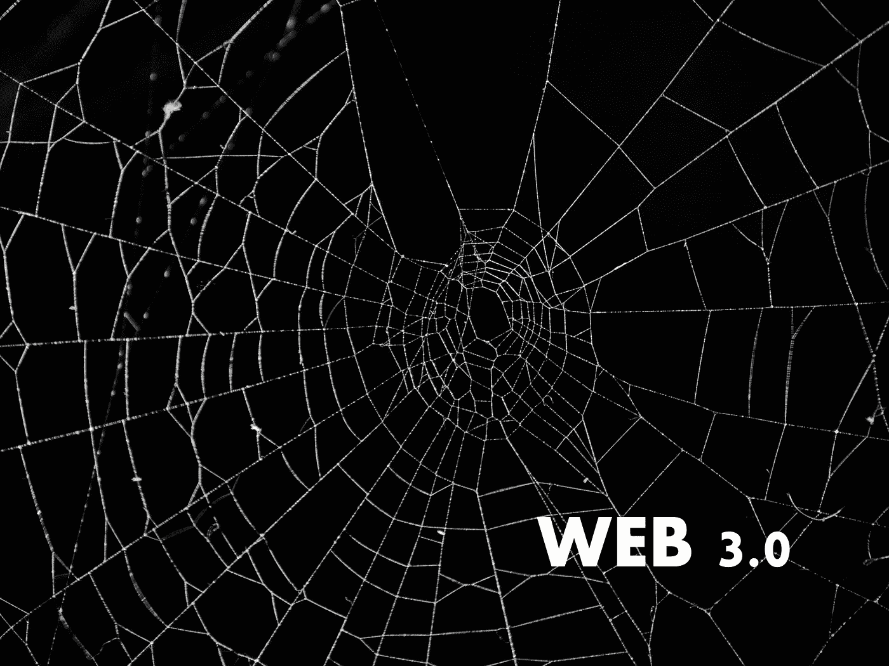

# 什么是 Web3？

> 原文：<https://medium.com/coinmonks/what-is-web3-fe150ac47d2c?source=collection_archive---------47----------------------->

本周，我和十几岁的儿子在车里，他随意问我“什么是 web3.0？”我急于回答他的问题，因为我喜欢讨论这个话题，我相信我儿子这一代人将会是这个版本互联网最狂热的用户。

为了解释 web3，我必须解释 web1 和 web2。Web1 是第一个主要由静态网页(如 PDF 文档)组成的互联网版本…