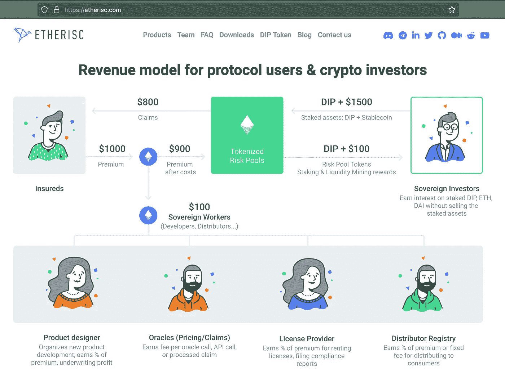

# 什么是 Web3？网站 1、网站 2、网站 3 已解释

> 原文：<https://medium.com/coinmonks/what-is-web3-progressing-from-web1-web2-to-web3-be43af686af4?source=collection_archive---------16----------------------->

Photo by [Pradamas Gifarry](https://unsplash.com/@pradasg?utm_source=unsplash&utm_medium=referral&utm_content=creditCopyText) on [Unsplash](https://unsplash.com/s/photos/internet?utm_source=unsplash&utm_medium=referral&utm_content=creditCopyText).

Web3，去中心化，互联网的未来。这些术语一直是最近人们感兴趣的主要话题。但是对许多人来说，Web3 到底是什么？(我们已经在 Web2 中了吗？)到底有什么区别？

在本文中，我将尝试解开以下内容:

*   什么是 Web3？
*   Web1、Web2 和 Web3 之间的区别
*   为什么 Web3 意义重大，它将如何影响我？

# 什么是 Web3？

Web3 指的是运行在区块链上的分散式应用。分散的应用程序意味着没有一个中央公司/组织拥有您可能正在使用的应用程序——脸书、推特、抖音都由实体控制，因此是集中的。这些平台有权控制活动和访问，制定平台策略，并拥有其用户生成的内容和数据。相比之下，分散平台依赖于平台治理的替代模型，这意味着通常没有一方能够完全访问和控制。这些备选的治理模式是由区块链技术公司实现的，这解释了它的密切联系。

# Web1、Web2 和 Web3 之间的区别

Photo by [Leon Seibert](https://unsplash.com/@yapics?utm_source=unsplash&utm_medium=referral&utm_content=creditCopyText) on [Unsplash](https://unsplash.com/?utm_source=unsplash&utm_medium=referral&utm_content=creditCopyText).

有一个小小的误解，认为 Web1、Web2 和 Web3 存在于一个有点线性的时间线中——所有的互联网都从 Web1 转移到 Web2，最终所有的互联网都将成为 Web3。然而，这不仅是不真实的，也不一定是可取的。互联网由属于 Web1、Web2 或 Web3 定义的网站和平台组成，它们很可能会继续共存。

这样，我们就进入了他们的定义:

*   **web 1**——“只读”网站和平台。简单地想想数字化任何形式和以物理形式存在的信息片段。这可能是你的字典，公司信息，或者只是一个目录。
*   **web 2**——“阅读和创造”的网站和平台。除了阅读和消费内容，用户现在还在网站和平台上为其他用户生成内容。我们很熟悉这些例子——想想脸书，推特，当然，还有你阅读这篇文章的平台:媒体。
*   web 3——“读取-创建-拥有-管理”网站和平台。在 Web2 中，我们提到的例子通常是由公司管理的，这些公司是平台政策的唯一决策者，并且拥有用户生成的内容和数据。正如我们上面提到的，Web3 反过来代表了分散的应用程序和平台，它们利用区块链来制定备选的治理形式，并允许用户拥有内容。

# 为什么 Web3 意义重大，它将如何影响我？

并不是所有的服务都需要变成一个分散的应用程序。

Web3 的重要性以及它将会产生的重大影响就是平台治理和所有权所带来的问题。例如，这包括**访问控制、信息控制/审查，以及由托管人或“中间人”收取的服务费用**。

## 访问控制

平台治理的一个关键要素是确定谁可以使用服务。有理由认为，某些实体可能会收集个人信息并实施被认为有利于公司利益的选择性政策，但反过来却对某些群体具有歧视性。这可能包括银行服务、获得资本或其他可能严重影响个人生活的问题。理想情况下，当政策由一个社区制定，而不是由一家专注于拓展底线的公司制定时，这种情况可以被消除或更好地控制。

## 信息控制/审查

虽然像 Twitter 这样的单一实体可能会决定制定它认为合适的审查政策，但分散的应用程序可以阻止这种情况发生。这种政策必须由所选择的普遍分权治理模式来决定。在理想的情况下，这可以鼓励在这些平台上实施更公平、更包容的政策。

相反，选择向用户显示什么也同样重要。随着越来越多的内容不断产生，争夺同样有限的注意力，排序内容提要以显示给用户的算法出现了。通过选择和决定向用户展示什么，它可以影响受众的情绪、观点和看法。2014 年，脸书披露了一项由康乃尔大学和加州大学的学者进行的[研究](https://www.theguardian.com/technology/2014/jun/29/facebook-users-emotions-news-feeds)，该研究表明接触积极或消极的内容会影响用户的情绪。在唐纳德·川普赢得大选期间，[剑桥分析公司](https://www.theguardian.com/uk-news/2018/mar/23/leaked-cambridge-analyticas-blueprint-for-trump-victory)也对脸书的用户进行了微定位，以影响他们的政治观点。

理论上，Web3 为用户提供了一个以公开透明的方式做出决策的机会，而不是让公司实体成为平台上管理信息控制的算法和政策的唯一决策者。

## 托管人/中间人服务收取的费用

这里的想法是，许多“中间人”服务本质上是通过作为托管人来运营和获取利润的，如果有一个开放、透明和安全的网络，这将不再是必要的。这样一个网络是通过[智能合同](https://ethereum.org/en/smart-contracts/)实现的，合同以程序的形式写成，存储在区块链上，在满足指定的前提条件时生效。

通过绕过“中间人”，本应收取的费用因此可以避免，而是与服务的用户共享，从而使他们获得比集中式平台更好的收益。例如，这是一个重要的概念，它推动了许多去中心化的金融平台——或“DeFi”。这些平台能够为大多数金融服务提供分散化的替代方案——允许你汇款、借款、储蓄、投资、交易甚至购买保险。

例如，以太坊提供的去中心化金融平台列表可以在[这里](https://ethereum.org/en/dapps/?category=finance)找到。

A screenshot of [Etherisc](https://etherisc.com/)’s revenue model — a decentralized ecosystem to build insurance products.

# 结束语

Web3 确实是一个非常令人兴奋的领域。我们已经提到了破坏已建立的现有平台以获得主要与平台治理相关的好处的机会和可能性。

Web3 还有其他好处和用例，特别是在所有权领域，本文没有详细讨论，比如著名的不可替代令牌(NFT)领域。

如果你有兴趣了解更多关于底层技术和平台如何被保护的信息，我也建议你从了解更多关于[智能合约](https://ethereum.org/en/smart-contracts/)开始，进一步阅读。

最后，我想重申一下，尽管 Web3 令人兴奋，但认识到并非所有的服务都需要转变为分散的应用程序仍然很重要。尽管如此，在它非常重要的地方——特别是在平台治理和所有权产生的问题上——有巨大的潜力来彻底地影响世界。

> 交易新手？尝试[加密交易机器人](/coinmonks/crypto-trading-bot-c2ffce8acb2a)或[复制交易](/coinmonks/top-10-crypto-copy-trading-platforms-for-beginners-d0c37c7d698c)