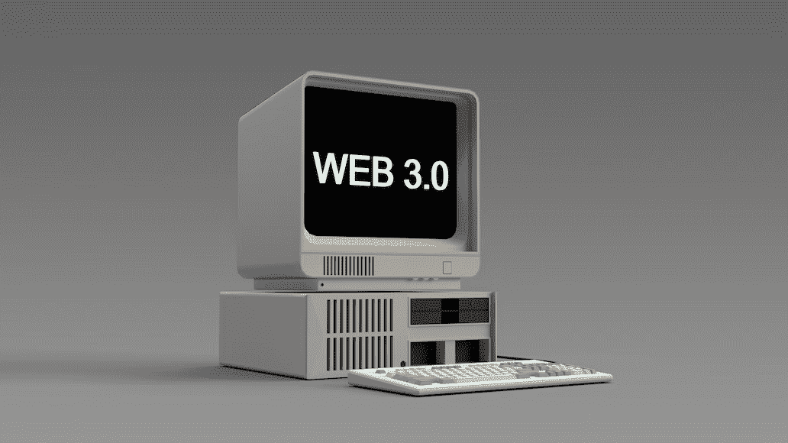
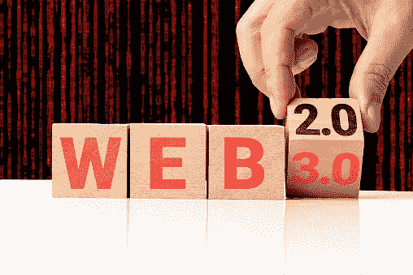

# WEB3 (Web 3.0)是什么？互联网(万维网)的演变解释。

> 原文：<https://medium.com/coinmonks/what-is-web3-web-3-0-all-about-evolution-of-the-internet-world-wide-web-explained-1404349ad51f?source=collection_archive---------24----------------------->

***Web3(或 Web 3.0)被称为第三代万维网。它促进去中心化的治理，并寻求让用户对他们的数据有更大的控制权。***

互联网的巨大发展简直令人惊叹。从 20 世纪 90 年代末最早引入互联网到现在可能实现的许多功能和好处，我们已经看到了我们与互联网交互方式的快速改进。

***互联网(有时被称为“网”)是计算机网络的集合体。使用因特网，用户可以通过这个网络中的网络从他们自己的计算机上访问任何其他计算机上的信息，只要他们有这样做的授权。***

这些年来，互联网已经发生了巨大的变化，它现在提供的实用程序与它最初推出时相比几乎已经面目全非。互联网的发展可以分为三个不同的阶段:Web 1.0、Web 2.0 和 Web 3.0。

为了理解什么是 Web3，首先了解互联网的历史以及它多年来的发展是很重要的。

# Web 1.0:只读(1989 年至 2004 年)

第一个已知的互联网是 Web1，通常被称为“只读”互联网，完全是关于阅读和查找信息的。

由 Berners-Lee 开发的 Web 1.0 主要由静态网站组成，其中许多网站主要由公司所有。它存在于 1989 年到 2004 年之间，用户之间基本没有互动。

大多数用户是内容消费者，而创作者主要是网站开发者，他们建立的网站主要以文本或图像的形式提供信息。

## **Web 1.0 的主要缺点**

1.  Web 1.0 只是一个没有用户交互或参与的信息网关。
2.  它的特点是单向通信系统，只允许通信从创作者流向用户，而不是相反。

# Web 2.0:读写(2005 年至今)

接下来是 Web2，即“读写”或“用户生成”网络，大约在 2005 年。

在这里，人们可以利用互联网的第二版做更多的事情，而不仅仅是在网上阅读信息。随着 Web 2.0 的引入，公司不再仅仅提供内容供用户消费，而是开始提供平台来共享用户生成的内容并参与用户间的交互。

用户现在可以在网上分享信息并相互交流。这主要是因为社交媒体的发展。

## Web 2.0 的主要缺点

1.  **集中化** — Web2 由大型组织拥有和管理的相当大一部分互联网组成。像谷歌、推特和脸书这样的大公司拥有并管理托管他们平台的服务器；因此，他们有权限制和控制用户帐户和数据。

例如，YouTube、Shopify、Meta 和 Twitter 等中央集权组织限制前总统唐纳德·特朗普在其任何平台上创建内容。这显示了这些组织对其用户的控制和权力。

**2。货币化**—web 2 公司最常见的两种赚钱方式是通过广告或出售用户数据。更多的用户数据转化为更有针对性的广告和更多的点击，这增加了众多 Web2 公司的广告收入，包括谷歌、脸书、Twitter 和其他公司。

尽管这些收入是由用户产生的，但这些组织保留了其中的一部分。在这些平台上，用户和创作者被留下来争夺剩下的一点点。

正如我们今天所知，Web 2.0 的基本功能和使用是围绕用户数据的利用和集中化而构建的。

**3。数据安全**——由于依赖于中央服务器，包括脸书在内的大多数 Web2 公司在保护用户数据方面都是臭名昭著的糟糕，并且经历了无数次数据泄露。

例如，在 2019 年发生的[最近一次脸书数据泄露事件中，超过 5.3 亿用户的敏感信息被曝光。](https://www.npr.org/2021/04/09/986005820/after-data-breach-exposes-530-million-facebook-says-it-will-not-notify-users)

**4。隐私** —用户的隐私有限，对他们在 Web2 上的数据及其存储方式没有任何控制权。公司经常在用户不知情的情况下收集和存储用户数据。负责这些平台的公司成为这些数据的所有者和控制者。

此外，如果用户居住在担心言论自由有害影响的国家，他们的身份可能很容易受到威胁。当服务器位于中心位置时，政府可以很容易地监管、关闭或监控用户的帐户，而且他们可以随心所欲地这样做。

# Web 3.0:读写所有

Web 3.0，通常被称为“读写自有网络”，已经变得如此众所周知，以至于它经常被认为是互联网发展中的下一个重大发展步骤。

但是刚刚**web 3**是什么？

好吧，让我们把事情简化一点。别再大言不惭了！

Web3 基本上是互联网的一个版本，它将数据所有权和 T2 控制权转移给用户。它的主要目标是通过[区块链技术](/coinmonks/blockchain-for-10-year-olds-c2728b94e00e)、[加密货币](/coinmonks/blockchain-book-101-bitcoin-all-you-need-to-know-f21a7887b18)和 [NFTs](/coinmonks/nfts-for-10-year-olds-what-is-an-nft-non-fungible-tokens-explained-f3b9369a038c) 将所有权和权力归还给用户。

想象一下，使用一个 web 界面，您不仅可以阅读和创建内容，还可以拥有和控制您创建的平台和内容。在这种情况下，权力和控制权都不属于任何特定的人或团体。因为区块链上的交易无法更改，所以没人能审查你的账户或删除你的内容。

2014 年，[以太坊](https://ethereum.org/en/)联合创始人和[波尔卡多](https://polkadot.network/)创始人[加文·伍德](https://gavwood.com/)创造了“Web 3.0”这个词。这个词被用来描述“建立在区块链上的去中心化在线生态系统”，这个词在 2021 年变得更加流行。

## Web 3.0 的特性

Web3 有一些突出的特性，可以解决困扰 Web2 的大部分问题。这些特性是 Web3 从互联网的其他版本中脱颖而出的主要吸引力和原因。下面讨论其中的一些功能:

**去中心化** : Web3 采用了一种模式，在这种模式下，互联网及其内容的所有权在创造者和用户之间分配，而不是由少数几个集中的组织管理和拥有。

有了 Web 3.0，用户可以完全控制他们的数据，并可以通过分散的数据网络交换数据，从而保持所有权控制。

**所有权**:web 3 提供无与伦比的数字资产所有权这一事实是其关键特性和优势之一。

例如，购买游戏内物品的 Web2 游戏玩家知道这些购买与他们的账户相关，不能转让或转售。不管他们花了多少钱，如果游戏开发者决定终止这个账户，他们将会失去这些物品。此外，如果他们退出游戏，他们将失去在这些游戏内物品上花费的钱。

然而，随着 Web3 的出现，没有人，甚至是游戏的开发者，有权撤销你的所有权。此外，如果您决定停止玩游戏，您可以在专门为这些物品创建的二级市场上转让或出售您的游戏内物品。

**不可信**:有了 Web3，你不必信任第三方——一个机构、一个人或任何中央权威机构——它们可能会阻碍你和你的交易或数据。

通过利用分散的对等网络，Web3 的参与者能够直接相互通信，而不需要可靠的中间人。

**原生支付**:web 2 的支付基础设施依赖于银行和支付处理器，这是它带来的主要问题之一。这一模式不包括没有银行账户的人或碰巧居住在外国的人。另一方面，Web3 建立了一个鼓励包容性的全新系统。

Web3 不依赖于传统的集中式基础设施，如银行和支付处理器，而是利用加密货币进行在线交易、支付和资金转移，这些都是在个人之间直接进行的，没有第三方的干预。

## **最终想法**

集中化有助于数十亿人上网，并有助于发展 Web2 赖以繁荣的坚实而强大的基础设施。然而，少数中央集权的组织牢牢地控制了相当大一部分互联网，使他们拥有上帝般的影响力和控制权。

Web3 为困扰 Web2 的问题提供了一个合适的解决方案。[去中心化](/coinmonks/defi-for-10-year-olds-what-is-decentralized-finance-and-how-does-it-work-2e7575a9668f)、[区块链技术](/coinmonks/blockchain-for-10-year-olds-c2728b94e00e)、 [NFTs](/coinmonks/nfts-for-10-year-olds-what-is-an-nft-non-fungible-tokens-explained-f3b9369a038c) 和加密货币都被 Web3 用来将权力从中央集权的公司转移到个人手中。

然而，即使有了 Web3 的所有优势，仍然有许多障碍需要消除，以便生态系统得到充分发展。

> 请留下评论，或者更好的是，如果有任何进一步的问题，请在 Twitter ( [@lanre aderemi)](https://twitter.com/lanre_aderemi) 上直接给我发消息，我会尽快做出回应。感谢你的阅读，如果你喜欢这个故事，给我一些掌声，记得打开电子邮件通知，第一个知道我的下一篇文章何时发表！

不要忘记点击“关注”按钮，打开电子邮件通知，以获取更多像这样的故事；-)

> *交易新手？试试* [*密码交易机器人*](/coinmonks/crypto-trading-bot-c2ffce8acb2a) *或* [*复制交易*](/coinmonks/top-10-crypto-copy-trading-platforms-for-beginners-d0c37c7d698c)
> 
> *分散密码持有量，了解* [*币安替代品*](https://coincodecap.com/binance-alternatives)
> 
> *加入 Coinmonks* [*电报频道*](https://t.me/coincodecap) *和* [*Youtube 频道*](https://www.youtube.com/c/coinmonks/videos) *获取每日* [*加密新闻*](http://coincodecap.com/)

# 另外，阅读

*   [复制交易](/coinmonks/top-10-crypto-copy-trading-platforms-for-beginners-d0c37c7d698c) | [加密税务软件](/coinmonks/crypto-tax-software-ed4b4810e338)
*   [网格交易](https://coincodecap.com/grid-trading) | [加密硬件钱包](/coinmonks/the-best-cryptocurrency-hardware-wallets-of-2020-e28b1c124069)
*   [密码电报信号](/coinmonks/top-3-telegram-channels-for-crypto-traders-in-2021-8385f4411ff4) | [密码交易机器人](/coinmonks/crypto-trading-bot-c2ffce8acb2a)
*   [最佳加密交易所](/coinmonks/crypto-exchange-dd2f9d6f3769) | [印度最佳加密交易所](/coinmonks/bitcoin-exchange-in-india-7f1fe79715c9)
*   面向开发人员的最佳加密 API
*   最佳[密码借贷平台](/coinmonks/top-5-crypto-lending-platforms-in-2020-that-you-need-to-know-a1b675cec3fa)
*   [免费加密信号](/coinmonks/free-crypto-signals-48b25e61a8da) | [加密交易机器人](/coinmonks/crypto-trading-bot-c2ffce8acb2a)
*   [杠杆代币的终极指南](/coinmonks/leveraged-token-3f5257808b22)