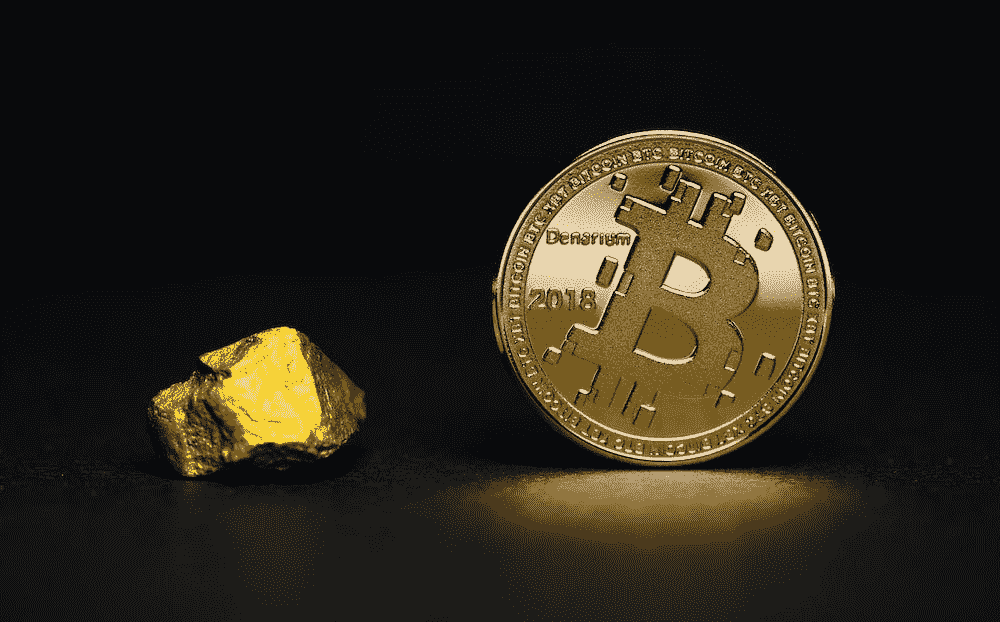

# 什么是包装比特币？

> 原文：<https://medium.com/coinmonks/what-is-wrapped-bitcoin-3fa1bec9dc69?source=collection_archive---------18----------------------->

如果你还没有听说过包装比特币，那你一定会喜欢上它。包装比特币是一个新项目，允许你在以太坊区块链上使用比特币。这意味着你现在可以在基于以太坊的应用和智能合约中使用比特币。

如果你是加密货币世界的新手，包装比特币是开始使用比特币的一个很好的方式。这也是一个以创新的方式使用比特币的好方法…