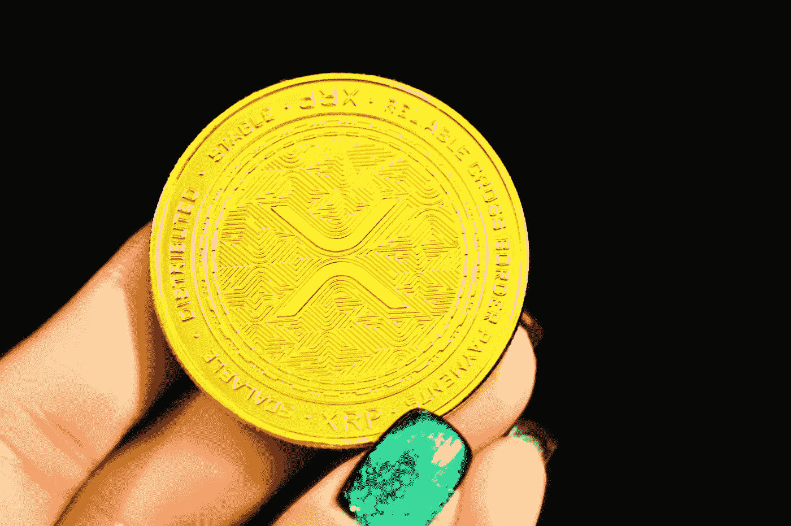

# 什么是包装 Xrp (Wxrp)，它是如何工作的？

> 原文：<https://medium.com/coinmonks/what-is-wrapped-xrp-wxrp-and-how-does-it-work-a56607cb08c8?source=collection_archive---------12----------------------->

## [加密货币与投资](/@TraderB/list/cryptocurrency-and-investment-8d81ae749faa)

## 最近也发现了。

Photo by [Kanchanara](https://unsplash.com/@kanchanara?utm_source=medium&utm_medium=referral) on [Unsplash](https://unsplash.com?utm_source=medium&utm_medium=referral)

**包装 XRP (wXRP)是一种与 XRP (XRP)挂钩的加密资产，可用于区块链，而不是 Ripple 的本地 XRP 总账。**包装 XRP 是一种令牌，旨在解决跨不同网络的资产可移植性问题。