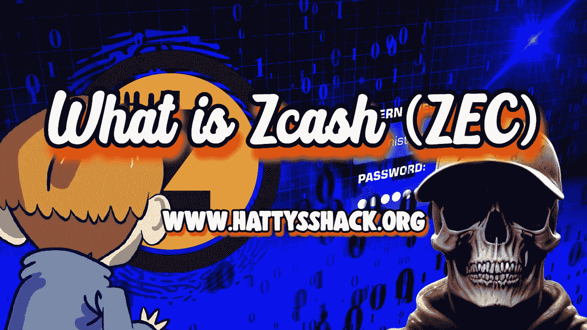

# 什么是 Zcash (ZEC)

> 原文：<https://medium.com/coinmonks/what-is-zcash-zec-bd3a9ce36a1b?source=collection_archive---------23----------------------->

约翰·霍普金斯大学的教授马修·格林和他的学生于 2013 年开始研发 ZEC T1。

Zcash 的最终开发和发布是在 2016 年 10 月 28 日，由[电子硬币公司](https://electriccoin.co/) (ECC)完成。ECC 由信息安全和密码学专家 Zooko Wilcox-O'Hearn 创建。