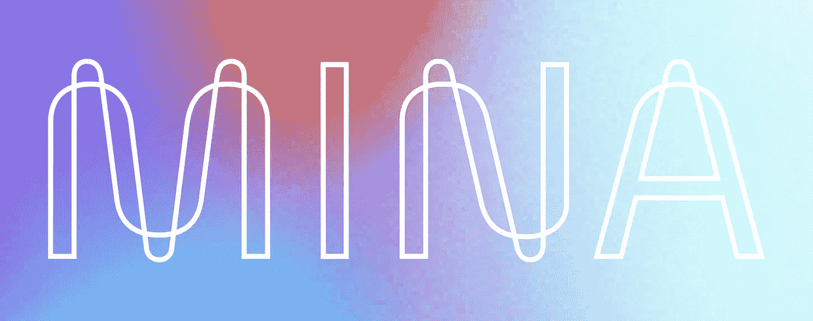
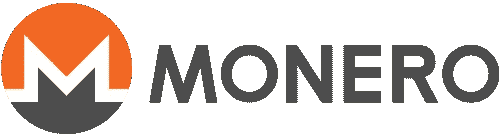
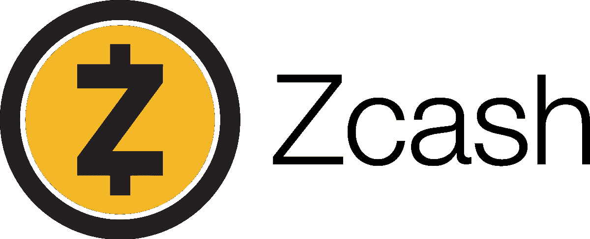
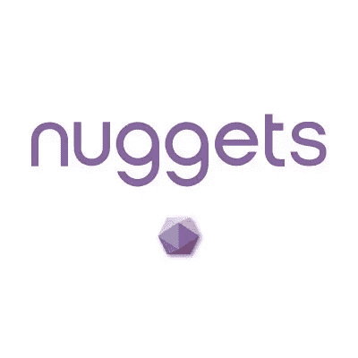
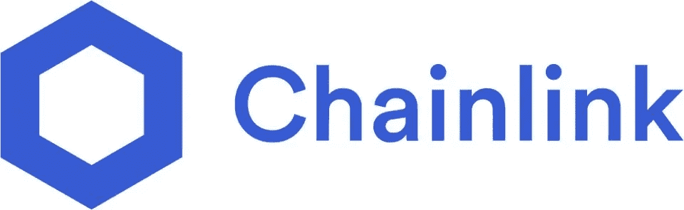
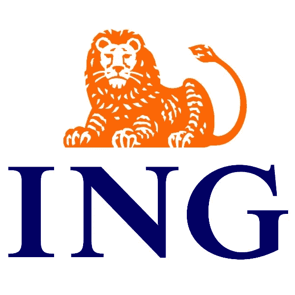

# 零知识证明是用来做什么的？—所有 ZKP 使用案例

> 原文：<https://medium.com/coinmonks/what-is-zero-knowledge-proof-used-for-all-zkp-use-cases-4e6326a25608?source=collection_archive---------1----------------------->

Boomish.org

# 关键见解

*   零知识证明(zkp)被定义为除了需要证明的命题的正确性之外，不传递任何额外知识的证明。
*   零知识证明的使用案例目前包括从身份、密码到成员身份验证。
*   零知识证明是加密货币领域中广泛使用的加密技术，但整个加密货币中 ZKP 的采用正在快速增加。
*   机构采用零知识证明已经开始，并且可能会继续下去。

# ‍
什么是零知识证明？

‍

零知识证明(ZKP)是一种密码学方法，其中被称为证明者的一方可以向被称为验证者的另一方证明他们知道一组信息，而无需向验证者展示实际信息。

‍

零知识证明(zkp)本质上被定义为除了需要证明的命题的正确性之外，不传递任何额外知识的证明。

‍

**关于什么是零知识证明以及它们具体如何工作的深入文章可以在** [**这里**](https://www.boomish.org/blogs/what-are-zero-knowledge-proofs) **找到。**

# 不同类型的零知识证明

‍

零知识证明有很多变种。这些不同的类型包括 zk-SNARKS、zk-STARKS、zk-SNARGS、Bulletproofs 和 zk Rollups。

‍

关于不同零知识证明的深度文章可以在这里找到。

‍

# 零知识证明的不同用例

‍

## 身份证明

‍

身份证明在认证过程中使用零知识证明，在该过程中，一方向另一方证明他们拥有确定证明者身份的特定信息。

‍

示证者验证所需的数据，而无需在示证者和验证者之间来回提供任何更敏感的或个人的数据。

‍

证明者将他们的信息提供给计算机算法，计算机算法检验该信息，并且如果证明者提供了足够的证明，则验证者被通知证明者具有验证其身份的必要信息。

‍

这样，验证者不知道任何信息，但是验证者已经成功地验证了证明者实际上拥有继续给定过程的必要标识。

‍

这确保了证明者可以控制他们的个人信息，而不必放弃这些信息。

‍

## 密码证明

‍

零知识口令证明(ZKPP)是一种零知识证明，它允许证明者向另一方(验证者)证明它知道口令的值，而不向验证者透露除了它知道口令之外的任何事情。

‍

零知识口令证明防止任何一方在不与知道口令的一方交互的情况下验证对口令的猜测，并且在最佳情况下，在每次交互中正好提供一个猜测。

‍

零知识口令证明的一个常见用途是在认证系统中，其中一方想要使用口令向另一方证明他们的身份，但是不希望第二方或任何其他人知道关于口令的任何信息。

‍

例如，应用程序可以在不处理密码的情况下验证密码，支付应用程序可以在不接触或不了解金额的情况下检查账户余额。

‍

## 成员资格证明

‍

因为零知识集成员证明已经被荷兰 ING 银行集成。

‍

零知识集成员资格(ZKSM)允许用户证明他们被包含在大型公共集的一部分中，而无需披露他们被包含在大型公共集的哪个部分中。

‍

是的，这看起来相当复杂(整个 ZKP 都相当复杂)，但有了 ING 整合的真实例子，这一点肯定会变得更加清晰。

‍

在荷兰国际集团的案例中，ZKSM 的解决方案允许银行确认客户居住在欧盟国家，而不需要透露客户居住的确切国家。

‍

# 区块链中的零知识证明

‍

零知识证明主要用于加密和区块链技术。

‍

零知识证明正获得更多机构的关注，并已被包括银行在内的众多机构采用。

‍

# 迈纳

‍

Mina 开发了自己的区块链，通过零知识协议存储其块，将其区块链保持在 22kb 的存储大小，使其成为加密货币领域最轻的区块链。

‍

Mina 的零知识应用程序(zkApps)可以私下与任何网站进行交互，并访问经过验证的真实世界数据以供链上使用。

‍

Mina 使用户能够与任何网站进行私人互动，无论是链上还是链下，都可以使用他们经过验证的真实世界私人数据，而不会泄露他们的数据。

‍

Mina 还使用户能够安全登录 Mina 访问的任何网站，而无需创建帐户或交出他们的个人数据。

‍

**nil 基金会目前正在做的工作是在 Mina 和以太坊之间建立一座桥梁，以太坊是加密货币中最大的智能合约区块链。**

‍

Mina 取得的进展不仅可以在以太坊之间，而且可以在许多不同的链之间建立不可信的桥梁。

‍

# 莫内罗

Monero 是一种加密货币，为用户及其交易维护了高度隐私。

‍

Monero 网络正在全面整合 Bulletproofs，这是一种零知识证明，于 2018 年引入他们的代码。

‍

Monero 的 Bulletproofs 旨在确保机密交易中存储的信息不包含虚假信息。

‍

Monero 最近升级了防弹 ZKP 系统的代码，使其成为新的改良防弹+ ZKP 解决方案。

‍

在 Monero 网站上，声明“Bulletproofs+的代码现已可用，这是一个零知识证明系统，可用于 Monero 协议中，取代现有的 Bulletproofs 零知识证明系统”。

‍

新的 Bulletproofs+协议将使交易规模更小，钱包生成速度更快，网络参与者验证速度更快。

‍

“虽然代码是功能性的，并包括对底层算法的测试，但如果选择在未来的 Monero 网络升级中部署，则应由第三方审计员进行审查。代码被许可使用是希望它能被广泛使用”。(getmonero.org，Bulletproofs+)

# ‍Zcash

‍

Zcash 在他们自己的公共区块链上托管他们的交易，尽管同时 Zcash 通过伪装的零知识地址给你保密交易和财务隐私的选择。

‍

**零知识证明允许在不暴露发送者、接收者或交易金额的情况下验证交易。**

Zcash 允许用户共享一些交易细节，用于合规或审计目的，并隐藏其他私人信息。

‍

交易金额全部加密，不公开可见。这种类型的加密只能通过使用零知识证明来实现。

‍

# 金砖

Nuggets 使用开放标准的 W3C 可验证凭证来允许用户证明他们的凭证，甚至不必通过使用零知识证明来提供任何个人信息。

‍

掘金网络使用密码零知识证明和区块链来创建身份识别系统，该系统可以通过共享私人信息来进行密码证明，而无需认证。

# 链环

Chainlink 实施了一个名为 [DECO](https://research.chain.link/deco.pdf) 的零知识证明 oracle 解决方案，这是一个隐私保护协议。

‍

**DECO 通过以保护隐私的方式证明其信誉，支持广泛的智能合同用例。**

‍

这可以使借款人借入抵押不足的贷款。用户可以展示他们的信誉，同时保护他们的敏感信息。

‍

借款人可以通过其他授权的在线来源(如已建立的机构)来展示他们的凭据，而不会暴露潜在的敏感数据。

‍

# 荷兰 ING 银行

11 月 16 日，在阿姆斯特丹举行的首届企业以太坊联盟活动上，ING 银行宣布首次发布其零知识范围证明(ZKRP)解决方案。

‍

ZKRP 解决方案是由荷兰国际集团自己的区块链团队开发的，并证明了其显著的效率改进。

‍

荷兰国际集团使用零知识范围证明(ZKRP)来允许他们的客户证明他们账户中的金额，而无需实际显示金额。

‍

ZKRP 允许在一个数字范围内验证数字数据。ING 的零知识范围证明解决方案允许用户证明他们有一个在已知范围内的秘密数字。

‍

例如，一个抵押贷款申请人可以证明他们的工资在一定范围内，而不用透露他们的确切工资。

‍

荷兰国际集团有自己的区块链团队，最近还开发了另一个零知识证明解决方案，称为零知识集成员(ZKSM)。

‍

如前所述，零知识集成员资格允许 ING 验证一个客户生活在一个属于欧盟的国家，而不暴露确切的国家。

‍

# 还有哪些地方可以实现零知识证明？

在更大的范围内，它可以用于更多的地方，包括全球身份、密码和成员身份验证。

‍

最终，零知识证明的最终愿景将是能够在透明系统(如以太坊这样的公共区块链网络)中使用私人信息保护，而实际上根本不会公开泄露您的敏感数据/个人信息。‍

‍

这一过程将同时提高透明度、安全性和隐私性，这看起来肯定是自相矛盾的。

‍

虽然区块链被设计成完全透明，任何人都可以看到和下载存储在区块链的所有数据，但 ZKP 技术应该能够允许区块链用户使用他们在区块链的私人信息，而不会实际泄露他们在区块链的敏感信息。

‍

从荷兰 ING 银行采用 ZKPs 可以看出，机构开始意识到他们的客户希望获得更多的隐私。

‍

**这种对隐私的渴望的革命很大程度上是由于人们意识到加密货币能够提供更多的隐私和匿名性。**

‍

人们开始意识到政府和机构对他们的巨大控制力，以及没有必要维持对信息流的垄断。

‍

机构开始意识到他们的客户在很大程度上重视隐私，这将推动机构开始采取更多的做法来维护用户的隐私。

‍

如果机构拒绝在其服务中融入更多隐私，它们将开始失去客户。

‍

由于有其他更私人的、通常同样安全的选择，愿意放弃他们对分散的区块链人信息的垄断，他们会被吸引到那里。

‍

# 结论

‍

目前有许多不同形式的零知识证明，它们都为用户提供了更多的隐私。

‍

零知识证明已经开始被采用，因此很可能成为机构最常采用的区块链和隐私功能。

‍

如果机构对客户的流动有很好的了解，它将迫使机构采用某种形式的隐私技术，这很可能是零知识证明技术。

> 交易新手？试试[密码交易机器人](/coinmonks/crypto-trading-bot-c2ffce8acb2a)或者[复制交易](/coinmonks/top-10-crypto-copy-trading-platforms-for-beginners-d0c37c7d698c)