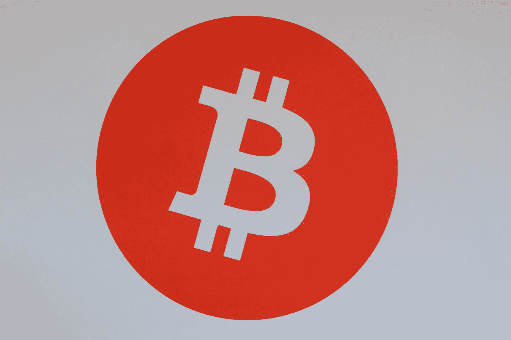
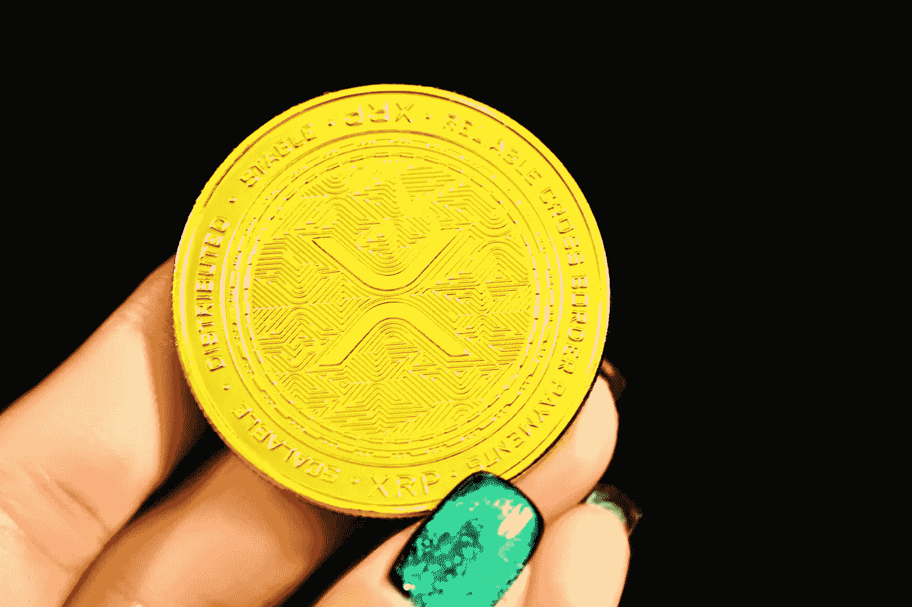

# 什么是好的硬币标志？

> 原文：<https://medium.com/coinmonks/what-makes-a-good-coin-logo-839e70af9480?source=collection_archive---------43----------------------->

加密货币席卷全球，随之而来的是新标识和品牌的激增。有些是好的，有些是坏的，有些是彻头彻尾的丑陋。这篇博文将带我们看看一些加密货币的标识。我们还将探究为什么某些设计行得通，而另一些却行不通。所以事不宜迟，我们开始吧！

我们名单上的第一个标志是比特币，这是最早的也是最广泛使用的加密货币。设计简单却有效，黑色背景衬托金色 B。负空间的使用也很巧妙，因为它形成了硬币的形状。总的来说，这个强烈而标志性的标志完美地代表了比特币品牌。

接下来是以太坊，市值第二大的加密货币。以太坊的标志是一个简单而优雅的黄色和蓝色的无限符号。这个设计完美地概括了区块链技术的概念，它构成了以太坊的基础。这也是一个很好的例子，说明极简主义的标志可以非常有效。

我们名单上的第三个是莱特币，通常被称为“比特币的黄金”莱特币的标志与比特币的类似，黑色背景下镶有银色的 L。然而，一些微妙的差异使它与众不同。首先，L 放在标志的中心，而不是放在旁边。二、莱特币 logo 有两条线贯穿，代表莱特币网络的速度和效率。

> 交易新手？试试[加密交易机器人](/coinmonks/crypto-trading-bot-c2ffce8acb2a)或者[复制交易](/coinmonks/top-10-crypto-copy-trading-platforms-for-beginners-d0c37c7d698c)

排名第四的是 Ripple，这是一种加密货币，最近受到了很大的关注。Ripple 标志是一个简单而有效的设计，以白色背景上的蓝色“X”为特色。X 代表波纹网络，而蓝色象征可信赖性和稳定性。总的来说，这个干净而现代的标志完美地代表了 Ripple 品牌。

现在是完全不同的东西:Dogecoin。这种著名的加密货币开始只是一个笑话，但后来已经发展成为一种成熟的货币，拥有自己的专门社区。Dogecoin 标志是异想天开的，以黄色背景为背景的卡通柴犬为特色。这个设计简单而有效，完美地概括了 Dogecoin 社区的乐趣和友好的本质。

这就是你们看到的，一些商标的综述。你怎么想呢?还有其他你认为值得上榜的设计吗？我很想在下面的评论中听到你的想法。如果你的组织需要加密货币和区块链作家，我很乐意帮助！[点击这里了解更多](https://www.fiverr.com/share/W0XN0E)。

> 加入 Coinmonks [电报频道](https://t.me/coincodecap)和 [Youtube 频道](https://www.youtube.com/c/coinmonks/videos)了解加密交易和投资

# 另外，阅读

*   [OKEx vs KuCoin](https://coincodecap.com/okex-kucoin) | [摄氏替代品](https://coincodecap.com/celsius-alternatives) | [如何购买 VeChain](https://coincodecap.com/buy-vechain)
*   [ProfitFarmers 回顾](https://coincodecap.com/profitfarmers-review) | [如何使用 Cornix Trading Bot](https://coincodecap.com/cornix-trading-bot)
*   [如何匿名购买比特币](https://coincodecap.com/buy-bitcoin-anonymously) | [比特币现金钱包](https://coincodecap.com/bitcoin-cash-wallets)
*   [瓦济里克斯 NFT 评论](https://coincodecap.com/wazirx-nft-review) | [比茨盖普 vs 皮奥克斯](https://coincodecap.com/bitsgap-vs-pionex) | [坦吉姆评论](https://coincodecap.com/tangem-wallet-review)
*   [如何使用 Solidity 在以太坊上创建 DApp？](https://coincodecap.com/create-a-dapp-on-ethereum-using-solidity)