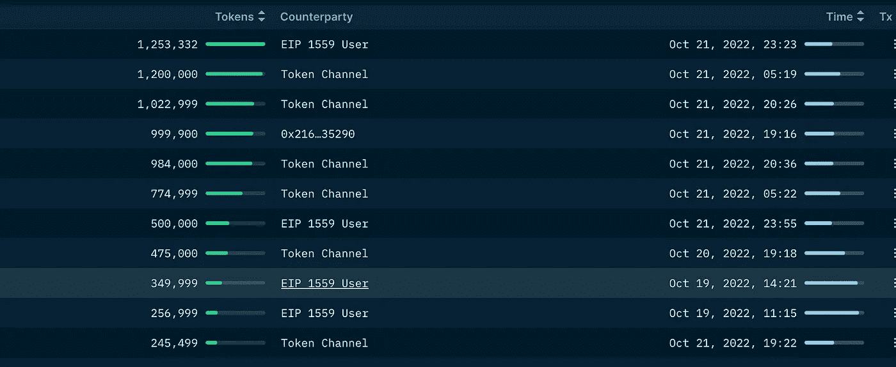

# 什么使零层厚？

> 原文：<https://medium.com/coinmonks/what-makes-layer-zero-thick-7b56d448442?source=collection_archive---------23----------------------->

LayerZero 是一个 Omnichain 互操作性协议，设计用于跨链传递轻量级消息。LayerZero 通过可配置的不信任度提供真实可靠的消息传递。该协议被实现为一组节能、不可升级的智能合同。

# 哪些我们最喜欢的风投已经被授予了？

*   LayerZero 实验室筹集了 1.35 亿美元的资金。
*   [A16z](https://medium.com/u/953b8e58af4b?source=post_page-----7b56d448442--------------------------------) 、比特币基地、FTX、迪法恩斯资本、斯巴达、CoinFund、Sino Global Capital、Multicoin Capital、红杉、Delfi Digital、GEMINI 和币安等等。
*   注意，投资者之一是 PayPal Ventures。
    (L0 是他们作品集里的第一个 web3 项目)。

# 对其技术的深入探究。

硅谷公司 a16z 的创始人 Andreessen Horowitz 将零层定义为 ***“旨在缓解全链条活动当前局限性的链条”。***

## 不使用 2 个字就不能定义零层；

*   互操作性。
*   不信任。

Omnichain 旨在显著改善跨链活动的工作方式，并消除其明显的瓶颈。

一些已知的方法已被用于解决**“桥接三难困境”**，尽管效率不高，即**“即时保证终结性、统一流动性和本地资产。”**如澳大利亚领先投资公司所述；阿波罗资本。

## 这些现有的方法是:

*   让中间链形成共识，验证并在链之间转发消息。
*   在链上运行轻节点。

让我们讨论一下它们的缺点；

## 中间链的使用:

所有消息都通过这个链接收、验证和发送。如果出现“共识腐败”，可用的流动性可以立即从所有相关链条中抽走。

## 利用链上灯节点:

轻型节点(也称为瘦客户端)不像完整节点那样存储区块链的完整拷贝。通过只存储块头(而不是块事务)，轻量级节点可以在内存资源有限的设备上运行，比如智能手机。轻型节点依赖于完整节点来运行。

这些光节点接收并验证相对的成对链的这些块报头。然后，这些块头在链上根据包含交易证明的消息进行验证，以证明真实性。这是最安全的信息传输方式，但价格高得离谱，每条成对链每天要花费数千万美元。

# 零层如何在跨链活动中创造范式转变？

## 进入超轻节点(ULN):

这利用了轻节点的安全性，但是具有中间链的成本不变性。
使用了相同的链上轻节点过程，但在这种情况下，块头不是按顺序操作，而是“由分散式 oracles 按需流式传输”。

LayerZero 通过要求两个独立的实体，即 **Oracle** 和 **Relayer** ，来确证两个端点之间的消息事务/传输，从而确保了跨链
通信的有效性。

## 该事务按以下顺序工作:

当用户应用(UA)在这种情况下是第 0 层，从链 X 向链 Y 发送消息时，该消息通过链 X 端点被路由。然后，所述端点将消息和目的地链通知给先知和中继器。然后，oracle 负责将块头发送到链 Y 端点，而 relayer 提交事务证明。
在目的链上验证证明，并将消息转发到目的地址。

# 用途和特性:

零层不仅仅是桥接。
LayerZero 启用跨链；国家共享、桥接、借贷、互换、治理等等。

零层的影响应该超越使用 [EVM](https://ethereum.org/en/developers/docs/evm/) 或[非 EVM](https://ethereum.org/en/developers/docs/evm/) 兼容链的偏见，因为 omnichain 是互操作性的最佳缩影。

零层解决了现实世界中**同步状态**的问题。omnichain 协议通过为每个涉及的跨链协议提供单一的代码库、用户界面和安全目录来解决这个问题。

# 零层提供解决方案的关键领域；

## 交叉链索引:

LayerZero 支持跨链
DEX(跨链桥),通过发送消息 b/w 链和两个链上存在的流动性池来专门处理本机资产，使用户能够将其本机资产存放在
一个池中，并从另一个池中提取本机资产，这与现有的 DEX 设计相反，现有的 DEX 设计发行
包装令牌或通过中间侧链。

LayerZero 的消息传递原语足够强大，可以实现直接桥接(1:1 定价)、自动做市(ab = k 定价)和任何其他类似于 curve DAO 定价的衍生产品。

零层最大的亮点之一是它的**“不可信的有效交付”。**

## 多链产量聚合:

许多当前(如果不是全部)的收益聚合器都是单链的。这些单链产量聚合系统的一个关键弱点是，它们不能利用当前生态系统之外的任何产量机会，可能会错过许多最佳产量。
通过为用户获得和利用更好的收益提供途径，多链收益聚合器将提供比单链收益聚合器大得多的机会。

## 多链借贷:

今天的贷款人受到不持有资产的链条瓶颈的限制。这些用户必须将他们的资产连接到新的链，转换成不同的货币，借出资产和借入期望的资产，然后将所述资产连接到目的地链。
有了零层，这些贷款人可以将他们的资产保留在原来的链条中(从而消除了原本应该遵循的漫长过渡过程)，将其借出，然后以新链条的面值借入资产。

这还消除了额外的交易成本，如过桥费用和掉期 gwei，这些成本本来是要支付 2 倍的。

# 零层正在被零售企业采用吗？

人们肯定会期待像零层这样解决现实世界问题的项目获得关注和零售使用。事实正是如此。

Omnichain 协议目前正受到散户投资者和大公司 ie 的青睐。机构和风险投资家。

在文章的开头，已经精心挑选了资助这些项目的公司名单。

作为背景，互用性协议 LayerZero 已经发布了**星际之门**，这是一个跨不同区块链交换令牌的协议。

阿波罗资本的团队在三月的凌晨时分起床，希望在公开拍卖期间购买一些星际之门金融代币——但像几乎所有其他人一样，他们被拒之门外。亿万富翁加密投资者 Sam Bankman-Fried 的 Alameda Research 公司设法买下了拍卖的全部 2500 万美元的代币，没有留给其他数千计划参与的人。该公司向矿工支付了 5.744 乙醚(约 19，000 美元)，以确保其交易在所有其他交易之前得到优先处理。
这表明了加密领域最大的参与者之一[阿拉米达研究公司](https://medium.com/u/a81e091b6b73?source=post_page-----7b56d448442--------------------------------)的信念。

零层还与 Aptos 合作——你知道，这个项目现在非常热门。

在这里快速阅读我的 Aptos 文章。

此外，虽然零层仍然处于 [testnet](https://en.m.wikipedia.org/wiki/Testnet#:~:text=In%20blockchain%20technology%2C%20a%20testnet,funds%20or%20the%20main%20chain.) 阶段，但它的采用令人难以置信，合同数量稳步上升至超过 7，000 份有效合同。

许多项目已经部署在零层。

此外，由于它似乎是空投 szn，许多市场参与者目前投机于$ZRO 令牌。

在撰写本文时，零层 Aptos 池的前 10 名 USDC 美元储户是过去 2 天内的新钱包，他们的 USDC 美元来自 FTX。

前 10 名(470 名储户中)的地址存储了 TVL 75%的存款(600 万美元)，试图进行潜在的空投。

# 结论

没有人知道是否会有$ZRO 代币，但如果它实现了，就值得一试。

零层凭借其突破性的技术承诺了很多。

***免责声明*** *:本文仅代表作者个人观点。它仅用于信息和教育目的，上述内容不应被视为财务建议。*

> 交易新手？尝试[加密交易机器人](/coinmonks/crypto-trading-bot-c2ffce8acb2a)或[复制交易](/coinmonks/top-10-crypto-copy-trading-platforms-for-beginners-d0c37c7d698c)