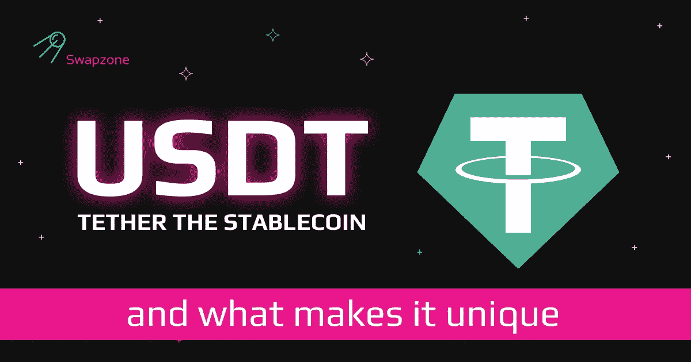

# 是什么让泰瑟(USDT)与众不同？

> 原文：<https://medium.com/coinmonks/what-makes-tether-usdt-unique-3793e2b7cf56?source=collection_archive---------7----------------------->

相当多的密码爱好者对这个问题没有明确的答案:什么是 USDT？本页将揭示关于主题的大量信息，并以简单明了的术语阐述所有关于系绳的知识。然而，在全面展开之前，你可以检查一下下面突出显示的要点，以帮助你理解 stablecoin。

**关于“USDT 是什么”这个问题的要点**

*   Tether 既是一种协议，也是一种加密货币。
*   作为一种协议，它被称为系绳，而作为一种货币，它是系绳。
*   Tether 提供几种加密货币，它们都是稳定的货币。它最受欢迎的硬币是 USDT。Tether (USDT)在加密市场中被广泛使用，大约有 730 亿个令牌分布在世界各地(截至撰写本文时)。
*   其他一些系绳发行的货币包括:系绳黄金(AUXT)，系绳欧元(EURT)，系绳比索(MXNT)和系绳人民币(CNHT)。其中三种稳定货币与货币价值挂钩，最后一种与黄金价值挂钩。

> 交易新手？试试[密码交易机器人](/coinmonks/crypto-trading-bot-c2ffce8acb2a)或者[复制交易](/coinmonks/top-10-crypto-copy-trading-platforms-for-beginners-d0c37c7d698c)

# USDT——一枚稳定的硬币

所有由 Tether 发行的货币都属于被称为 stablecoins 的加密硬币类别。稳定币是波动率较小的加密货币。这类加密资产的价格和价值与法定货币(美元、人民币)等波动性较小的资产挂钩。

# 系绳是如何工作的？

系绳 USDT 硬币在两方面挑战了密码系统的特性。与许多加密货币不同，USDT 既不开采也不分散。它遵循一种集中控制机制，在这种机制下，公司保留控制硬币发行和流通数量的权利。硬币的供给和需求的相互作用由公司手动控制。

Tether 由该公司储备资产支持，以确保 USDT 与美元保持一比一的汇率。不仅如此，在每一个需要将 USDT 兑换成美元或其他法定货币的地方。

作为保持透明度和问责制的一种方式，Tether 被授权公布其储备资产的财务证明。这份证明每季度发布一次，披露公司保存的资产类别。凭借上一次发行的追索权，Tether 的储备包括现金、商业票据、公司债券、贷款、数字货币和其他一些资产类别。Tether 采用了 IOU(我欠你的)模式，因此该公司承诺立即将稳定的硬币兑换成货币。

# 系绳简史

有史以来第一次提到 Tether 是在 2014 年，当时它发行了第一种名为“真币”的数字货币。真正的硬币是一种美元支持的货币，用于在比特币区块链上转移法定货币。它是由香港的 iFinex 公司创立的。真币后来在 2014 年晚些时候更名为 tether。自成立以来，Tether 已经扩展到不同的其他区块链(Solana，Tron，Ethereum，Avalanche，Polygon 和其他一些货币),并推出了几种货币。截至 2022 年 5 月的记录显示，就市值而言，USDT 代币是市场上第三大加密货币。

# 系绳是怎么背的？

Tether 运行在一个集中式加密系统中，其价值由创建公司拥有的不同资产和资源支持。这些资产与系留货币具有同等价值，并被保留在储备中，以便于立即将系留货币兑换为法定货币。

# Tether vs. TerraUSD(和以前一样)

两种加密货币的一个共同特征是波动性水平。它们都是稳定的货币，其价值取决于美元的价值。这意味着在价值上，Tether 和 TerraUSD 可以等同，因为这些货币的一个单位总是价值为 1 美元。然而，不同之处在于维护这些值的机制。

Tether 是一种担保稳定币，其系统通过公司的资产和储备确保其持续价值。因此，当储备中资源的价值等于流通中的代币的价值或者甚至更低时，则 Tether 已经达到完全储备。另一方面，TerraUSD 是一种算法稳定币的意思，它是由编程语言而不是现金储备支持的。与 Tether 相比，这种维护方案是一种更不稳定的方法，因为它已经几次跌破其价格挂钩，甚至被币安交易所平台暂停交易。

# 系绳与比特币

Tether 和比特币在许多方面都有所不同。然而，最明显的区别是波动的程度。虽然 Tether 是一种稳定的硬币，其价值与真实商品(黄金和美元)的价值挂钩，但比特币是一种自由浮动的硬币。它不是基于任何商品的价值。它的价值是由需求和供给的相互作用决定的。

两种货币的另一个显著区别是控制和第三方介入的程度。Tether 维持一个集中的金融模式，而比特币则是去中心化的。最后一个要提到的区别是，Tether 严格来说是一种价值存储工具，不像比特币那样旨在赚钱，并作为一种有投资回报的投资。

# 泰瑟与戴

戴很像系绳。他们都是稳定的同盟，然而，他们以不同的方式找到他们的支持。泰雷是由等值资产支持的，戴是由道支持的稳定货币。它维护一个分散的系统，不同于 Tether 的系统。它由一个分散的自治组织(DAO)管理。

# 泰瑟与 USDC

泰瑟和 USDC 是市场上最大的两家公司(截至本文撰写之时)。这两个国家在整个稳定的货币市场中占有 80%的市场份额，其中 USDT 占有 50%，USDC 占有 30%。一般来说，人们认为 USDC 的波动性较小，因为它有现金和现金等价物作为支持，而 USDT 则有同等价值的资产作为支持。这两种货币都保持 1 美元兑 1 枚硬币的汇率。

# 系绳是好的投资吗？

如前所述，Tether 更多的是一种储值货币，而不是赚取投资回报。因此，如果用投资作为衡量重要性的标准，泰瑟和许多其他稳定的公司可能都没有机会。投资不是系绳货币的强项，因为它不会直接升值。Tether 是一种避免密码系统高波动性同时仍能使用该系统的方法。因此，虽然在加密网络中没有任何东西是有保证的，但是 Tether 比许多其他令牌更有保证。

# 如何兑换 USDT

交换 USDT 是密码系统中最简单的交换过程之一。作为一种受欢迎的硬币，它有一个支持它的详尽的加密交换平台列表。然而，尽管找到并持有 USDT 货币是天衣无缝的，但错误地选择一个交易平台或钱包可能会毁掉整个天衣无缝的过程。因此，在做出选择之前，进行审查和研究几个选项是很重要的。其中最安全和最有效的是 Swapzone。它是一个受欢迎的交换平台，有一长串硬币。

该平台易于使用，交易程序简单，价格实惠，拥有成千上万的用户。要兑换 USDT，请访问 [Swapzone，](https://swapzone.io/)在那里开立一个包含所有必需信息的账户，然后按照概述的说明进行操作。整个过程可以在几分钟内完成。