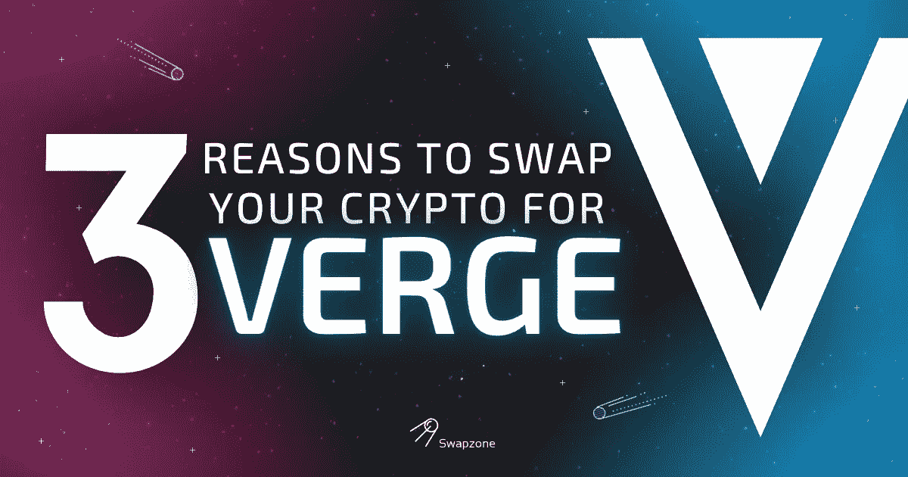

# 是什么让 Verge 脱颖而出:用你的密码换$XVG 的 3 个理由

> 原文：<https://medium.com/coinmonks/what-makes-verge-stand-out-3-reasons-to-swap-your-crypto-for-xvg-32ec8f2fd77c?source=collection_archive---------20----------------------->

作为市场上著名的加密货币之一， [**Verge (XVG) crypto**](https://vergecurrency.com/) 已经存在了很长时间，并且仍在增长。XVG 是最受信任的替代币之一，它有一个忠实的社区支持它。让我们来看看为什么你应该投资你的钱在这个密码的一些原因。

# 用例

T4 边缘硬币的主要目标是为数字世界提供一种支付手段，这种支付手段在日常使用和投资方面都有很好的用例。正如 the Verge 网站所言，该项目旨在创造“一种快速、高效和分散的直接交易方式”。

XVG 加密货币旨在鼓励人们利用数字货币的优势，并方便快捷地参与区块链交易。为此，verge 团队实施了以下工具:

*   **原子互换:**这允许不同加密货币之间的跨链交换，并使您能够将您的 Verge 硬币兑换成许多其他加密货币，而无需通过币安或比特币基地等中介。目前，使用第三方服务(如 Changelly 和 Shapeshift)可以完成这些转移。尽管如此，原子交换通过将它们直接集成到钱包软件本身，将使它们变得容易得多。
*   **TOR 集成:**这为用户提供了通过 TOR 浏览器连接的访问权限，使他们在浏览在线内容或进行在线交易时匿名(许多人认为这是一种隐私功能)。如果你担心被政府机构或公司跟踪，那么当你用 XVG 币在线购物时，这可能是一个重要的功能，因为它可以隐藏谁用 XVG 支付了多少钱——尽管请注意，即使启用了此功能，网站仍有可能跟踪 IP 地址，所以请注意不要对安全性过于自满。允许在公共区块链进行私人交易

# 隐私

隐私是加密货币中的一个热门话题，你应该知道 Verge 是一个隐私硬币。它可以用来保护您的身份，并确保交易无法通过元数据跟踪。然而，在区块链的边缘，所有的交易都是公开的。这意味着，即使有人能够找出哪些地址属于你，他们仍然可以跟踪你的消费。

Verge 自 2014 年以来一直存在，但直到 2017 年它才真正起飞，当时它推出了现在被称为私人交易的幽灵协议——一种允许用户在公共区块链上发送私人交易的技术(隐藏接收者是谁)。随着私人交易的启用，对于希望保持某些交易私密的人来说，Verge 已经成为越来越受欢迎的选择。

# 团队和社区

这是一个社区驱动的项目。Verge 已经在社交媒体方面建立了强大的存在，其团队非常活跃。开发商对社区也非常透明和开放，这使得投资者更容易就这是否是一个好的投资做出明智的决定。

Verge 有一个强大的社区，这意味着你可以与其他用户联系，分享关于硬币的信息。社区也非常乐于助人，愿意尽你所能帮助新手。

*   社交媒体网站: Verge 在 Twitter、YouTube 和 Reddit 等社交媒体网站上拥有大量粉丝。这意味着总是有人在谈论 XVG，因此您可以在白天或晚上的任何时间加入对话，并立即了解所有的变化。
*   **YouTube:** 在 YouTube 上，有许多视频是由那些使用 XVG 作为他们在网上购物或通过当地便利店(或其他地方)的 ATM 机亲自购买东西时选择的货币的人创作的。这些视频可以教会你一切，从特定时期(比如上个月)赚了多少钱，人们最常把钱花在哪里(比如沃尔玛)，他们最常买什么样的东西(通常是食品)，等等。

# 你为什么要投资 Verge？

Verge (XVG)是一种隐私币，使用 Tor 和 I2P 网络来匿名化交易。XVG 有一个忠诚的社区，一个强大的团队，以及 crypto 中最好的路线图之一。但最重要的是，Verge 是 crypto 中最受信任的 altcoins 之一，因为这个项目已经存在了 7 年多，即使在受到攻击后，社区也总是做出反应并恢复链。

*不过，请记住你应该保持警惕，在做出任何投资决定之前，一定要做好自己的研究。本文提供的信息仅供您参考，不应被视为投资建议。*

# 如何购买 XVG，在哪里购买？

如果您受到上述任何用例的激励，并决定投资 Verge，下一步是选择一个可靠的加密交易所，在那里您可以购买令牌。根据您的偏好，您可能想要选择不同的选项，但有一个比其他选项更稳定、更舒适、更安全。

Swapzone 聚合了多个加密货币交易所，并允许您通过在 15 个以上值得信赖的交易所合作伙伴中进行选择来执行即时加密货币交易，包括 Verge 的最佳利率掉期。

以下是在 Swapzone 上购买 XVG 的一些简单步骤:

1.  选择边缘交换对(例如 [**ETH 到 XVG**](https://swapzone.io/exchange/eth/xvg) )。
2.  输入您要交换的 ETH 总量。
3.  选择最佳的 ETH 到 XVG 互换报价。
4.  点击交换按钮。
5.  请输入您的钱包地址，以便将 Verge 存入您的钱包。
6.  将您的 ETH 存款发送到生成的地址。
7.  等待您的 ETH-XVG 交换完成。
8.  将您的 XVG 收入您的钱包！

# 流行对转换边缘

[XVG 到 BTC](https://swapzone.io/exchange/xvg/btc)

[XVG 转 ETH](https://swapzone.io/exchange/xvg/eth)

[XVG 至 LTC](https://swapzone.io/exchange/xvg/ltc)

[XVG 到 BNB](https://swapzone.io/exchange/xvg/bnb)

[XVG 到 BCH](https://swapzone.io/exchange/xvg/bch)

[XVG 到 USDT](https://swapzone.io/exchange/xvg/usdt)

[XVG 到 THETA](https://swapzone.io/exchange/xvg/theta)

[XVG 至 XMR](https://swapzone.io/exchange/xvg/xmr)

[XVG 到 TRX](https://swapzone.io/exchange/xvg/trx)

[XVG 到 BSV](https://swapzone.io/exchange/xvg/bsv)

[XVG 到破折号](https://swapzone.io/exchange/xvg/dash)

[XVG 到 ZEC](https://swapzone.io/exchange/xvg/zec)

> 加入 Coinmonks [电报频道](https://t.me/coincodecap)和 [Youtube 频道](https://www.youtube.com/c/coinmonks/videos)了解加密交易和投资

# 另外，阅读

*   [AscendEx 保证金交易](https://coincodecap.com/ascendex-margin-trading) | [Bitfinex 赌注](https://coincodecap.com/bitfinex-staking) | [bitFlyer 审核](https://coincodecap.com/bitflyer-review)
*   [麻雀交换评论](https://coincodecap.com/sparrow-exchange-review) | [纳什交换评论](https://coincodecap.com/nash-exchange-review)
*   [拥护卡审核](https://coincodecap.com/uphold-card-review) | [信任钱包 vs MetaMask](https://coincodecap.com/trust-wallet-vs-metamask)
*   [TraderWagon 回顾](https://coincodecap.com/traderwagon-review) | [北海巨妖 vs 双子星 vs BitYard](https://coincodecap.com/kraken-vs-gemini-vs-bityard)
*   [Exness 回顾](https://coincodecap.com/exness-review)|[moon xbt Vs bit get Vs Bingbon](https://coincodecap.com/bingbon-vs-bitget-vs-moonxbt)