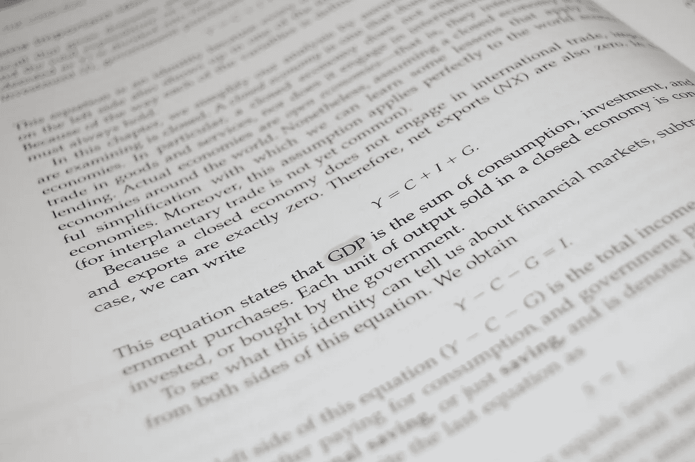

# 什么叫 GDP？

> 原文：<https://medium.com/coinmonks/what-mean-gdp-2aa91bd5f17c?source=collection_archive---------35----------------------->

Source photo [Pib Hârtie Document — Fotografie gratuită pe Pixabay](https://pixabay.com/ro/photos/pib-h%c3%a2rtie-document-carte-economie-3369544/)

GDP 或国内生产总值是衡量一个国家经济产出的指标。它代表一个国家在某一年生产的所有商品和服务的总价值，通常被用来衡量一个经济体的整体规模和实力。

为了计算 GDP，经济学家将一个特定时期内，通常是一年内，一国境内生产的所有商品和服务的价值相加。这包括…