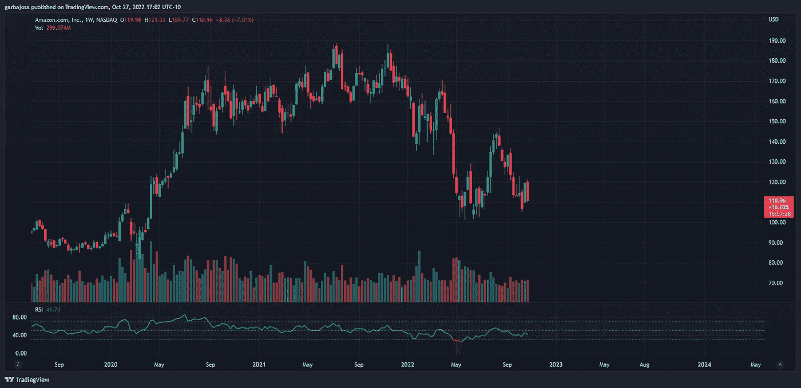
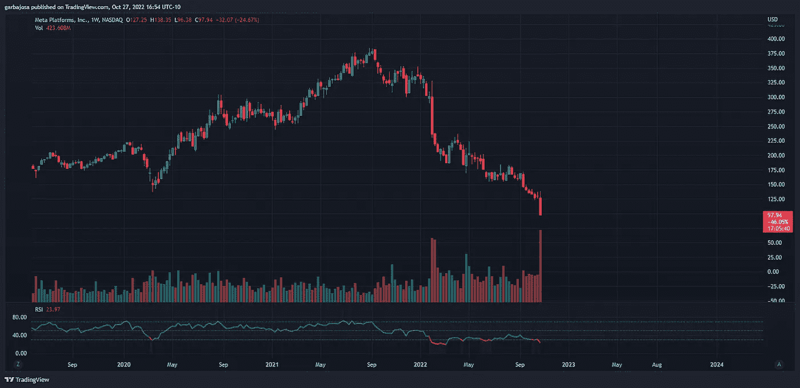
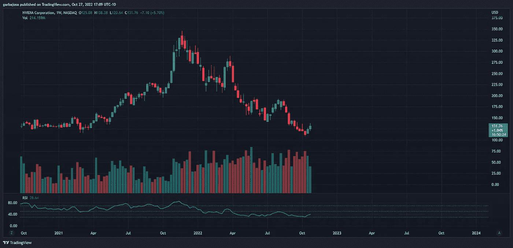
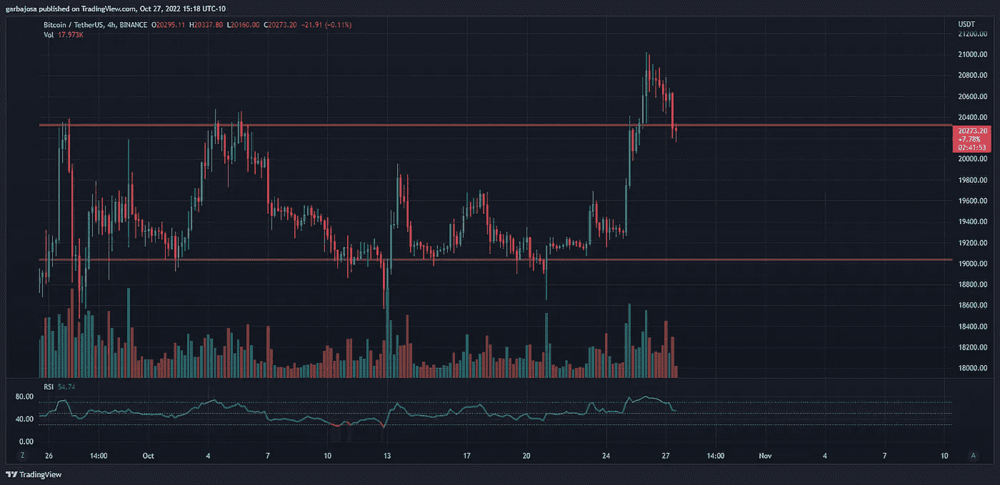
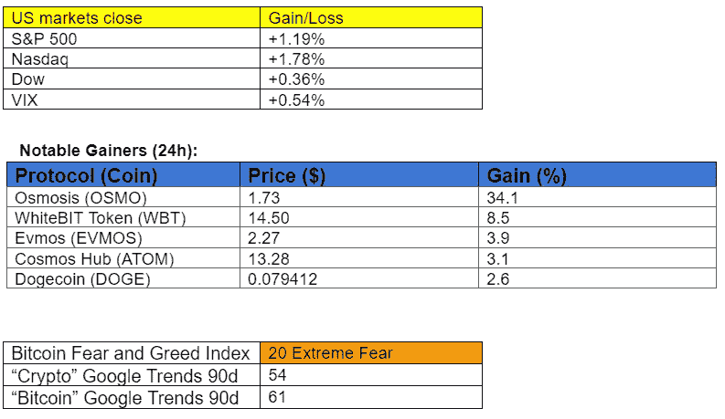

# 马斯克对 Twitter 的规划可能会让你大吃一惊。

> 原文：<https://medium.com/coinmonks/what-musk-has-planned-with-twitter-may-surprise-you-42e7d6a897c3?source=collection_archive---------10----------------------->

## 每日征服#113

最好的每日新闻、见解和阿尔法信息来源。

Photo by [Alexander Shatov](https://unsplash.com/@alexbemore?utm_source=medium&utm_medium=referral) on [Unsplash](https://unsplash.com?utm_source=medium&utm_medium=referral)

*密码市场是一个狂野、奇妙而令人生畏的地方；不要一个人跋涉！订阅加密征服者，让我们成为您的向导。*

订阅这份每日时事通讯，永不错过任何一期。

**概述**

*   股票也不稳定！
*   市场:BTC 在 4 天的攀升后回撤。
*   谷歌表示支持 Web3 未来。
*   埃隆·马斯克震撼推特。

早上好，家人，

Crypto 经常因为太不稳定而抓住很多漏洞，他们没有错。自 2021 年高点以来，BTC 和瑞士联邦理工学院分别下跌了 69%和 70%。但让我们记住，加密是一项新兴技术，缺乏既定的监管。波动性是一种资产在多岩石、充满敌意的环境中寻找自己位置的常见特征。

另一方面，投资者忘记了在十年的宽松货币牛市之后，股票可能会波动。所以，当美联储让打印机沉默时，世界上一些最大的公司开始像替代硬币一样回应。缺乏流动性会影响所有人。

以下是一些受市场低迷影响最大的公司，以及在此过程中损失的大量财富:

亚马逊公司(Amazon)

2021 年 7 月历史最高股价:**【188.65 美元**

当前价格: **$110.96 (- 41%)**

损失:**7500 亿美元**

*高分辨率* [*图表*](https://www.tradingview.com/x/Pmkbj7lP/) 。

**元(META)**

2021 年 9 月的历史最高股价:$ **382.96**

当前价格: **$97.94 (-74.4%)**

亏损:**6212.7 亿美元**

*高分辨率* [*图表*](https://www.tradingview.com/x/5bovNqdg/) 。

**英伟达(NVDA)**

2021 年 11 月历史最高股价:**:346.47 美元**

当前价格: **$131.76 (- 62%)**

亏损:**5060 亿美元**

*高分辨率* [*图表*](https://www.tradingview.com/x/UyioLAaD/) 。

**优秀奖:**

网飞(NFLX)——自高点以来的 56%

特斯拉(TSLA)——自高点以来的 46%

英特尔(INTC) —自高点以来的 62%

# 市场更新🌍

**BTC/USDT 4H**

自 10 月 5 日以来，BTC 股价本周首次突破 2 万美元。在连续四天强势攀升后，BTC 昨日经历了对 20.2 美元支撑位(黄色)的回撤。4 小时图上的成交量下降表明，除非发生重大新闻事件，否则该水平可能会保持。BTC 收盘下跌 2.2%，至 20，295 美元。

*高清* [*图表*](https://www.tradingview.com/x/pzwvL8BR/) 。

如果你喜欢这份报告，并且认为它值 20 分(0.01 美分)，请点击下面的鼓掌按钮来支持我的写作。(最多 50 次！)谢谢！

# 新闻观察📰

**谷歌的以太坊节点服务。科技巨头谷歌宣布计划为以太坊开发者推出一个基于云的节点引擎。这项名为“区块链节点引擎”的服务将是一项完全托管的服务，具有主动监控和谷歌云盔甲的安全功能。谷歌 Web3 战略负责人理查德·威德曼说，该公司希望成为 Web3 基础设施的关键参与者。**

**埃隆震动推特。**据[路透社](https://www.reuters.com/markets/deals/elon-musk-completes-44-bln-acquisition-twitter-2022-10-28/)报道，埃隆·马斯克(Elon Musk)已经正式收购 Twitter，并立即解雇了首席执行官帕拉格·阿格拉瓦尔(Parag Agrawal)和首席财务官奈德·西格尔(Ned Segal)。在马斯克撤回最初的报价后，这笔 440 亿美元的收购交易就发生了，只是受到了 Twitter 法律团队的诉讼威胁。当被问及他的意图时，马斯克说，“我收购 Twitter 的原因是因为拥有一个共同的数字城市广场对文明的未来很重要，在那里可以以健康的方式辩论各种信仰，而不用诉诸暴力”。

**新闻花絮:**

*   由于软件错误，THORChain [暂停](https://twitter.com/THORChain/status/1585765332958183425?s=20&t=GpizA4XGAFQd9oqmO2g3Sw)。
*   元收益[错过](https://www.cnbc.com/2022/10/27/meta-stock-falls-23percent-on-earnings-miss-analyst-downgrades.html)。库存处于 2016 年以来的最低水平。
*   Filecoin [发布](https://www.theblock.co/post/180450/filecoin-releases-new-content-delivery-network-called-saturn)名为 Saturn 的内容交付网络。
*   Jason Choi 的宇宙(原子)牛/熊[案例](https://twitter.com/mrjasonchoi/status/1585658843215712257?s=20&t=mh2W1O1k6tlklOAXPv-U2A)。

**NFT &元宇宙更新🐵**

*   **Twitter 转** [**允许**](https://decrypt.co/113007/twitter-buy-sell-nfts-tweets-magic-eden-dapper-rarible) **用户通过 tweets 进行 NFT 交易**

# 我的五分钱…

埃隆·马斯克收购 Twitter 可能会让这个平台呈现出一种全新的形式，这可能是最好的结果。有兴趣的可以看看他下面关于购买的声明。如果一个真正开放、自由、共同的数字城镇广场能够以他多次描述的方式存在，可能对所有人都极其有益。

让我们只希望他也摆脱那些该死的机器人吧！

享受你的周末家庭！

# ***加布里埃尔***

*关注我的* [*推特*](https://twitter.com/web3_gabri) *每日更新！*

订阅这份每日时事通讯，不要错过任何一期。

> 交易新手？尝试[加密交易机器人](/coinmonks/crypto-trading-bot-c2ffce8acb2a)或[复制交易](/coinmonks/top-10-crypto-copy-trading-platforms-for-beginners-d0c37c7d698c)