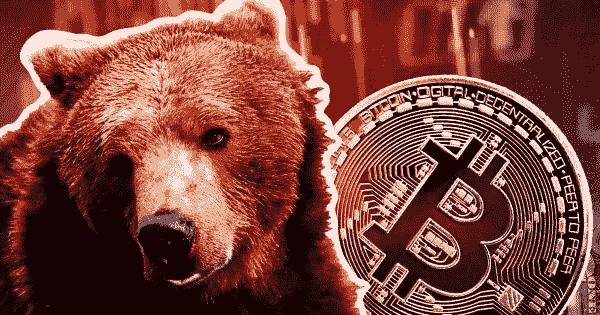

# 熊市过后会发生什么？

> 原文：<https://medium.com/coinmonks/what-next-after-a-bear-market-cceff51d8fd9?source=collection_archive---------41----------------------->

当我们将 2021 年的高点和成功与迄今为止吞噬了 2022 年大部分时间的财富和熊市的逆转进行比较时，加密市场的财富似乎形成了对比。

不用说 2021 年有多幸福。几个项目筹集了大量资金，随着投资者将资金投入到他们认为的下一件事情中，更多的项目增加了他们的财富。沿着这条线，NFT 和元宇宙的项目成为了当时的明星，即使他们只有项目原型。

突然，令人惊讶的是，2022 年已经抵消了 2021 年的大部分成就。嗯,“未完成”听起来很刺耳，也许合适的说法是，2022 年将加密货币带到了地球上，并告诉我们需要做好基础工作。

我在这篇文章中的唯一目的是，在我看来，当熊市最终结束时，可能会发生什么。所以，让我们开始吧。

# 秘密童话结束了！

就像网络泡沫破裂一样，目前的加密熊市比之前的任何一次都要大。它的规模是巨大的，伤亡也是巨大的。沿着这条线，一些著名的行业巨头已经崩溃，其他几家的立足点也不稳固了。随便说个名字，三箭之都(3AC)、BlockFi、Celsius 都在这次熊周期中受到重创。随着每一天的进展，它看起来更有可能以另一个重大挫折的消息而结束。

换句话说，我们回到了现实，面对着许多加密项目最初避免的怪物。

# 2021 和一夜成名

有报道称，2021 年发生了多达 1700 起秘密风险投资交易。在这些交易的过程中，一些报道称融资额为 250 亿美元，而[的一些报道称融资额约为 330 亿美元。事实上，2021 年最后一个季度筹集的资金比 2020 年全年都多。与 2020 年相比，2021 年的年同比增长率估计为 126%，而几个加密项目爬上了独角兽阶梯(估计价值至少 10 亿美元)。](https://blockworks.co/report-vcs-invested-33b-in-crypto-and-blockchain-startups-in-2021/)

它不需要大肆宣传，2021 年对区块链的项目来说是非常富有成效的。尽管取得了创纪录的成功，但 2021 年在很大程度上被一夜增值的项目所堵塞。如前所述，数百个项目在粗略产品的基础上筹集资金，严重依赖筹集的资金来推进项目开发进程。

直接的影响是，许多项目建设得很差，缺乏主要的经济驱动力，并且在产品设计和用户参与方面表现糟糕。还值得一提的是，沿线有大型地毯拉。这种一夜之间的成功只是加速了我们现在所处的熊市。

# 熊市之后的下一步是什么？

当这个市场结束时，我们将达到区块链技术和加密货币进化过程中的又一个重要里程碑。在 2022 年之前，有过三次不同的熊市，我们从每次下跌中吸取了宝贵的教训。

# 加强审查

当潮流最终被扭转时，我们会学到项目审查的重要性，我们再也不会想当然地认为危险信号存在。投资者将会对加密项目的核心方面更感兴趣，比如令牌组学和项目运行的整个经济模型。还可能会在投资透明度和项目团队背景调查等方面采取新措施(这是 Terra 和 SAC 倒闭的一个主要因素)。

目前情况看起来有点不明朗，但可以肯定的是，投资者和整个行业将寻求新的方法来保证安全投资和项目透明度。

# 坚实产业的开端

今天，网络泡沫破灭已经被远远地埋葬在历史的书页中。泡沫破裂后出现的市场已经发展成为一个价值数十亿美元的产业，几个顶级的家喻户晓的名字从此占据了主导地位。今天，网络已经商业化，它已经成为任何希望在现代保持竞争力的企业的必需品和生命线。

区块链技术和加密货币最终将遵循类似的趋势。我们已经开始看到主流传统渠道甚至国家政府的采纳和整合。从所有迹象来看，这种模式只会持续到未来。更多的国家将最终接受区块链，并将创建一个使数字资产繁荣的结构。

# 最后的想法

我们无法断言当前的熊市何时会结束，但可以肯定的是，我们都会从当前的熊市中吸取教训。现在是抵御弱者的时候了，因为我们要为未来建设一个充满活力的区块链经济。

> 交易新手？试试[加密交易机器人](/coinmonks/crypto-trading-bot-c2ffce8acb2a)或者[复制交易](/coinmonks/top-10-crypto-copy-trading-platforms-for-beginners-d0c37c7d698c)