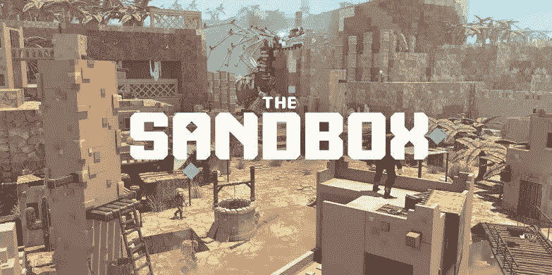

# 库币 NFT ETF 平台提供什么 NFT ETF？

> 原文：<https://medium.com/coinmonks/what-nft-etf-does-kucoin-nft-etf-platform-provide-e6d3a1744d1f?source=collection_archive---------19----------------------->

对高端蓝筹股 NFT 的需求不断增长。这些 NFT 很受欢迎，很受欢迎，但是对于普通的密码爱好者来说也非常昂贵。

这使得它成为富人的资产，而不太富裕的人则被排除在外。

这是蓝筹 NFTs 的宗旨吗？

蓝筹 NFT 应该只提供给极度富有的人吗？

大多数高端 NFT 的底价都远高于 10 万美元。我不知道有多少人有 10 万美元闲坐在那里，准备在 NFT 推出时舒适地挥霍一番。

# 什么是库币 NFT 交易所交易基金，它是如何工作的？

[KuCoin、人民交易所和世界排名第一的 altcoin 交易所加入进来，通过与 Fracton protocol 合作，在交易所以 ETF 的形式提供分级 NFT，为蓝筹股 NFT 收购马得利提供解决方案。](https://www.kucoin.com/blog/all-you-need-to-know-about-fracton-protocol?utm_source=blogcommunity)

KuCoin NFT 交易所交易基金代表了 Fracton protocol 购买的蓝筹高端 NFT 的一小部分，锁在 NFT 的收藏库中。

对于 Fracton 购买的每一只蓝筹股 NFT，KuCoin 都会列出对应的相当于 NFT 价值的 ETF。

这些交易所交易基金面向所有类别的投资者，可以很容易地在[库币加密现货市场](https://www.kucoin.com/markets?spm=kcWeb.B3creator.Header3.1)购买或交易。现在你不再需要卖掉你的贵重物品或者抵押你的房子来跳上 NFT 的高端列车。

谢谢库科恩，谢谢 Fracton。

# 目前有 6 类蓝筹 Nfts ETF 在库币上市。

[希拜克](https://www.kucoin.com/news/en-nft-etf-hibayc-gets-listed-on-kucoin-world-premiere)；一种由 BAYC NFT 支持的令牌，代表由 Fracton 协议操作的链上 BAYC 元交换池中的 1/1，000，000 BAYC。

[胯骨](https://www.kucoin.com/news/en-nft-etf-hipunks-gets-listed-on-kucoin-world-premiere)；由密码朋克支持的 ERC 20 代币，代表收藏库中一个密码朋克的 1/1000000 的所有权。

[hio DBS](https://www.kucoin.com/news/en-nft-etf-hiodbs-gets-listed-on-kucoin-world-premiere)；一个 ERC-20 令牌，代表 Fracton 协议的元交换池中 odb 的 1/1，000，000 所有权。

[hiENS](https://www.kucoin.com/news/en-nft-etf-hiens3-gets-listed-on-kucoin-world-premiere)；一种 ERC-20 令牌，代表 Fracton 协议元交换池中一位(*)数字 en 的 1/1，000，000 所有权。

[hiSAND33](https://www.kucoin.com/news/en-nft-etf-hisand33-gets-listed-on-kucoin-world-premiere)；一个 ERC-20 令牌，代表 Fracton 协议的元交换池中一个 3x3 沙盒绑定的 1/1，000，000 所有权。

[hiDOODLE](https://www.kucoin.com/news/en-nft-etf-hidoodles-gets-listed-on-kucoin-world-premiere)；一个 ERC-20 令牌，代表 Fracton 协议的元交换池中涂鸦的 1/1，000，000 所有权。

9 月 29 日，KuCoin 将上市第 7 只 NFT ETF [MAYC](https://www.kucoin.com/news/en-introducing-the-8th-kucoin-fractional-nft-mayc) ，以加强已经令人印象深刻的阵容。投资者准备在发布前参与预售活动。

在 KuCoin 上购买 NFT ETF 就像在 KuCoin 市场上购买任何其他加密货币一样简单。

>>>首先，[创建一个 KuCoin 帐户](https://www.kucoin.com/r/rf/r395ZQJ)并登录。使用上面的链接注册时，您可以获得高达 500 美元的比特币。

>>>通过存款 crypto 或使用 KuCoin 支持的 27 个选项中的任何一个购买 crypto[向您的 KuCoin 帐户添加资金。](https://www.kucoin.com/express?spm=kcWeb.B3creator.Header2.1)

>>>登录后在登陆页面找到[库币密码市场](https://www.kucoin.com/markets?spm=kcWeb.B3creator.Header3.1)。

>>>搜索你想要的 NFT 交易所交易基金。([希拜克](https://www.kucoin.com/trade/spot/HIBAYC-USDT)，[希庞克](https://www.kucoin.com/trade/spot/HIPUNKS-USDT)，[希恩斯](https://www.kucoin.com/trade/spot/HIENS3-USDT)，[希恩斯](https://www.kucoin.com/trade/spot/HISAND33-USDT)，[希多尔](https://www.kucoin.com/trade/spot/HIDOODLES-USDT)，[希奥德布斯](https://www.kucoin.com/trade/spot/HIODBS-USDT))

>>>填写价格和数量，然后点击购买按钮。

KuCoin 是第一个向所有类别的投资者提供这种机会的集中交易所，我个人认为这是 NFT 空间需要的进步。授权爱好者拥有他们想要的蓝筹高端 NFT 的一部分。

> 交易新手？试试[加密交易机器人](/coinmonks/crypto-trading-bot-c2ffce8acb2a)或者[复制交易](/coinmonks/top-10-crypto-copy-trading-platforms-for-beginners-d0c37c7d698c)