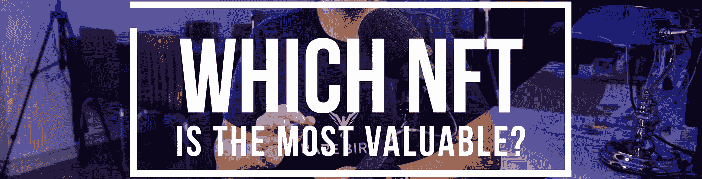
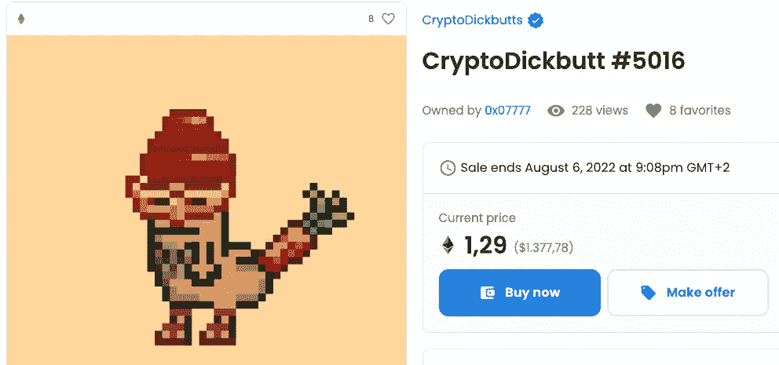
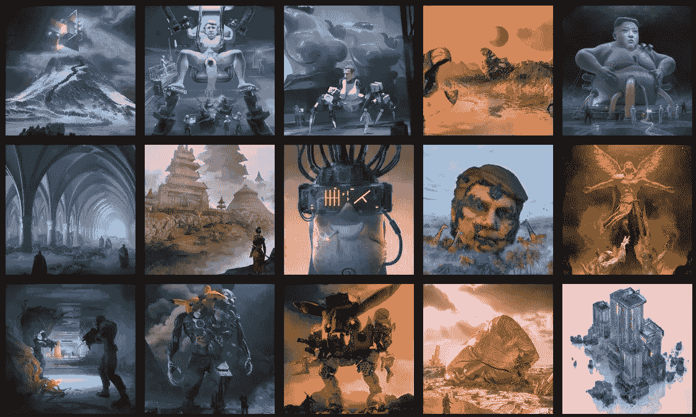
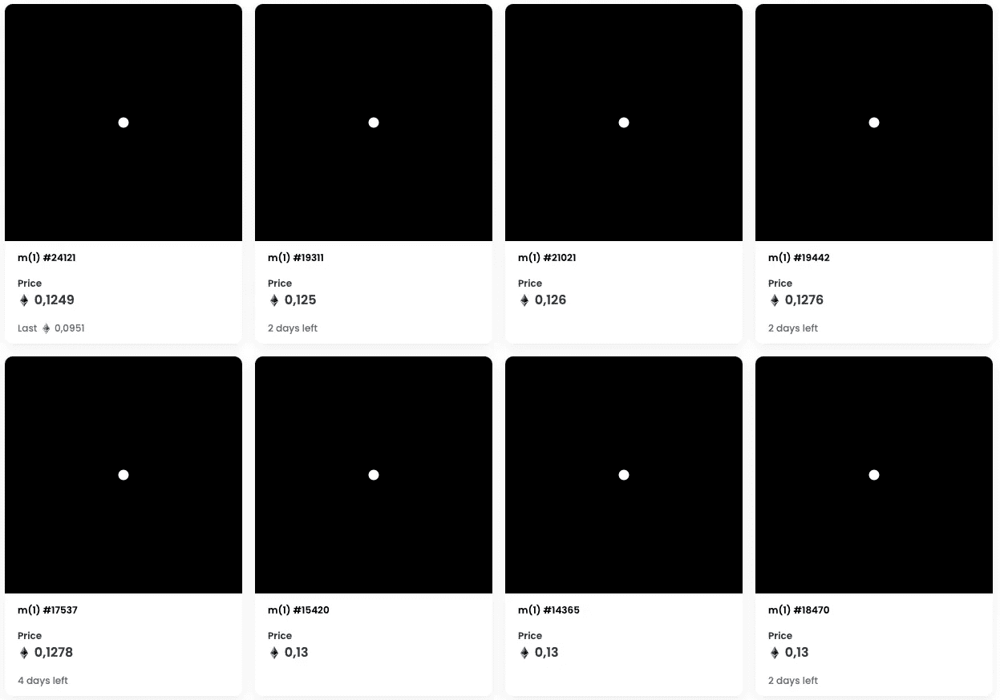

# NFT 最有价值的是什么？

> 原文：<https://medium.com/coinmonks/what-nft-is-worth-the-most-d184a73b62d?source=collection_archive---------38----------------------->

在过去的几年里，你到处都可以看到关于 NFT 的疯狂新闻，以及人们如何通过买卖它们来发财。如果你访问 [opensea.io](https://opensea.io/) 来看看有什么 NFT 出售，你可能会偶然发现一张售价 1400 美元的“ [CryptoDickbutt](https://opensea.io/assets/ethereum/0x42069abfe407c60cf4ae4112bedead391dba1cdb/5016) 图片。是的，这些是 NFTs

[https://opensea.io/assets/ethereum/0x42069abfe407c60cf4ae4112bedead391dba1cdb/5016](https://opensea.io/assets/ethereum/0x42069abfe407c60cf4ae4112bedead391dba1cdb/5016) (12-07-2022)

这些价格是否合理是一个不同的讨论。事实是，人们愿意支付这些金额，因此市场就在那里。

但是哪个 NFT 实际上是最有价值的呢？并非所有的 NFT 都是一样的，有人可能会说艺术技巧和复杂性可能使 NFT 实际上很特别，但这仍然需要证明。但是让我们来看看那些 NFT，它们是今天最昂贵的 NFT 的记录保持者。

You can also listen to my summary here

[迈克·温克尔曼](https://en.wikipedia.org/wiki/Mike_Winkelmann)，又名毕普，在 2021 年春天以 6930 万美元的价格卖出了一辆名为 [Everydays](https://onlineonly.christies.com/s/beeple-first-5000-days/beeple-b-1981-1/112924) 的 NFT。NFT 是大约 21000x21000 像素的 JPEG。人们可能会期待价格略低于 7000 万美元的有史以来最令人惊叹的 JPEG。实际上，它是温克尔曼为他的“日常”系列创作的 5000 件不同艺术品的组合。所以这是一件错综复杂的艺术品，但如果你仔细观察每一个元素，你可能会感到惊讶。

如果你想详细了解拼贴画的瓷砖是什么样子的，Beeple 的网站可以让你深入探索他的个人作品。他的许多作品是“有争议的”，或者至少远离政治正确。从 2007 年 5 月 1 日到 2021 年 1 月 7 日，Beeple 每天都在创作新的图像，许多图形都受到了当前事件的影响。

> 交易新手？尝试[加密交易机器人](/coinmonks/crypto-trading-bot-c2ffce8acb2a)或[复制交易](/coinmonks/top-10-crypto-copy-trading-platforms-for-beginners-d0c37c7d698c)

不管我对皮普尔的作品怎么看，他最大的崇拜者似乎是维格内什·孙达雷森，他在拍卖会上花了 42329 英镑，当时大约是 7000 万美元买下这幅拼贴画。但这并不是故事的结尾。艺术家和买家是通过另一个项目认识的，这给这个故事带来了有趣的转折。

[https://www.beeple-crap.com/everydays](https://www.beeple-crap.com/everydays) (12–07–2022)

当时，Sundaresan 正在开发新的 B20 令牌 T1。这是一种加密货币，建立在 Beeple 的其他 NFT 上，由于 Beeple 的突然成名，拍卖后其价值急剧增加，因此 Beeple 和 Sundaresan 都在经济上受益。

我不认为这一事件被证明是欺诈。也许 Sundaresan 真的是 Beeple 的超级粉丝，以至于他需要购买他所有的作品，不管价格如何。但是让你的商业伙伴在持有资产的同时抬高你的拍卖价格，与这件艺术品的价值挂钩[看起来非常可疑](https://amycastor.com/2021/03/14/metakovan-the-mystery-beeple-art-buyer-and-his-nft-defi-scheme/)。

因此，Beeple 价值 7000 万欧元的 NFT 将不仅作为有史以来最赚钱的 NFT 销售之一而被人们铭记，而且还作为一场可疑的营销活动，甚至可能是一场巨大的欺诈，如果这次销售只是一个吸引人们在 Beeple 的其他项目上花费大笔资金的策略。但是，据我所知，这还有待证明。

尽管《每天》拍出的 7000 万美元是 NFT 有史以来最高的价格，但它并不是 NFT 有史以来最昂贵的作品。 [Pak](https://en.wikipedia.org/wiki/Pak_(creator)) ，无论是艺术家还是组合，创造了一个名为“The Merge”的项目，这个项目创造了 9200 万美元的销售额。它不是被一个人买走的，而是被大约 30，000 名收藏家买走的，他们每个人都购买了“合并”的个人作品。

这个东西确实很特别。合并产生了 312，686 个独特的 NFT。每个 NFT 代表一个质量单位。NFT 的智能合约与其他非功能性交易不同。在大多数情况下，NFT 合约只不过是用货币和 NFT 的所有者进行交易来结算购买。然而，大众的智能合约会考虑您的钱包中是否已经有一辆大众 NFT，因为购买第二辆大众 NFT 会将两个独特的 NFT 合并为一辆更有价值的 NFT。他们将被“合并”！结果，合并的个体成分变得越来越稀少，越来越珍贵。

pieces of The Merge, sold at opensea.io: [https://opensea.io/collection/m](https://opensea.io/collection/m) (12–07–2022)

这种融合是由一个带有白色球体的黑色背景图形表示的，每个球体代表一个质量 NFT。当两个 NFT 结合成一个时，匹配的球体膨胀。可以说，它们“质量更大”。

这似乎是一个游戏，其中的目标是购买和吞下尽可能多的其他领域，以便开发一个比其他玩家更大的领域。合并的最大球体甚至被称为“阿尔法质量”。

Pak 能够开发一个有趣的游戏，在这个游戏中，个人投资数百、数千甚至数百万美元，他/她/他们能够收集到大约 9200 万美元。

如果你想知道 NFT 到底代表什么，看看我的简介。我相信 NFTs 和智能合约将在互联网的未来扮演非常重要的角色，尽管今天我们正在以一种奇怪的方式使用它们。

“NFT — What does it stand for?”

如果您想了解更多关于加密的基础知识、区块链技术的潜力以及加密市场的真实情况，请跟随我。如果你有任何问题或评论，请给我留言。

保持牛逼！