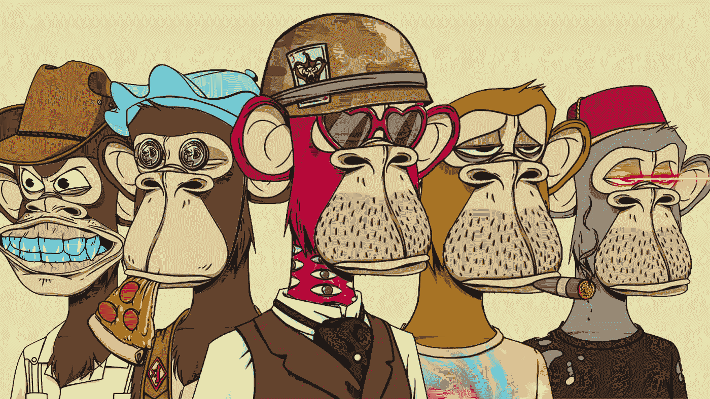
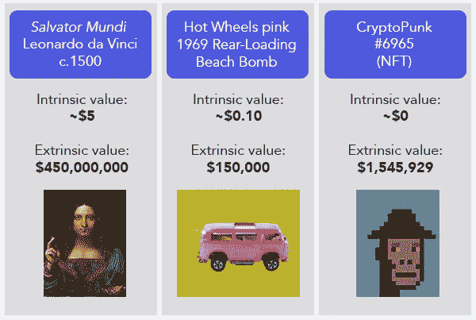
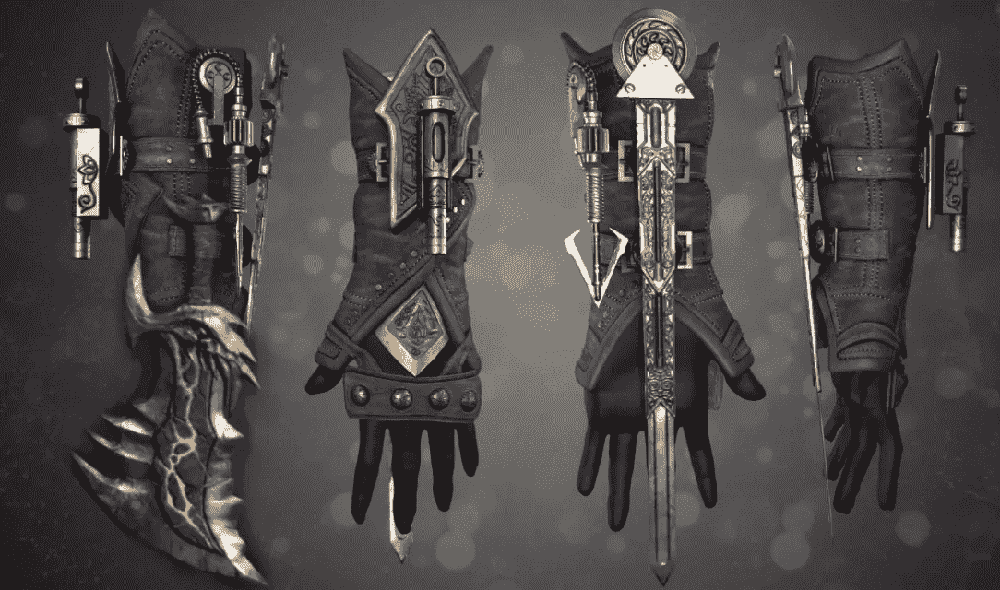

# 什么是 NFT，游戏业务将如何发展(第一部分)

> 原文：<https://medium.com/coinmonks/what-nfts-are-and-how-the-gaming-business-will-evolve-as-a-consequence-42a3ba286f61?source=collection_archive---------15----------------------->

NFTs:即使你对加密货币和区块链不感兴趣，如果你关注游戏新闻或任何相关新闻，你也可能听说过这个话题。尽管某些企业声称技术是“行业的未来”,其支持者认为它是“革命性的”,但技术已经显示出高度的争议性，以至于你要么热爱它，要么厌恶它

在所有复杂的感觉中，准确理解这项技术是什么以及它如何影响游戏是一项挑战。毕竟，除了零售 jpg 之外，它还有其他用途吗？投资这个市场值得吗？在传统游戏中实施这种方法会有危险吗？

这篇博客试图描述事物目前是如何运作的，以解决这些和其他相关的问题。但是请注意:因为这项技术仍然相对年轻，而且不断变化，我们已经知道的许多东西正在迅速转变，它的潜在应用还没有得到彻底的研究。

# 什么是 NFT？

NFTs，或字面意义上的不可替代令牌，是“不可替代令牌”的缩写。这个词听起来可能不寻常，但它描述了技术使虚拟商品成为可能的特征:它们有独特的注册号，不可能复制，价值与其他发布的数字资产不完全匹配，无论它们有多接近。

为了便于理解，你可以把它们想象成艺术品，甚至是收藏品。以蒙娜丽莎为例:即使它可能被复制或印在衣服上，只有原作才具有真正的价值。全球只有一份官方副本。由于我们在 NFT 的背景下谈论虚拟商品，或者更具体地说，与虚拟产品相关的证书，事情变得有点困难。

例如，在电子游戏领域，一把 NFT 可能与游戏场景中的一把威力无比的剑相连。通过获得令牌，你并没有真正得到剑；取而代之的是，你会得到一个特殊的证书，证明你对它的所有权，并且可以交易或出售。

换句话说，仅仅因为你购买了一件 NFT，并收到了一份保证书，并不意味着你就自动拥有了这件东西。换句话说，它可以继续在社交媒体上共享，被开发者用于营销材料，或印在衣服上。但是在游戏中，你将是唯一拥有它的玩家，这使得它独一无二。

# “可替代的”到底是什么意思？

即使这个词(让我们面对它，有点不寻常，不经常使用)，什么是可替代的或不可替代的想法一直存在于我们的日常生活中。一张 10 美元的真钞票是可替换物品的一个例子，因为它可以以多种方式使用。即使一个是全新的，另一个由于使用而被撕破和弄皱，它们都可以被挂起来，而不会损失相同金额的任何钞票的价值。

重要的是要记住，区分可替代性和不可替代性的界限并不总是绝对的，甚至在讨论同一对象时也可能发生变化。根据《战神》珍藏版发行的时间和保存的程度，一个珍藏版可能不如另一个。

# 你认为 NFT 的价值可以和真正的收藏品相比吗？

即使一开始它们是可以互换的，一件用过并打开过的物品今天的价值也不同于一件仍然密封完好的物品。换句话说，最有价值的收藏品更有可能是特殊的、不可替代的，而不是已经用完的。货币也是如此:在适当的情况下，一枚甚至不再用于日常交易的硬币或纸币可以以高于其初始面值的价格卖给收藏家。

**遗憾的是，他们不能**

这种想法就是为什么你家里的破旧的《超级马里奥兄弟 3》不值得一个收藏家在 2021 年的拍卖会上赢得的数百万美元的原因。值得注意的是，在现实中，一件物品的价值包括稀有性和生产价值等因素，但也包含高度的主观性和推测性。因此，即使你认为花几百万做任何事情都是愚蠢的，但如果你这样做了，也不要认为你是错的。

NFT 与区块链(一种确保数字商品合法性并使其几乎难以被非法窃取或复制的认证方法)相连的事实，是使它们与众不同的另一个特征。想象一下，区块链是一个由数千台计算机共享的大规模账本，每台计算机都记录着数字资产的每一次移动，并需要验证发生的每一次修改。这种去中心化和高度的安全性导致了一个非常耗能的过程。

数百万用户可以连接到单个区块链，每个用户都参与检查并执行自己的事务(触发数据块检查过程)。即使不需要验证整个区块链来处理交易，也必须使用大量设备和处理能力，这意味着必须使用电力。

# **那么它在游戏中是如何工作的呢？**

NFTs 可以与游戏中的任何数字组件结合使用。虽然这考虑到了潜在的可能性，例如，购买歌曲或游戏纹理的所有权证书，但在现实中，该技术与直接与游戏性方面交互的对象和角色相关联。

在育碧的幽灵侦察断点中，NFT 与过于强大的装备(以及特殊属性)相关联，玩家可以获得这些装备来装备他们的角色，出售或与他人交易。虚拟资产与区块链的联系确保了它的合法性，并使交易可以在没有游戏制作人参与的情况下进行，这使它有别于传统物品。

将 NFT 用于“律师”技术的一个好处是开发者看不到属性。看起来完全是原创。换句话说，这确保了它有机会变得不寻常，价值增加，并能够再次出售获得高额利润。所有这一切都发生在这样一个环境中，即市场据说可以自我调节，没有外部行为者的干预。

换句话说，事实上，他们允许客户更大的权力来处理它，这使得 NFTs 有别于通过微交易销售的传统商品。然而，有几个障碍使得这个场景不够完美。

# 虽然是分散的，但国家森林公园还是与集中的基地相连。

NFT 被告(如前链接公园雇员麦克·信田)提出的主要主张之一是，这项技术将允许交换游戏资产。想想看，如果能在《战神》中购买混沌链，并将其用在《堡垒之夜》或《刺客信条》中的角色身上，那该有多棒。这在原则上可能是可行的，但是有几个困难。这就需要玩家考虑了。

尽管 NFT 市场建立在区块链上，部分是分散的，但游戏仍遵循相对受控的运营体系。换句话说，不能保证索尼圣莫尼卡资产用于制作与系列兼容的混沌链将在未来的游戏中使用。请记住，某些相关玩家会因为技术而想要虚拟产品。然而，它并不能保证你真正拥有它，或者你对它的使用有任何权利。

开发者有可能在游戏之间转移物品。然而，仍然有许多挑战需要克服。这两款游戏的引擎可能会有所不同。考虑一个场景，两个游戏，一个使用 Unity，另一个不真实。因此，移动设备是不可能的。同样，这种武器可能不适合在其他游戏中使用。即便如此，视角也可能是第一人称。这使得很难按照预期用途使用该物品。

你意识到情况有多复杂了吗？真正的项目互操作性只能通过创建基于相同引擎和资源的共享基础来实现。

换句话说，要实现这一点，需要大量的全行业标准化。最终，它将严重危及新的开发和其他游戏类型。资产和引擎都可以进行一定程度的调整。然而，它们总是会遇到需要开发新“模型”的障碍。这些提供了更广泛和更简单的答案。此外，将以前的工作迁移给他们比你想象的要困难得多。

因此，无论谁声称 NFT 是一个难题的简单答案，他似乎都不了解游戏是如何开发的，也不了解将一个物体移动到一个新环境中可能会产生的潜在影响。由于设计语言的变化和游戏理念，这种方法即使在同一个系列中也可能具有挑战性。例如，巴耶克的服装可能同时出现在《刺客信条起源》和《刺客信条瓦尔哈拉》中。但是，考虑到它的特性，它在每个游戏中的功能都很不同。和原创建议。

# **用作衣服或“皮肤”的天然纤维**

数字令牌的值非常依赖于上下文的事实是另一个问题。而且由于技术限制，也没有太多的控制。消费者最终很少对它有任何影响。想想从 RPG 里得到一件非常稀有的武器。它以提供强大的火力和快速消灭所有敌人而著称。我喜欢，嗯？如果你花钱买了 NFT 后游戏更新了怎么办？所以所有的敌人现在对你物品中的元素免疫？武器失去了一些效力。结果，你的投资减少了。令牌或设备的属性将被保留，因为它是 NFT。不允许对其进行任何修改。

这表明物品的所有权、销售和交易的分散性仍然存在。正因为如此，它的大部分金融价值(以及在游戏中的有用性)仍然依赖于集中的判断。它们总是依赖于开发者。如果在网络游戏中失去使用你最喜欢的武器的能力还不令人讨厌的话！想象一下，如果它发生在你花钱买的东西上，会有多沮丧。

# **使用 NFTs，工作变成了娱乐。**

[第二部](/@patirishavnath/what-nfts-are-and-how-the-gaming-business-will-evolve-as-a-consequence-part-2-4a296c39031e)