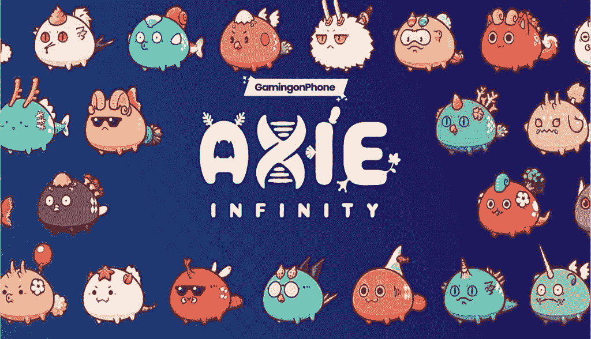
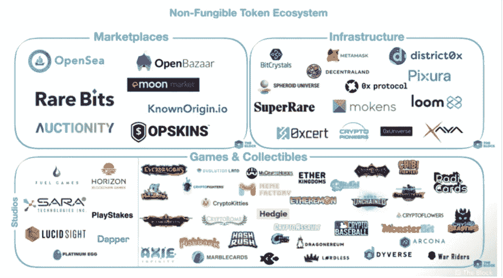

# 什么是 NFT，游戏业务将如何发展(第二部分)

> 原文：<https://medium.com/coinmonks/what-nfts-are-and-how-the-gaming-business-will-evolve-as-a-consequence-part-2-4a296c39031e?source=collection_archive---------41----------------------->

[点击这里观看**第一部**](/@patirishavnath/what-nfts-are-and-how-the-gaming-business-will-evolve-as-a-consequence-42a3ba286f61)

# 使用 NFTs，工作变成了娱乐。

在商业领域，玩家早就发现了在不应该成为他们目标的情况下赚钱的方法，游戏相关物品的商业化实验并不新鲜。魔兽境界的“金农”谁没听说过？这在网络游戏世界中尤其普遍，在那里有一个完全平行的市场来买卖真钱。

然而，没有任何事件像《暗黑破坏神 3》拍卖行那样改变了玩家的看法和游戏风格。它在 2012 年随着游戏在 PC 上的发布而首次亮相，它提供了一个通过向其他感兴趣的玩家提供你的东西来快速赚钱的机会(当然，给动视暴雪一小部分利润)。

这个概念对于纸上的开发者来说似乎是理想的。毕竟，通过消除中间商并为其客户提供一个安全的环境，它可以在平行市场上销售游戏产品，因为这是可能的。事实上，游戏的设计和玩家对其价值的评估都直接受到系统的影响。

## 有可能游戏一点都不好玩

通过拍卖行改进装备通常比在暗黑破坏神 3 中参与战斗和探索更简单。换句话说，由于货币化方法，许多人不再觉得有必要玩游戏。结果，他们完全忘记了这个头衔。

在做出这个决定的时候，暴雪声明“越来越清楚的是，尽管拍卖行系统有好处，而且世界各地的许多玩家都在使用它，但它最终会破坏暗黑破坏神的核心游戏。”:杀怪获得酷炫物品”。

换句话说，在游戏之外引入真正有价值的物品对经济有影响，并导致许多玩家把它当成一份工作。游戏的目标不再是利用这些东西来让你的角色变得强大。新的目标是出售它们以获利。暴雪，让生活变得不那么愉快和满足。这样做是为了平衡人们已经花掉的钱。

# 从先玩后赚系统过渡到先付后赚系统

一些大公司，如 Konami、Square Enix 和 Ubisoft，都对与 NFTs 合作感兴趣。不过，他们中的许多人仍在继续探索。这主要归咎于公众对技术的不信任。那些认为这是一种简单的赚钱方式的人实际上并没有从任何有意义的意义上给游戏带来好处。这几乎就像一个没有人想要(除了有钱的人)的全新的磁控振荡器或战利品盒。

选择“游戏赚钱”商业模式来吸引公众注意力的独立企业实际上是决定这个行业发展方向的负责人。理由很简单:为什么不为了钱而玩，也为了娱乐，以增加家庭收入呢？

Axie Infinity 是这一类别中最知名的游戏之一。在游戏中，玩家建造怪物，这些怪物可能会得到增强，然后以比最初投资更高的价格出售。然而，为了玩游戏，你必须首先拿出你的现金。此外，收入以药剂的形式收到，这是以太坊代币的加密货币对应物，开发商 Sky Marvis 从每笔交易中扣除一部分。

鉴于其创造高于该国最低工资的回报的能力，这款游戏在 COVID 19 疫情期间在菲律宾成为一种热潮，即使玩家的收入不是天文数字般高(这也吸引了许多对美元收入感兴趣的巴西人)。

实际上，它们是与他人共享的账户组，以换取 60%至 70%的适度利润分成，具体取决于协议条款。根据 Overloadr 网站上的一篇文章，这种情况通常是非常不正式和不安全的，包括玩家必须超过每日目标以保持利润的合同——利润可能会在一夜之间下降。

前面我提到过，NFT 的所有者对它的使用环境没有影响。你记得我说过什么吗？Axie Infinity 已经非常有效地证明了这种做法对玩家的伤害，在 Axie Infinity 中，创造者限制了代币收益，并对其进行了构建，以便只有那些在竞争模式中达到特定级别的人才能兑换代币。

因此，许多玩家被迫在游戏中投入额外的时间来弥补他们最初的支出，有些人甚至发现他们无法维持“零到零”的水平。对于那些有能力的人来说，答案往往是在游戏上花更多的钱，购买更强大(也更昂贵)的怪物，以保证在线比赛的竞争。

换句话说，当风格游戏声称你可能从中获利时，它们是诚实的。Axie Infinity 在巴西和菲律宾等国家非常受欢迎，美元的大幅升值和显著的就业市场突出了这一点。然而，收入往往不能取代更传统的职业或支付初始投资。失业和不稳定的环境。有些人已经成功地赚了很多钱，但他们应该被视为例外，而不是规律。

# **型号可疑**

有几个额外的游戏具有可比的模型，以及玩和赚钱不需要相同的门票费用的活动。游戏的玩法通常是简单而单调的，只专注于研磨，这是目前大多数游戏的共同特点。

然而，缺乏“有趣的游戏”并没有阻止许多项目的发展，这些项目将 NFT 视为一种革新游戏的手段。鉴于这项技术的影响力，它已经引起了许多投资者的兴趣，他们毫不犹豫地向尚未起飞的项目投入大量资金。

与这项技术的新颖性相关的缺乏监管和分散化也为欺诈者创造了空间，这只会加深公众对博彩业的不信任。对于出版商来说，“NFT 和加密货币可能给游戏带来的优势是理论上的，但负面影响是有形的，”游戏行业网站在 2021 年 3 月决定不推出任何与 NFT 相关的话题。

这款车不仅引起了人们对该领域高度投机行为的关注，还批评了其对环境的潜在威胁。编辑 Brendan Sinclair 声称，随着技术的传播，对采矿加密货币的需求将会增加，这将推高价格和电力消耗。

“玩到赚”的概念，在某些情况下转化为“支付到赚”或“支付到赚”,改变了我们对游戏的期望以及它们令人愉快的能力。当你从事一项活动的目的是为了赚钱来买牛肉干时，你就不会把时间花在无关的、非生产性的(但可能是令人愉快的)活动上。相反，你的目标是最大限度地利用你的时间，专注于能产生最大回报的事情。换句话说，游戏的结构甚至它的艺术目的都会改变。

# 污染问题

在调查这些话题时，通常会遇到文献声称 NFT 和加密货币对地球的未来构成威胁。据《自然》杂志报道，在不考虑地球上所有其他污染物的情况下，仅比特币产生的排放就有可能在 30 年内使全球气温升高 2 摄氏度。

这是因为整个行业的基础是由大规模数据中心组成的，高性能机器在这些数据中心合作解决数学问题，如区块链验证。因此，由于需要更换很快超过其使用寿命的部件，电能消耗和浪费显著增加。

## 加密货币关系

尽管存在声称碳中和的 NFT 解决方案和即将调整其开采程序的 Etherem(一种通常与代币相关的加密货币),但市场作为一个整体并不追求可持续的道路。哈萨克斯坦的大部分电力来自污染严重的老旧煤矿，其贡献了全球 18%的哈希值(用于创造新比特币的电力比率)。

尽管地方官员声称他们正在采取行动关闭采矿中心，但这并不总是表明问题已经解决。由于采矿发生在世界范围内，只要一个市场关闭，另一个市场就会意识到这是一个商机。例如，当中国禁止在哈萨克斯坦境内开采加密货币时，该行业才出现增长。

过度能源消耗的问题不是一个区域性的问题，而是加密货币和区块链技术的一个特征。除非发生重大变化，否则对高产量的探索和这些技术带来的投机可能会成为阻止全球变暖的重大障碍。

# 道路仍不明朗

Piers Kicks 是 Bitkraft 和 Delphi Digital 的雇员，他说还有很多研究要做。在接受 VentureBeat 采访时，他声称虽然大多数投资者实际上并不关注游戏，但他们对新业务感兴趣。

在我看来，我们似乎仍处于一个重大发现时期。在这段时间里，有几种新的机制和方法来解决问题。他解释说，“我们仍在了解它们。Yield Guild Games 的首席执行官 Gabby Dizon 表示，只有那些理解密码球的人才能脱颖而出。然而，从长远来看，赢家将是游戏设计者。

“我觉得如果游戏开发商加入进来，他们会变得更加强大，”Dizon 断言。NFT 市场目前正在经历一场真正的“淘金热”虽然一些涉案特工消失了，但其他人变得更强大了。

现在很难说这种趋势是否会继续。它可能会像之前一些做出改变行业承诺的运动一样消失。像战利品盒和附带的应用程序这样的东西可能会变得无关紧要。

顺便问一下，你认为现在的情况怎么样？你认为 NFT 有前途还是你不认为这项技术有潜力？在我们的区域发表你的想法吧！

像 Mojang 这样的公司最近采取了反对 NFTs 的立场。然而，像 Epic Games 这样的巨头对此表示支持。据《堡垒之夜》的所有者说，这取决于创作者。显然，Instagram 也可以访问非功能性测试。