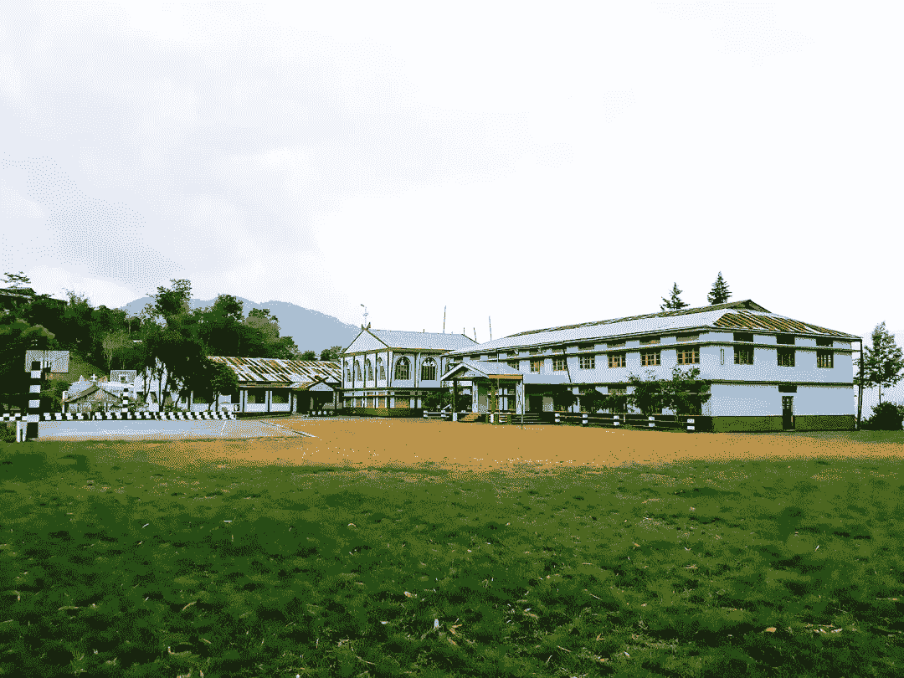
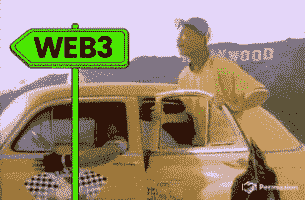
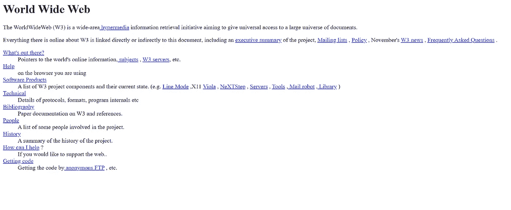
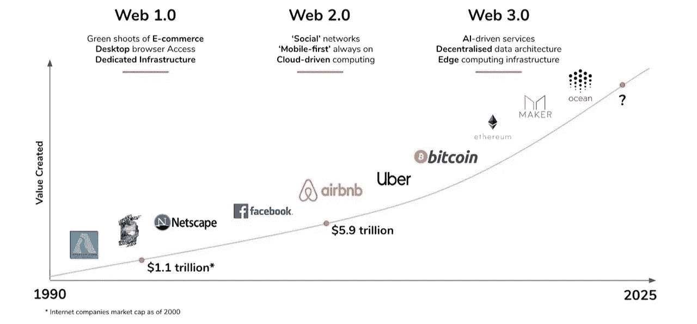
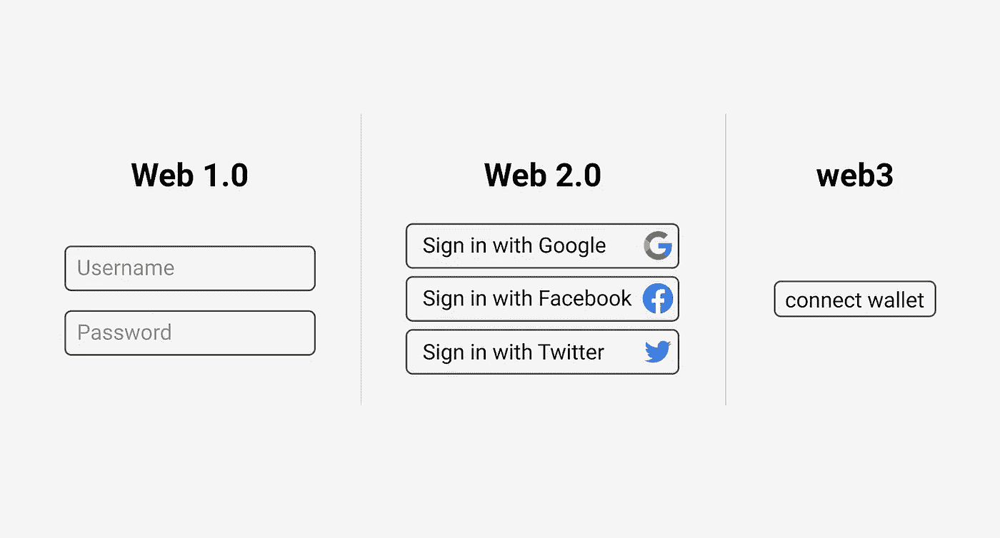
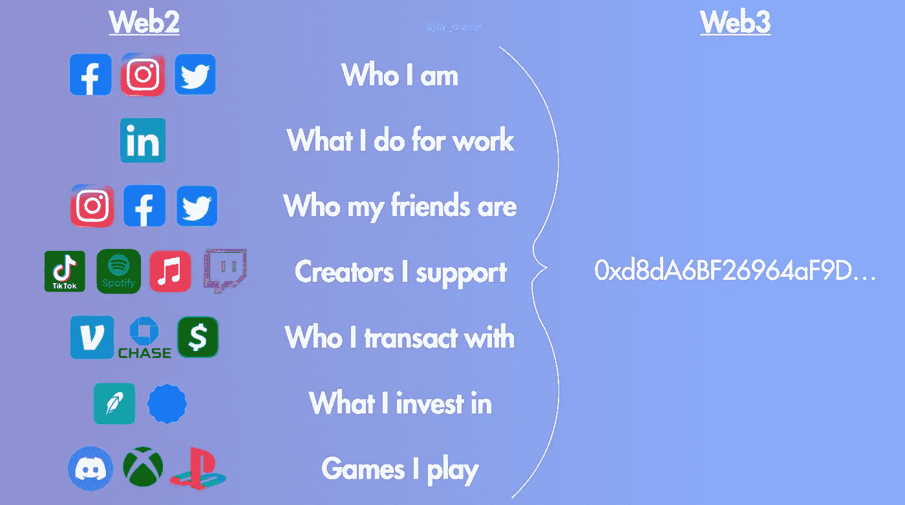
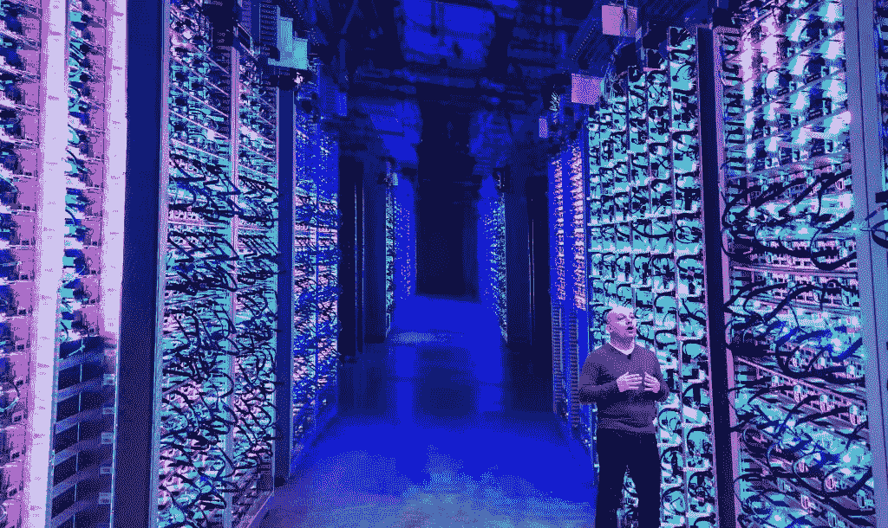
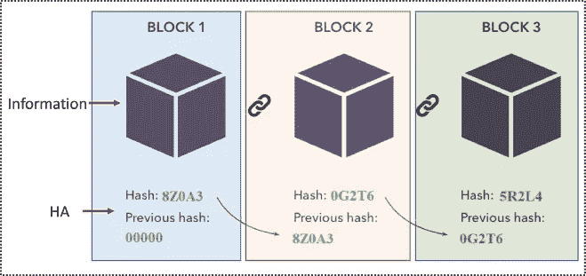
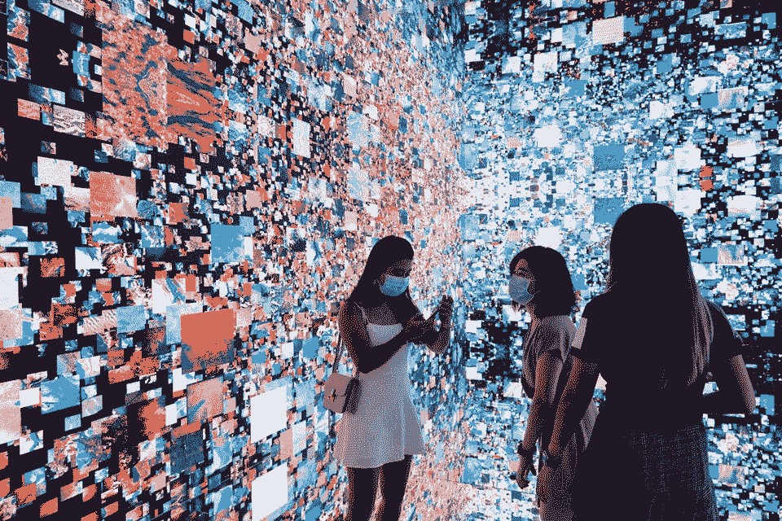

# Web3 到底是什么？

> 原文：<https://medium.com/coinmonks/what-really-is-web3-23778500a998?source=collection_archive---------40----------------------->

## 正如 Web2 使在线内容共享民主化，Web3 使所有权民主化。

你好世界，

十年前，我在那加兰邦 Phek 区一个不太偏远的村庄读八年级(一所初中)。我当时不知道互联网是什么，更不用说使用它了。快进到今天，住在被普遍称为印度硅谷的班加罗尔，我无法想象没有互联网的生活。

那加兰邦奇扎米圣心高级中学。(我的高中)。

今天，我在网上做一切事情，从订餐、预订出租车、支付账单到办公室工作。

顺便问一下，你知道联合国已经宣布 [**互联网为人权**](https://www.brookings.edu/blog/techtank/2016/11/07/the-internet-as-a-human-right/) **吗？**

我在这里提出的观点是，未来正在快速发生；我们生活在地球村。在我上一期的时事通讯中，我写了互联网是如何将全球超过 50 亿人联系在一起的。如果你还没有看过，你可以在这里查看一下。

今天，随着超级互联网连接以及人工智能(AI)、区块链和基因组科学等技术的进步，我们比以往任何时候都更有机会在生活中取得成就。

随着我的不断成长和不断学习，我相信未来在技术上。但光靠技术不会改变你的“未来”；你必须“更新”

记住技术是伟大的——但前提是你要保持更新。技术不会让你变得更好。它只是让你更加真实。

这就是为什么我想帮助你获得财务信息、技术敏捷和社会联系。

在本周的问题中，我想带你去了解一种叫做 Web3 的新兴技术。

你一定想知道 web3 到底是什么？它与我们今天使用的脸书、谷歌和 Instagram 有什么不同？这些不都是 web 吗？

让我带你回顾一下历史。

# 大约在 1990 年至 2005 年，网络 1 时代

当万维网(www)在 1991 年首次开发时，它带来了 Web1 时代。

它是关于分散的开放协议。你只能“阅读”网页上的信息，而不能像在今天的社交媒体上那样真正喜欢、评论或分享。

*这是 1991 年 8 月 6 日上线的第一个网站。*

# 大约 2005-2020 年:Web2 时代

我们大多数人都知道 Web 2。大多数人使用的集中式平台——如谷歌、脸书、苹果和亚马逊。与 Web1 不同，Web2 允许“阅读”和“写作”

在 web2 中，它是免费使用的，但要以你的数字身份作为交换。你提供你的名字、电话号码和其他信息，而大的中央平台利用它们来获利。

该平台控制着你的在线身份，他们可以随时禁止你使用它，就像美国总统如何被禁止使用 Twitter 一样。

你的内容不是你的而是平台的，随时可以拿下来，就像某些记者和作者写的“有争议的文章和书籍”怎么会被封禁。

所以，在 web2 中，你可以“读”和“写”，但是你没有所有权。

# 大约 2020 年及以后:Web3 时代

说到 web3，web3 给现有的 web2 增加了什么？

Web3 提供了一个 web1 和 web2 中没有的元素。除了“读”和“写”，Web3 给了你“所有权”

是的，Web3 是关于“所有权”的

记住你访问的每个网站和下载的应用程序都要求你用谷歌、脸书、苹果 Id 等登录。？

在这里，你不必用谷歌或脸书登录。

您管理和拥有的钱包直接连接到互联网。

钱包只不过是一个加密的地址，就像你银行账户的 PIN 或密码。(参考下图。)

# Web3 是去中心化和无权限的

像谷歌、脸书、亚马逊和苹果这样的公司拥有并控制着你的数据，因为它们拥有存储这些数据的大型服务器。

是的，你的 Instagram 照片和在线内容就像这样储存在数据中心。

这就是为什么你不拥有你在 web2 上的照片、视频和内容。

但是在 web3 中，就不一样了。

数据存储在一种叫做分布式账本技术的技术中，也就是区块链。

区块链只不过是将信息存储在形成一条链的多个相连的区块中的存储。因此得名，区块链。

这个区块链形成了一个特殊的计算机，任何人都可以访问，但没有人可以拥有。

web3 也是如此；没有任何个人、组织或公司控制或拥有该网络。

我不会深入区块链技术如何工作的技术细节；这超出了本文的范围。(如果你想让我在以后的文章中讨论这个问题，请在评论中告诉我)。

就目前而言，要知道区块链是一种在全球范围内连接的计算机的分布式开放网络中存储数据的技术，没有一个单点控制这个网络的大部分。

# 你如何在 web3 中获得所有权？

在 Web3 中，所有权是通过硬币、代币(加密)和 NFT 实现的。

硬币和代币允许你拥有网络或项目的一部分，这意味着你拥有互联网的一部分。

而 NFT 允许你拥有对象，可以是艺术品、照片、代码、音乐、文本、游戏对象、凭证、治理权、通行证、虚拟土地等。

*身临其境的 NFT 艺术装置。*

因此，正如 Web2 使在线内容共享民主化一样，Web3 使所有权民主化。

这本身就是一种进化，一场革命。

就像过去二十年里每个公司都成为了互联网公司一样，几年后每个公司都会成为 web3 公司。

所以拥抱自己；冬天到了，夏天很快就会到来。

感谢你读到这里；这是关于 Web3 的简短介绍。

我将在未来的时事通讯中介绍更多关于 Web3 的内容。

如果这些信息对你有用，请考虑与你的朋友分享。

如果你在社交网站上分享，别忘了给我加标签或告诉我。

我在这里的社交: [Instagram](https://www.instagram.com/akuzolohe/) ， [Twitter](https://twitter.com/Kuzotelohe) 。

看看我的朋友维尼·日莫米[在这里](https://www.instagram.com/vinizhimomii/)，他正在帮我为你编辑这些内容。她一直是我的好朋友。

这就是本周的内容，我迫不及待地想下周再给你写信。

嘿，如果我们是第一次见面，我是库佐特·洛赫(阿库佐)，web3 和区块链的研究员。我帮你简化 Web3 和区块链的概念。

请订阅这份旨在帮助您获得财务信息、技术敏捷和社交联系的时事通讯。

干杯，并有一个伟大的未来。

如果您希望在收件箱中收到未来的问题，请在此订阅我的时事通讯[。](https://kuzotelohe.substack.com/)

[https://kuzotelohe.substack.com/](https://kuzotelohe.substack.com/)

> 加入 Coinmonks [电报频道](https://t.me/coincodecap)和 [Youtube 频道](https://www.youtube.com/c/coinmonks/videos)了解加密交易和投资

# 另外，阅读

*   [币安期货交易](https://coincodecap.com/binance-futures-trading)|[3 comas vs Mudrex vs eToro](https://coincodecap.com/mudrex-3commas-etoro)
*   [如何购买 Monero](https://coincodecap.com/buy-monero) | [IDEX 评论](https://coincodecap.com/idex-review) | [BitKan 交易机器人](https://coincodecap.com/bitkan-trading-bot)
*   [CoinDCX 评论](/coinmonks/coindcx-review-8444db3621a2) | [加密保证金交易交易所](https://coincodecap.com/crypto-margin-trading-exchanges)
*   [红狗赌场评论](https://coincodecap.com/red-dog-casino-review) | [Swyftx 评论](https://coincodecap.com/swyftx-review) | [造币厂评论](https://coincodecap.com/coingate-review)