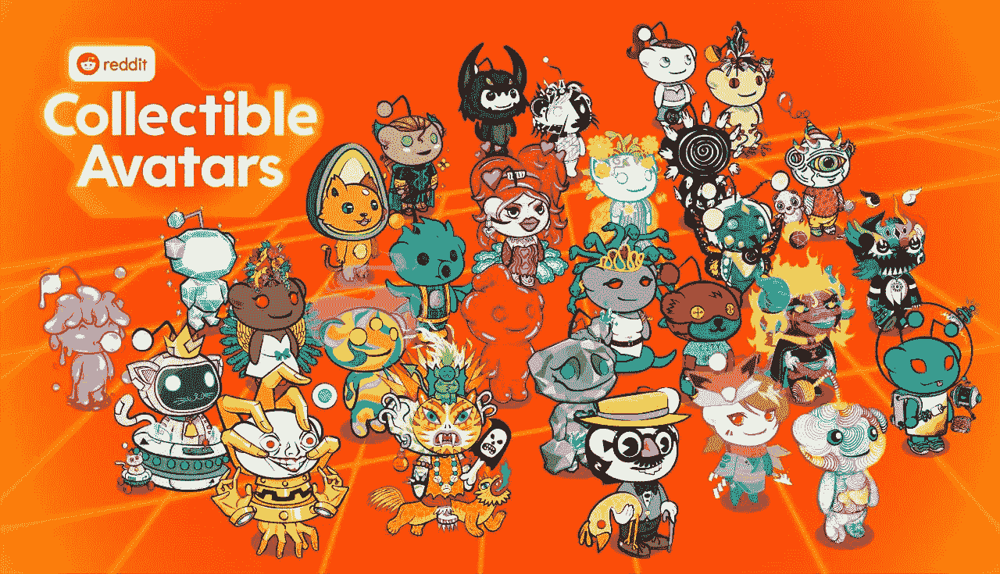
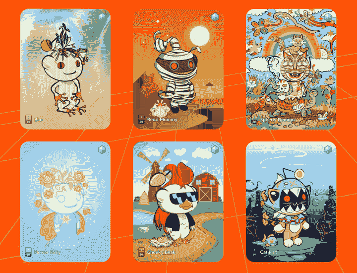
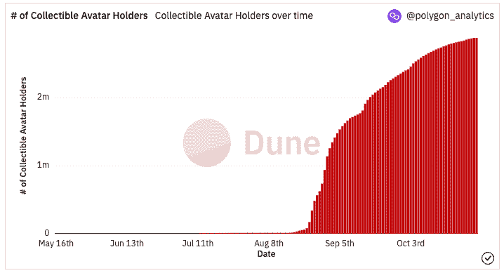
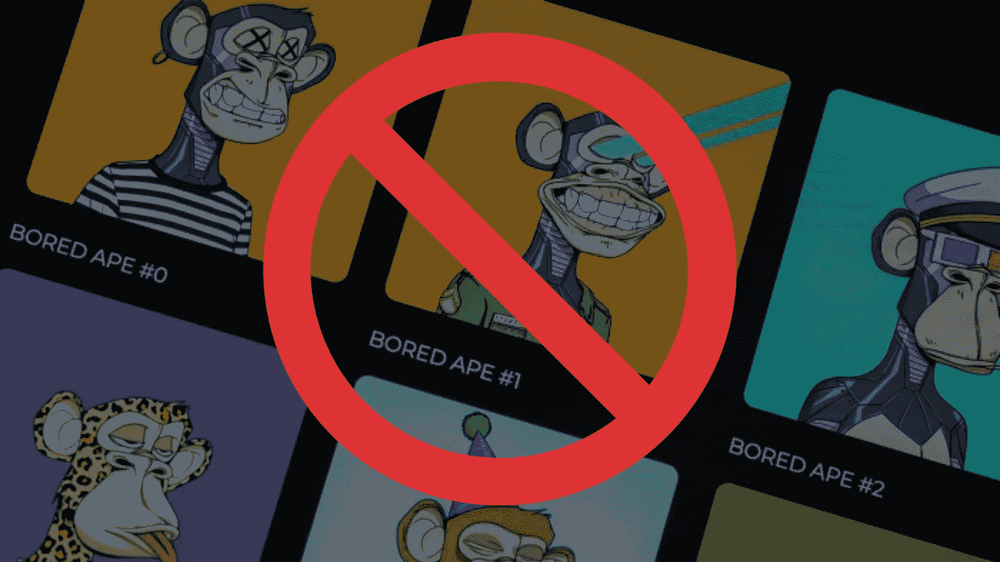
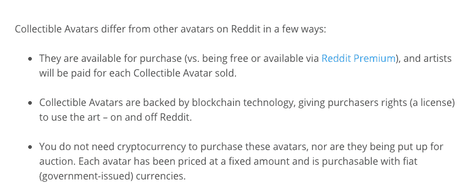
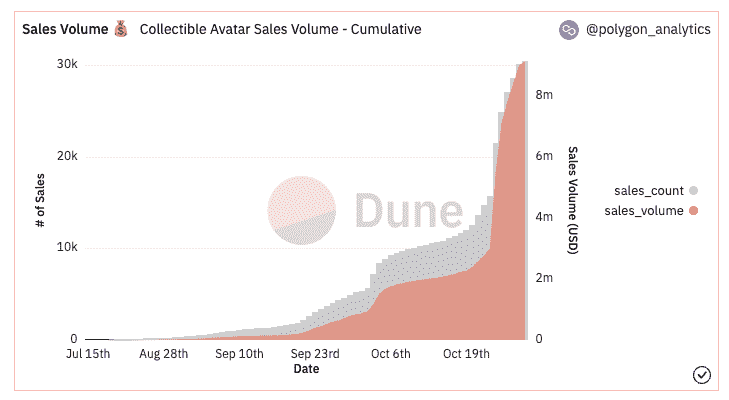

# 关于 NFTs，Reddit 能教你什么

> 原文：<https://medium.com/coinmonks/what-reddit-can-teach-you-about-nfts-5003c48c34ad?source=collection_archive---------10----------------------->

## 穿着闪亮盔甲的密码骑士？

加密社区一直在耐心地等待一个主要的催化剂来启动主流的采用。在过去的 24 个月里，我们已经看到了大量的新产品发布、经过验证的使用案例、企业合作、名人采用，甚至像[星巴克](https://techcrunch.com/2022/09/12/starbucks-unveils-its-blockchain-based-loyalty-platform-and-nft-community-starbucks-odyssey/?guccounter=1&guce_referrer=aHR0cHM6Ly93d3cuZ29vZ2xlLmNvbS8&guce_referrer_sig=AQAAAL2XuQlr2VzqMVM3JVlk5yvIl7j7joD_wyFjlgM7IWV7YEodI9csAYcqa7PjusHpwpfeIeIVQT9MSp6BSCwh4KR69UgvbmihJstk0UJvaMhbMEC6mU8w6su_szqjSur2NFIADZBSEMZOAYHx4QIVG2zHuiyQ-Jjzm16LlslC4SJA)和[迪士尼](https://nftnow.com/collectibles/where-are-all-the-disney-nfts-we-scrolled-around-found-out/)这样的重量级公司推出的 NFT 项目。甚至 Instagram 和 Twitter】也推出了直接在其平台上展示 NFT 的功能。[谷歌与比特币基地合作](https://www.forbes.com/sites/qai/2022/10/11/google-to-allow-crypto-payments-with-new-coinbase-deal/)允许加密支付，苹果正在 AppStore 中推出对 NFTs 的支持([尽管条款很糟糕](https://www.coindesk.com/business/2022/10/24/apple-refuses-to-exempt-nfts-from-app-stores-30-fee/))。

似乎什么都不管用。

那么，如何才能实现主流采用呢？我们在寻找什么重大事件？

[Collectible Avatars X Reddit](https://opensea.io/category/reddit-collectible-avatars)

Reddit 可能有答案。他们的 NFT 项目的启动为寻求快速接纳新用户的密码社区带来了宝贵的经验。这个项目应该成为未来 NFT 团队的蓝图。让我们开始吧！

# Reddit 推出 NFTs

7 月 7 日，Reddit 官方[宣布推出可收藏头像](https://www.redditinc.com/blog/blockchain-backed-collectible-avatars-coming-to-reddit-via-new-storefront)，这是一个在以太坊缩放解决方案[多边形](https://polygon.technology/)上的 NFT 项目。Reddit 加入了 [Instagram](https://about.fb.com/news/2022/05/introducing-digital-collectibles-to-showcase-nfts-instagram/) 、 [Stripe](https://stripe.com/blog/expanding-global-payouts-with-crypto) 和 [Adidas](https://news.adidas.com/originals/adidas-originals-and-prada-announce-a-first-of-its-kind-open-metaverse---user-generated-nft-project/s/30a29dad-6ded-4302-ae40-f9f2338e7298) 的行列，在 Polygon 网络上推出了他们的第一个加密项目。

[可收藏头像 X Reddit](https://opensea.io/en-US/category/reddit-collectible-avatars) 是由独立艺术家创作的限量版数字收藏品，在 Reddit 平台上为持有者提供独特的优惠。基于他们从 2020 年[开始的](https://www.reddit.com/r/changelog/comments/jip5qu/announcing_reddits_new_avatar_builder/)独特的头像生成器项目的成功，将 Reddit 头像转移到 NFTs 的领域是我们从大公司看到的最无缝的加密用例过渡之一。

Credit — [Reddit](https://www.redditinc.com/blog/blockchain-backed-collectible-avatars-coming-to-reddit-via-new-storefront)

购买了可收藏头像的 Redditors 可以使用 tnem 作为他们在平台上的个人资料图片，让他们的头像发出独特的光芒，并可以混合和匹配多个头像的装备，以增加额外的创意。

这个项目中的许多独立艺术家都来自各种创造性的分支，如 [r/Comics](https://www.reddit.com/r/comics/) 和 [r/AdobeIllustrator](https://www.reddit.com/r/AdobeIllustrator/) 。还有什么地方比在你已经充满活力的社区中找到不可思议的艺术家更好呢？

希望有机会参与项目未来迭代的有抱负的艺术家被鼓励[加入创作者等候名单](https://docs.google.com/forms/d/e/1FAIpQLSf-IYc73YB-3aTKCulhqg5QPwrwPigY_dmhRQ0lduB3qXvgfA/viewform?usp=sf_link)。

# 成功还是失败？

那么，收藏头像 x Reddit 的结果是什么呢？

在第一个月，13，000 多一点的持有人拿起了他们可收藏的头像。有人会说这是 NFT 公司项目的成功启动。其他人不同意，[暗示 NFT 疲劳](https://www.inputmag.com/culture/reddit-digital-collectible-avatar-experiment-nft-fatigue)。但是接下来的两个月里发生的事情是引人注目的。

到 9 月 7 日，头像持有者的数量跃升至**160 万**，并且没有减缓的迹象。一个月后，这个数字是 260 万，今天已经有大约 280 万虚拟形象持有者开始定居，最有价值的销售记录在 **30 ETH** 。

Dune Analytics Dashboard — [petertherock](https://dune.com/polygon_analytics/reddit-collectible-avatars)

在几个月的时间里，Reddit 单枪匹马地吸引了近 300 万新用户加入 web3 和 NFTs。

相比之下，全球最大的 NFT 市场 [OpenSea](https://opensea.io/) 拥有 230 万注册用户，紧随其后的是 Solana 市场 [Magic Eden](https://magiceden.io/) ，拥有 120 万注册用户。

# 来自 Reddit 的教训

那么，Reddit 是如何在不到 6 个月的时间里让近 300 万用户使用 crypto 的呢？让我们探索一下可收藏头像项目做对的一些事情。

## **1。不要疏远社区**

在发布可收藏头像的公告中，Reddit 对 NFT 领域的所有其他项目采取了相反的方式。这个关键的决定可能会使这个项目被超过 4 亿活跃 Redditors 的社区所接受。那是什么？

他们忽略了“NFT”这个术语。公告中找不到这个术语。不相信我？查看上面的链接。

Credit — [FT](https://www.ft.com/content/ce600e79-93cf-40c8-928c-e9bbd66072c7)

他们为什么这样做？

一般客户不在乎。此外，乘着加密的浪潮，抛出“NFT 降落”这样的术语，实际上可能会使社区中的人疏远这个项目。加密仍然是一项小众技术，大多数人并不关心它。Reddit 没有利用流行词汇和炒作的浪潮，而是选择让该项目适应他们现有的用户群。

类似于 web2 企业不在他们的网站上推广使用 HTTPS 加密和传输层安全性，Reddit 没有必要为 NFTs 大喊大叫。这是第一个没有提到“NFTs”就启动的 NFT 项目。向 Reddit 致敬！

## **2。移除加密摩擦**

加密用户体验很糟糕。我们都知道。这将在某个时候改变，但对今天试图让客户使用 crypto rails 的公司来说是一个巨大的挑战。Reddit 完全为他们的用户消除了这种摩擦。你不需要知道任何关于区块链或密码来获得一个可收藏的头像。它们可以用美元购买，保存在[的 Reddit 金库](https://reddithelp.com/hc/en-us/articles/7558997757332)，这是一个基于多边形的数字钱包。所有“秘密的东西”都发生在幕后。

头像持有者仍然保留他们的 NFT 的完全监护权，并且精通加密的用户可以将他们的头像转移到外部钱包，例如他们的元面具。这可能是迄今为止最好的加密入职体验之一。

## **3。社区第一**

非功能性团队本质上是由他们的社区驱动的。没有一个强大的社区，NFT 收藏品是没有价值的(当然有期望)。大多数创作者团队都以错误的方式对待这个问题。他们首先启动 NFTs，然后回顾性地建立社区。

在过去的 18 年里，Reddit 建立了互联网上最强大的社区之一。尽管如此，他们仍然没有对他们的社区进行强行推销。相反，他们将 NFT 战略以最小的干扰注入社区。

Reddit 用户在整个平台的各种子编辑上互相发表帖子和评论。当这些帖子被投票支持时，用户就会收到因果报应。Karma 在 Reddit 上充当社交货币，帮助用户辨别谁值得信任，谁不值得信任，等等。随着可收藏头像的推出，达到一定因果报应水平的用户将获得该收藏中的一个专属 NFT 作为奖励(免费)。这有助于推动平台上的真实参与，加强社区，并在此过程中奖励用户。

## **4。跳过行话**

新技术的早期采用者是最大的爱好者，并且通常是技术专家。他们使用大多数人不理解的技术术语，这些术语在空间中流传。它为试图参与进来的新用户增加了一个不必要的障碍。去除行话，专注于终端用户是 web2 公司多年来擅长的事情。Web3 项目在这方面很挣扎。然而，Reddit 却利用了这一点。

Reddit 没有谈论所有权的可验证证明、私钥和智能合约，而是使用了任何人都可以理解的简单语言。以下是可收藏头像公告的快照:

Credit — [Reddit](https://www.redditinc.com/blog/blockchain-backed-collectible-avatars-coming-to-reddit-via-new-storefront)

谈论智能合约以及虚拟形象如何与你的区块链地址联系在一起，由你用种子短语访问的加密私钥进行验证，不会让人们兴奋。简单的语言就能达到目的。不服气？这些销售数字可能会有所帮助。

Dune Analytics Dashboard — [petertherock](https://dune.com/polygon_analytics/reddit-collectible-avatars)

## **5。忽略 FUD**

什么时候是启动 NFT 项目的合适时机？大多数人会说，当市场出现泡沫，一切都在上涨的时候。许多项目受益于“乘风破浪”和获得大众媒体的关注，仅仅是因为市场时机。

然而，Reddit 在最糟糕的时机推出。可收藏的头像在低迷的熊市中发行了大约 6 个月。大约一个月后，8 月 19 日，[发表了这篇文章](https://www.inputmag.com/culture/reddit-digital-collectible-avatar-experiment-nft-fatigue)，抨击这个项目及其明显的失败。如果我们回头看看我们之前看到的图表，我们可以看到这篇文章是在可收集的头像开始他们的超高速增长之前大约 6 天发表的。请记住，宏观市场状况在这一点上没有改变。那么我们能从中学到什么呢？

首先，准确预测加密项目的结果是徒劳的。但更重要的是，Reddit 并不关心市场状况。这个项目是关于社区及其背后的艺术家的。这对他们已经庞大而充满活力的社区来说是一个额外的社会效用层。这从来不是为了支持 Reddit 的底线而进行的快速翻转。这可能是这个项目最重要的一课。**关注社区。其余的会自己解决。为您的客户带来难以置信的体验。这就是 NFT 的意义所在。**

> 交易新手？尝试[加密交易机器人](/coinmonks/crypto-trading-bot-c2ffce8acb2a)或[复制交易](/coinmonks/top-10-crypto-copy-trading-platforms-for-beginners-d0c37c7d698c)