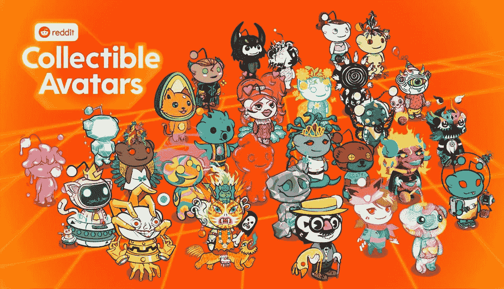
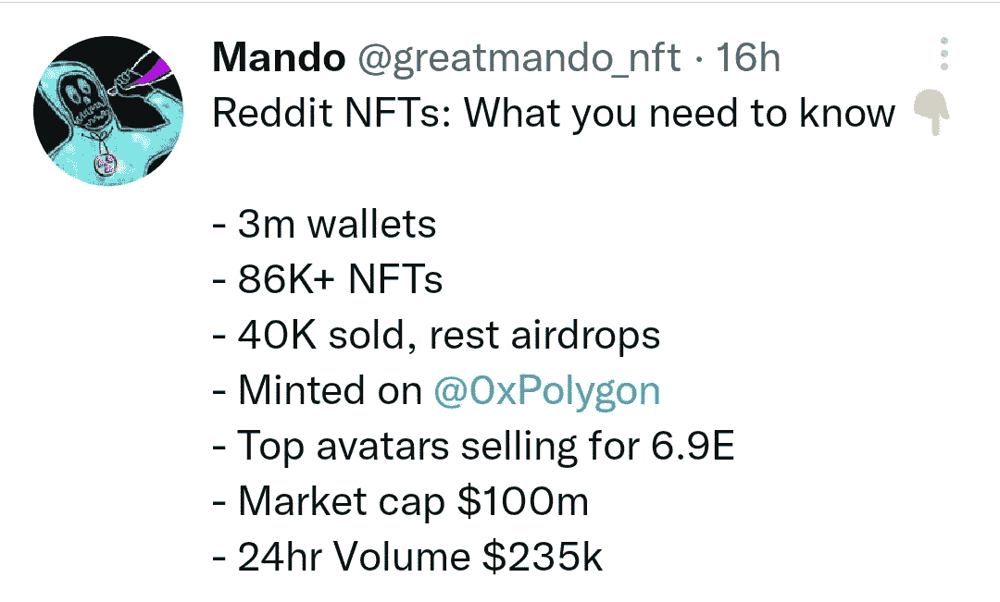
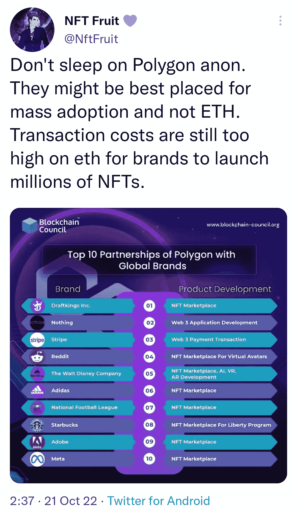

# Reddit 的“数字收藏品”对 NFT 空间意味着什么

> 原文：<https://medium.com/coinmonks/what-reddits-digital-collectibles-mean-for-the-nft-space-f13bc8ec4c30?source=collection_archive---------15----------------------->

## 现在正在发生

Reddit NFTs 遍布 Twitter。我不会用细节来烦你，因为我已经看到了几十条总结它们的推文。还有，这是印度的排灯节，我需要出去和我的朋友一起庆祝。所以，我正试着尽快写完这篇文章！这是一个简洁地展示细节的截图。

我知道他们的炒作会在几天内平息，我们不会再讨论他们了。因此，我更关心它们对 NFT 市场的现状和未来意味着什么。这些是我最初的想法:

**可收集的头像，而不是虚拟桌面**

这是巨大的。在这次投放中，他们有意在所有营销材料中省略了术语 NFTs。我能想到他们做这件事的各种理由。当有人问我什么是 NFT 时，我说它们是不可替代的令牌。然后，我必须解释什么是不可替代的，然后什么是令牌。这是不顺利的。如果每次我们在解释一个新产品的时候都必须进入技术讨论，那么它就失去了可分享性。仅仅因为这个原因，我不认为 NFT 这个词会在几年后继续存在。对正常人来说太专业了。

最重要的是，NFT 有可怕的公关。我们不能因此责怪任何人。我们中的许多人在 2021 年运气好，买了正确的动物照片，这让我们赚了很多钱。然后，我们开始骂其他人愚蠢，并开始炫耀我们从 NFT 赚的钱。人们最讨厌傲慢的有钱混蛋了！没有哪个大品牌愿意和这种公关扯上关系。因此，数字收藏品，而不是称之为 NFT。

这对我个人来说是个坏消息，因为我的用户名是“NFT 水果”。如果有人建议取一个不包含“NFT”的名字，我洗耳恭听。

**多边形网络代替 ETH**

几天前我发了这条微博。我认为 Reddit 对 Polygon 的选择只是后续内容的预告片。对于一个主要品牌来说，ETH 的交易费用太高，无法进入这个领域。他们不能指望他们的用户每次支付 5-20 美元来转移一个 NFT。在接下来的 12 个月里，我们将在 Polygon 上看到多个大品牌的下降。因为这个原因，我正在考虑购买他们的硬币$matic。押注于基础设施通常是一个好主意，而不是押注于建立在该基础设施上的单个项目。少花很多时间。(显然是 NFA)

**大规模采用比我们想象的要快**

我估计在 3-4 年内会有数千万用户涌入这个领域。我将这一估计修正为 12-18 个月。为即将到来的事情做好准备，因为我们都没有准备好。新技术不是线性增长，而是指数增长，无论我们多么直观，我们永远无法在头脑中完全理解指数增长。我们谁也不知道拥有 5000 万活跃用户的空间会是什么样子。快速反应，不要坚持先入为主的观念。我见过许多人亏损，因为他们不愿适应市场的动态变化。不要做纯粹主义者！纯粹主义者被抛在后面，而适应性强的人幸存下来。

**美元且不加密**

说到纯粹主义者，不要成为那些开始抱怨这些不是真正的 NFT 的人之一，因为他们是使用 fiat 而不是 crypto 购买的。没人在乎你的喜好。这个世界永远会选择方便而不是纯洁。在我们解决钱包问题之前，我们将看到所有主要的 NFT 美元下跌，而不是加密。仅仅为了买一个 50 美元的数字收藏品，建立一个 Metamask 账户并把 fiat 转换成 crypto 是一个非常麻烦的过程。

**低成本**

这很简单。如果我们想让数百万人进入这个领域，那么 NFTs 的价格需要低于 100 美元，而不是 1 万美元。几天前，我写了一篇关于泰勒·斯威夫特的 NFTs 的文章，并建议如果她想拥有大多数忠实粉丝，她的收藏应该定价在 50-100 美元之间。

**非投机资产**

如果我们想为即将到来的事情做好准备，这是最重要的事情。几年后，99%的非金融资产将不再是投机性资产。它们具有内在价值，不会仅仅因为你有能力以更高的价格出售它们而产生价值。我怎么知道这个？因为世界上 99%的人都不积极交易股票。我们不能指望他们改变行为，开始在一个更加动荡的市场中投机。他们会为了自己的利益而购买 NFT，而不是为了投机。

关于这一点，我有很多其他想法，但我现在不会让它们在市场上供过于求。也许是第二季！

干杯，
‘数码收藏品’的果实

> 交易新手？尝试[加密交易机器人](/coinmonks/crypto-trading-bot-c2ffce8acb2a)或[复制交易](/coinmonks/top-10-crypto-copy-trading-platforms-for-beginners-d0c37c7d698c)