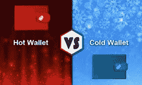

# 我应该用我的密码做什么？

> 原文：<https://medium.com/coinmonks/what-should-i-be-doing-with-my-crypto-557ac7bca810?source=collection_archive---------29----------------------->

随着这些天 FTX 和所有其他 FUD(恐惧、不确定性、怀疑)的突然影响，一个人可能会问我到底应该拿着这些硬币做什么，并希望继续持有。

虽然把事情放在心里是正确的，但当你开始听说和看到交易所暂停提款，个人不得不等着拿到资金时，情况就更是如此了。

那么你应该怎么做呢？

你们中的许多人刚刚开始你们的加密之旅，或者你们中的一些人没有经历过艰难的熊市，可能已经开始听说一个钱包，冷存储，热存储，分类账或 Trezor。这些都是人们储存密码并保证其安全的不同方式。在使用所有这些不同类型的存储时，也有不同的安全级别，我将带您了解其中的一些。

**钱包**

人们可能经常听说的一件事是钱包。现在，一个人可能会认为钱包是你放钱或卡的东西，或者把它放在钱包、手提包、口袋里，它保护你的货币安全。

这非常类似于钱包对于加密的意义，不过通常它是放置数字货币的地方。我不能取出任何密码并使用它，但我可以把它存在钱包里。每种类型的钱包通常都有几个安全步骤，通常都很安全。有两种主要类型的钱包，一个热存储和一个冷存储。

**热储**

热存储钱包是一种保持在线并可访问互联网的钱包。这些例子中的一些包括绑定到交易所的钱包。所以如果我有币安的账户。币安有一个专门为每个注册用户设置的钱包。然而，那是在线的，而**可能会被黑客或者银行挤兑进入。这些基金在交易所的钱包里，因此技术上可以在他们认为合适的时候移动它们。它总是那样发生吗，不。但是它能，是的。**

**冷藏？**

加密客户的另一个选择是冷藏。冷存储是拥有一个不在线的钱包的能力，你实际上持有你的加密密钥。冷藏通常带有一个小的 USB 类型的设备，你可以插入你的电脑。你通常会有一个 12 或 24 个单词的“种子短语”，你写下来，只有你知道。所以只要没人能接触到这个短语，你的密码就应该是安全的。主要有两种:莱杰和特雷佐。两者各有利弊，所以你必须自己做研究，找出哪一个适合你自己的工作。

**但是为什么呢？**

有两个主要原因让你的密码在冷存储中离线。第一个原因是黑客无法得到它。如果它是离线的，没有人可以访问它，那么就不用担心有人得到信息，如登录或密码，并获得您的加密。即使他们无法获得完整的取款密码，他们也可以像几周前 3Commas 那样，用你的资金抽取和抛售“shitcoins ”,同时他们用自己的账户在顶部卖出，用你的账户在顶部买入。另一个原因是，如果一些疯狂的事情发生，每个人都想立即撤回他们的 BTC，交易所可能没有足够的 BTC，你可能会暂停撤回或没有资金。想一想 Crypto.com 或 FTX。

**那么我该怎么办呢？**
那是我不能告诉你的事情。然而，我希望通过这篇文章，我已经给了你一些好的想法来思考，一些事情会让你思考到底应该把你的密码放在哪里，以及如何保持你的密码安全。

**链接**

YouTube 上的 grid bot Guru:[**点击这里！**](https://www.youtube.com/c/gridbotguru)

美国公民 pionex:[**点击这里！**](https://pionex.us/en-US/sign/ref/RnIZeirs)

全球公民 pionex:[**点击这里！**](https://www.pionex.com/en-US/sign/ref/zVt0KmHU)

报名比特币基地: [**点击这里！**](https://www.coinbase.com/join/wyatt_h)

**USDT(TRC 20):**taiedlxa 7 mlvwoybwr 46 mmqefifyq1htj

**BTC:**3 ftbppewnaoyxbpa 1 mpdhdjn 7 e 41 mzhriy

> 交易新手？尝试[加密交易机器人](/coinmonks/crypto-trading-bot-c2ffce8acb2a)或[复制交易](/coinmonks/top-10-crypto-copy-trading-platforms-for-beginners-d0c37c7d698c)