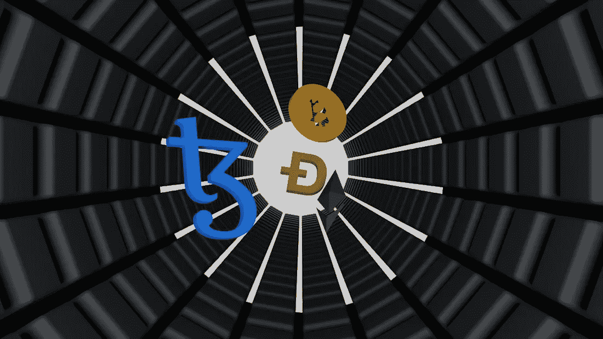

# 关于 WEB3 我应该知道些什么？

> 原文：<https://medium.com/coinmonks/what-should-i-know-about-the-web3-2521b101d06c?source=collection_archive---------34----------------------->

Image by Shubham Dhage on [Unsplash](http://unsplash.com)

参与 web3 社区需要学习交流中可能使用的语言，并了解这些社区的最新消息。

只有当你能很容易地理解社区其他成员在说什么时，交流才变得令人兴奋。

在本文中，我们将检查一些你在使用 web3 互联网时可能遇到的术语，以确保你不会在那里迷路。

***刀***

DAO 是分散自治组织的缩写。Dao 允许在没有第三方或中央组织参与的情况下在区块链上执行操作。

[Dao 使用智能合约](/coinmonks/smart-contracts-moving-towards-decentralization-8f1d079f6755)实现区块链交易的自动化。

使用 Dao 的组织将组织的决策委托给社区，社区由组织的利益相关者组成。社区可以通过使用 DAO 项目的独特 DAO 令牌来影响组织内的决策。

任何拥有这些 DAO 令牌的人都能够通过参与智能契约来投票支持他们希望组织采取的行动。

***第 0 层***

公共区块链就是建立在这个协议之上的。建立在 0 层协议上的公链有以太坊、索拉纳、比特币、Avanlanche 等。

公共链的隔离问题由第 0 层解决，与这些公共链相比，第 0 层是可互操作的。

***第 1 层***

公共区块链是第 1 层，它建立在第 0 层之上。他们是独立的区块链，通常与他们生态系统内的项目进行交互。

更简单地说，索拉纳不会自然地理解以太坊链，只会在索拉纳生态系统内交流。

***第二层***

第 2 层的工作方式类似于第 1 层的升级版。目标是建立一个更具可扩展性的网络，能够解决第 1 层网络中的缺陷。

以太坊链上已经构建了许多旨在降低汽油费用和加快交易完成速度的第 2 层解决方案。

***Web 3***

Web3 仅仅是创造者的经济；正是网络将控制权交到了公众手中。

尽管 web3 不一定只专注于互联网，但它将减少主要科技公司和互联网公司对人们的数据、内容和隐私的影响。

web3 将支持一个让每个人都能从自己的内容中获利的经济；对 web2 的改进。

**DApps**

分散式应用程序。DApps 有助于连接到分散的 web，就像标准的在线应用程序和页面一样。

基于区块链的去中心化应用程序通过钱包的 dApps 部分访问，需要钱包的连接才能有效运行。

DApps 与区块链完全兼容。一些分散式应用程序(dApps)是特定区块链独有的，而其他应用程序则使用互操作性特性，可以与多个区块链通信。

***元宇宙***

*元宇宙的概念经常与 web3 联系在一起。尽管许多人认为元宇宙是 web3 的全部，但元宇宙实际上只是 web3 的一小部分。*

*元宇宙本身就是一个存在于虚拟现实中的宇宙。预计未来的技术进步将使我们能够使用虚拟现实(VR)和增强现实(AR)。例如，任何拥有 3D 耳机和其他支持设备的人都可以访问这个虚拟世界。*

*在这个虚拟环境中，你可以拥有自己的房子并出租，参加会议，甚至参加音乐会——所有这些都在你自己舒适的家中进行。*

> *交易新手？试试[密码交易机器人](/coinmonks/crypto-trading-bot-c2ffce8acb2a)或[复制交易](/coinmonks/top-10-crypto-copy-trading-platforms-for-beginners-d0c37c7d698c)*

****GameFi****

*GameFi 是游戏和金融的简称。区块链技术已经发展，现在延伸到非本土区块链发展。因此，现在可以利用区块链技术创建传统游戏，这给了游戏玩家许多机会。*

*GameFi 奖励活跃的游戏，这与传统游戏的方式有很大不同。P2E 是一个经常与 GameFi 联系在一起的概念。*

****SocialFi****

*SocialFi 结合了 socials 和 finance。这是一个网络 3 的想法，旨在鼓励分散的社会互动。有了 SocialFi，拥有一个 web3 社交网络帐户并发布内容会得到回报。未来的社交网络预计将遵循这种奖励每一次参与的模式。*

*一些著名的 SocialFi 平台是 Minds 和 Hive。*

***T21NFT***

*NFT 是不可替代令牌的简称。NFT 用于存储数字资产，包括音乐、图片、艺术品和其他可以用数字方式表示的项目。*

*与比特币和其他几种加密货币不同，NFT 是不可复制的，因为永远不会有两个相同的 NFT。在区块链上创建的 NFT 表示各种数字属性，即使它们具有相同的数字图片。*

*最受欢迎的 NFTs 形式代表了数字艺术、3D 设计和以猿为主题的绘画。*

***结论***

*这篇文章中强调的概念是你应该理解的基本 web3 概念。还有其他的我们很快会探索！一定要留下来。*

*希望这对你有帮助！*

**

*Te veo pronto!*

> *加入 Coinmonks [电报频道](https://t.me/coincodecap)和 [Youtube 频道](https://www.youtube.com/c/coinmonks/videos)了解加密交易和投资*

# *另外，阅读*

*   *[用于 Huobi 的加密交易信号](https://coincodecap.com/huobi-crypto-trading-signals) | [HitBTC 审查](/coinmonks/hitbtc-review-c5143c5d53c2)*
*   *[TraderWagon 回顾](https://coincodecap.com/traderwagon-review) | [北海巨妖 vs 双子星 vs BitYard](https://coincodecap.com/kraken-vs-gemini-vs-bityard)*
*   *[如何在 FTX 交易所交易期货](https://coincodecap.com/ftx-futures-trading)*
*   *[OKEx vs KuCoin](https://coincodecap.com/okex-kucoin) | [摄氏替代品](https://coincodecap.com/celsius-alternatives) | [如何购买 VeChain](https://coincodecap.com/buy-vechain)*
*   *[ProfitFarmers 回顾](https://coincodecap.com/profitfarmers-review) | [如何使用 Cornix Trading Bot](https://coincodecap.com/cornix-trading-bot)*
*   *[如何匿名购买比特币](https://coincodecap.com/buy-bitcoin-anonymously) | [比特币现金钱包](https://coincodecap.com/bitcoin-cash-wallets)*