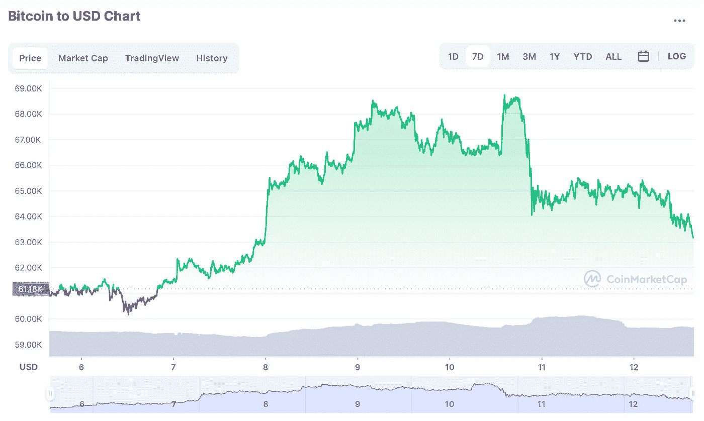

# 在高波动性市场中，我们应该做些什么？

> 原文：<https://medium.com/coinmonks/what-should-we-do-in-high-volatility-markets-e1a0ce450f39?source=collection_archive---------70----------------------->

金钱总是有吸引力的。因为你可以实现很多事情，并且得到满足。轻松赚钱更甜蜜。因为轻松赚钱真的很容易。我不需要解释这个的魅力。每个人都工作几个小时，要求更多的钱。没有人愿意一辈子为钱而工作。要满足的爱好是昂贵的。他也会想要得到它们。这个人需要知道如何为它赚钱。风险认知应该在路线图中创建和确定。您将参与的货币市场将极大地影响您的外汇或加密市场风险。你对压力的感知和你的生活环境将会改变。你必须为这一切做好准备。

首先你要从心理准备开始。心理不好让你输。心理好也是。:)最佳水平的心理将是你最重要的准备点，将为你工作。

加密货币是一个风险非常高，利润也非常高的市场。这是关于你对风险的认知。风险=金钱
但是当承担这些风险时，明智地而不是愚蠢地承担它们是很重要的。你的投资和风险决策，你将通过混合你的基本面和技术分析的知识，可以让你变得富有。但相反，它会让你处于一个非常困难的境地，比如在一个机会游戏的逻辑中。(这些我都经历过。)
我谈到了其中的一个风险，特别是在我关于[ICO](/@umutdeda/you-may-have-heard-about-ico-from-places-while-surfing-the-internet-82854d225e23)token 的文章中。

## 特别是在一些交易中，人们是很有希望的。其中最大的是期货交易。

期货交易给已经动荡的市场增加了更多的波动。我可以说 96%都输了。有一个事实是，当我们考虑稀释收益时，预测亏损并不困难。但这不代表钱不会折。这就是准备你的金钱观念和创造你的风险观念非常重要的地方。你必须追寻你的梦想。即使活着也是一种风险。*【赚钱】*除此之外就再平常不过了。所以我们必须带着信息开始工作。在其他几篇文章中，我将开始解释技术分析的内容。

> 使用你的市场选择从加密将是创新和非常有利可图的。

在这里，你将有机会在许多交易所进行交易。我想再次提醒你，你应该远离杠杆交易。与在你的股票市场选择中给你最好佣金率的交易所合作可以防止你支付高佣金。我更喜欢墨西哥国际公司。在这里你可以支付不同的佣金。

> 交易新手？试试[加密交易机器人](/coinmonks/crypto-trading-bot-c2ffce8acb2a)或者[复制交易](/coinmonks/top-10-crypto-copy-trading-platforms-for-beginners-d0c37c7d698c)