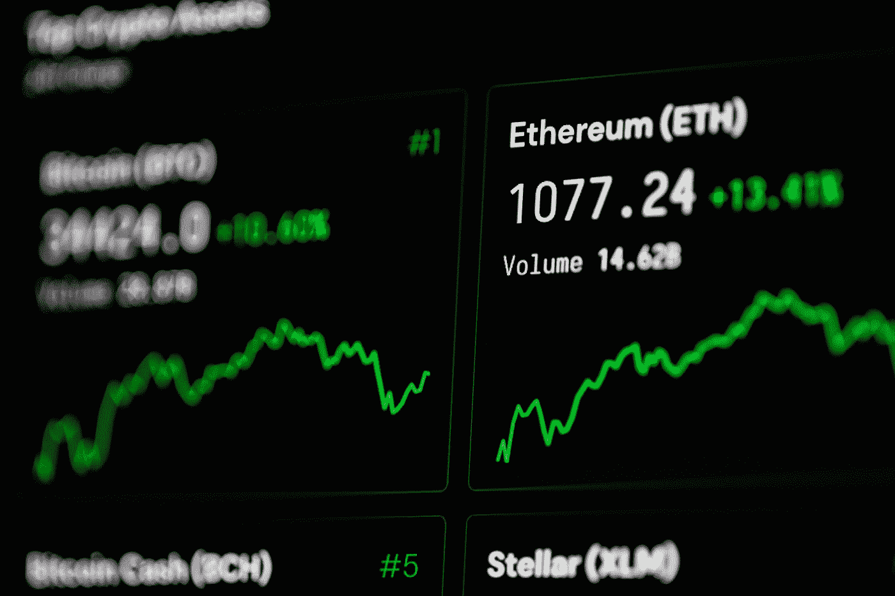
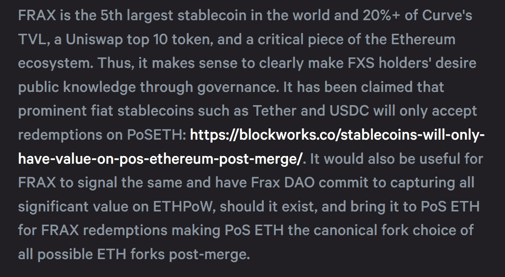
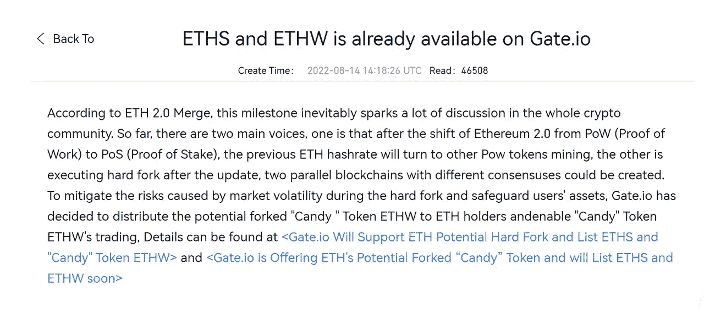
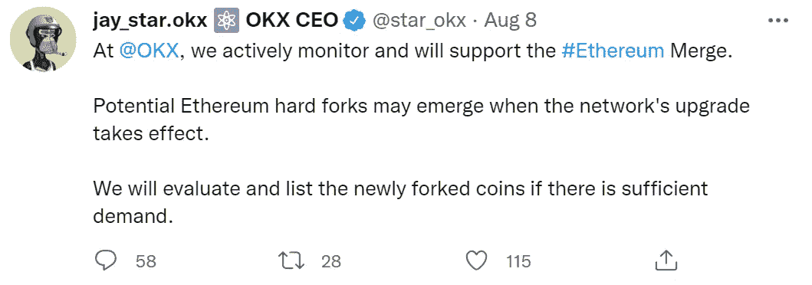
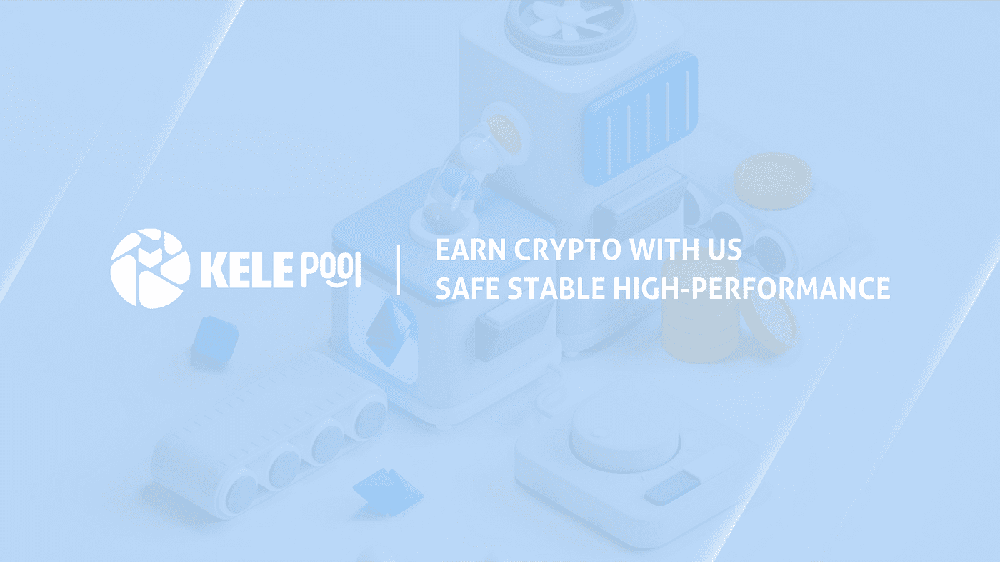

# 以太坊硬叉我们应该了解什么？

> 原文：<https://medium.com/coinmonks/what-should-we-know-about-the-ethereum-hard-fork-bc21dc0186a6?source=collection_archive---------21----------------------->

随着以太坊合并的临近，更多的人把目光放在了以太坊的分叉上。在区块链世界，加密货币分叉实际上是非常罕见的事件，当它们发生时，通常会产生很大的影响。以太坊是当今最重要的区块链网络，因此它的分叉吸引了全球前所未有的关注。不过话说回来，fork 是一个很少见的现象，很多人还没有完全理解它，或者它对我们意味着什么。在这篇文章中，我们将详细解释什么是叉子，以太坊叉子是什么样的，以及我们应该如何处理它。

# 加密货币的分叉是什么

简单来说，分叉指的是区块链协议的更改或升级。当我们使用传统的、非分布式的网络时，某些内容的改变往往非常简单。比如软件升级时，只要向用户推送新版本，逐步关闭旧版本，就能保证所有用户使用最新版本。但在分布式网络中，由于网络不是统一控制的，当发生变化时，很可能有人用新协议，有人用旧协议。如果一切顺利，新协议将成为主流，从而报废旧协议，但在极端情况下，也会出现两种协议共存的情况，会产生两条不同的链。

如果有些分叉并没有改变协议的实际结构，而是维护工作，那么我们称之为“软分叉”，它们的存在实际上是可以容忍的。但是对面的“硬叉”就大不一样了。它们是对加密货币协议本身的巨大改变，使旧版本无效。如果旧版本继续存在，就会从新版本中分离出来。一般来说，正常运行的加密货币不会实现硬分叉。

# 以太坊叉子

在即将到来的以太坊合并中，以太坊将从 PoW 共识机制过渡到 PoS 共识机制，这无疑是一个硬分叉，甚至从根本上改变以太坊的运营方式。说到这里，我想说说当年以太坊发生的硬分叉。以太坊自 2015 年创立以来，经历了数次硬分叉，其中最具争议的是以太坊经典(ETC)。

2016 年，以太坊开发团队注意到 DAO(去中心化自治组织)合同中的一个漏洞，导致约 360 万 ETH 被盗。根据合同设计的方式，资金在被转移之前经历了 28 天的冻结。在这种情况下，以太坊实现了硬分叉，开发团队反击黑客，追回资金。

但是硬分叉也把以太坊社区分成了两大阵营。第一阵营的人对开发团队采取的行动感到满意。他们认为这意味着开发人员已经吸取了教训，如果类似的事情再次发生，他们可以妥善处理。

第二个阵营不同意以太坊分叉，认为加密货币要真正去中心化，开发团队就得随波逐流。一旦开发团队开始采取行动，将会掀起连锁反应，危及加密货币的未来。

最终，开发人员决定实现一个硬分叉，旧的区块链被称为以太坊经典。这种分叉也导致了两种货币的分离:ETH 和 ETC。

可以看出，在目前以太坊向 PoS 过渡的趋势下，也会出现 PoS 的支持者和反对者，这预示着合并时会出现新的链和 ETHPoW 令牌。

> 相关文章
> 
> [关于以太坊的合并你需要知道的一切](/coinmonks/all-you-need-to-know-about-the-merge-of-ethereum-b45ebf93694f)

# 权威专家和机构的意见

面对产生新以太坊链的可能性，业内人士看法不一。以太坊的主要开发者 Vitalik 对 ETHPoW fork 提出了异议。他认为，叉的支持者只是想赚快钱。其实以太坊已经有 PoW fork 链了，就是前面提到的 ETC。Vitalik 认为，如果你愿意使用 PoW，直接转用 ETC 是更明智的选择。

以 Frax Finance 为代表的项目方也表示反对分叉。Frax 是世界上第五大稳定币，也是以太坊生态系统的关键部分。其创始人 Sam Kazemian 在社区发起提案，呼吁 Frax DAO 选择 ETHPoS 作为唯一 Frax 认可的以太坊网络。

Image excerpt from Frax Finance proposal

相反的分叉支持者大多来自交易所。Gate.io 已经在 8 月 14 日推出了 ETH 交换功能。用户可以用 ETH 交换 ETHW 或 ETHS，其中 ETHW 代表可能的 PoW 链令牌。

Image from Gate.io official announcement

OKX CEO Jay Hao 也表示，OKX 支持以太网合并，但如果出现硬分叉，OKX 会根据特性审核列出硬分叉令牌。

# 我们如何理解叉子

坦率地说，上述各方的态度都取决于他们在分叉链中的利益。头项目方不需要在分叉链上承担风险，所以他们倾向于支持 PoS 链；而交易所可以利用分叉链本身的资源吸引众多的用户和资金，所以自然成为 PoW 链的支持者。

作为用户，此时应该保持冷静，防止被各种言论冲昏头脑，进行不必要的投资。同时，这样的节点也意味着机遇。可以关注一些分叉币的空投，可能会有意外收获。

如果你有兴趣探索加密货币领域，也欢迎来到[乐可池](https://www.kelepool.com/)。我们是一个集电力开采和 PoS 打桩于一体的基础设施平台，致力于提供安全可靠的加密货币服务。

安全:乐可池的 staking smart 合同已通过区块链权威机构 SlowMist Technology 的审核。和乐可池支持使用分类帐硬件钱包。

加密货币的灵活赚取:与大多数只有单一服务的采矿池不同，乐可池支持两种服务模式，您可以自由选择符合您需求的方法。相比其他矿池，服务费也更合理。

官方网站:【https://www.kelepool.com/ 

> 跟着我们
> 
> 🤝[电报](https://t.me/kelepoolcom)
> 
> 🐦[推特](https://twitter.com/PoolCola)
> 
> 😊[脸书](https://www.facebook.com/KelePool/)
> 
> 📺 [YouTube](https://www.youtube.com/channel/UC41u9bo8U8UYNO_rJ6pb8GQ)

> 交易新手？尝试[加密交易机器人](/coinmonks/crypto-trading-bot-c2ffce8acb2a)或[复制交易](/coinmonks/top-10-crypto-copy-trading-platforms-for-beginners-d0c37c7d698c)