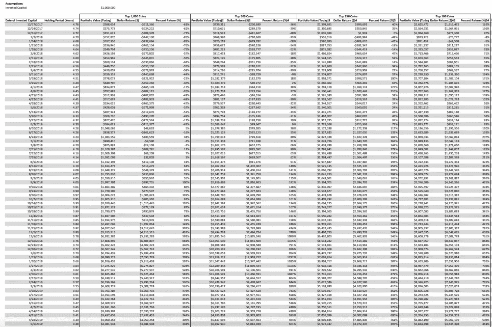
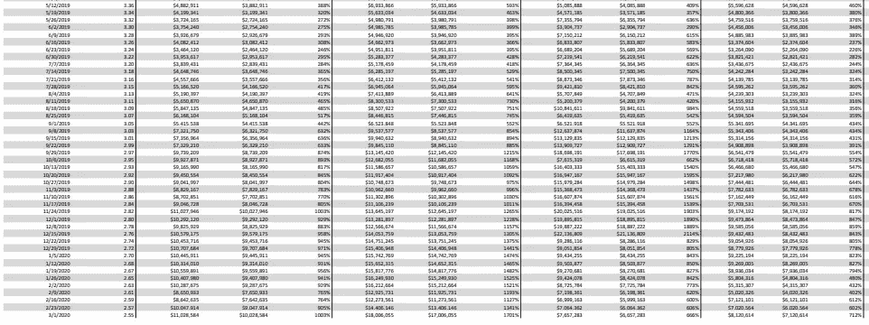
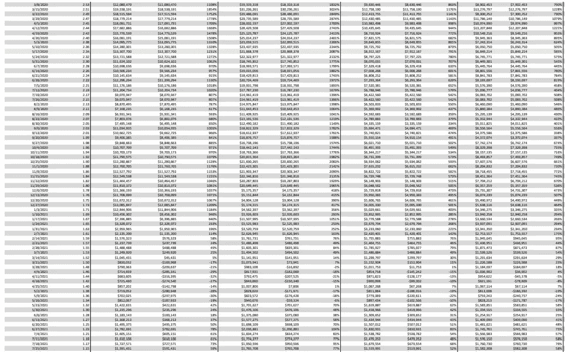
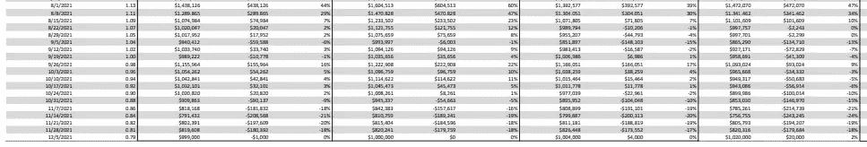

# 2018-2020 年的熊市和 2021 年的牛市告诉我们如何为加密货币的下一轮牛市做准备！

> 原文：<https://medium.com/coinmonks/what-the-bear-market-of-2018-2020-and-bull-run-of-2021-tells-us-about-preparing-for-the-next-bull-760eaf79d132?source=collection_archive---------10----------------------->

今天是 9/18/22，加密货币的市值已从 11/10/21 的约 2.9 美元跌至 6/19/22 的约 8 亿美元的本地低点。这意味着市值下降了 2.1 万亿美元，比历史最高水平下降了 72%。

我认为可以肯定地说，我们进入了加密货币的新熊市，这给投资者提供了一个投资廉价加密货币(相对于 ATH)的绝佳机会，直到下一轮牛市开始，这通常发生在下一次比特币减半后的几个月，下一次比特币减半将在 2024 年 3 月左右发生。

那么这次熊市我做了哪些准备呢？我决定回到 2017 年的牛市、2018-2020 年的熊市和 2021 年的牛市，寻找在管理风险的同时实现收益最大化的最佳策略的线索。

我首先需要的是数据。CoinMarketCap 有我需要的所有数据，但他们要求$3K 能够使用他们的 API 下载所有的历史硬币信息。所以我花了 2 周的时间，从 2017 年牛市的顶峰开始(比特币在 12/17/17 达到 19700 美元，到 2021 年牛市在 12/5/21 结束)，复制并粘贴了前 1000 种加密货币的每周市值。我选择从 2017 年牛市的顶峰开始的原因是，如果我决定在最糟糕的时间点开始投资加密货币，会发生什么，那将是 2017 年 12 月 17 日，因为比特币的价格在一年多一点后从 19.7 美元降至约 3.2 美元。

好了，我有了所有的数据，现在做什么？

我想比较的下一件事是，尝试把握市场时机好还是平均成本好？

此外，如果我决定美元成本平均，我会选择哪些硬币？我会投资前 10 名吗？50 强？100?250?500?！1,000?！

谁知道最佳策略是什么，但这是我想知道的。

让我们从平均成本开始。

# **策略#1:平均美元成本**

在 excel 中，我使用一些奇特的公式来绘制如果我有 100 万美元，并决定每周平均花费 100、250、500 和 1000 种加密货币会发生什么。

我想让你们猜猜看，你们认为哪一组(100、250、500、1000)表现最好。

从 2017 年 12 月 17 日到 2021 年 12 月 5 日，有 208 周，这意味着我计算了如果我平均投资 4807.69 美元(1000000 美元/208 周)，从 2017 年 12 月 17 日到 2021 年 12 月 5 日，我的回报会是多少。

赢家是前 500 名硬币的平均成本，回报率为 558%，我最初的 100 万美元变成了 6，584，930 美元。

排在第二位的是前 1000 种加密货币，回报率为 352%，最初的 100 万美元变成了 4，524，449 美元。

第三名是前 250 个硬币，回报率为 345%，我最初的 100 万美元变成了 4，446，198 美元。

最后，前 100 种加密货币的回报率为 298%，最初的 100 万美元变成了 3，980，566 美元。

这多酷啊！你甚至不需要尝试和挑选获胜的加密货币，只需投资前 100 种加密货币，在大约 200 周的时间里，你就可以获得 300%的回报！此外，请记住，这是假设你在最糟糕的时候开始的，当时比特币在 2017 年 12 月 17 日达到了历史最高水平 19.7 万美元。

想象一下，如果你在市场从历史高点下跌 66%时开始投资，回报会是多少，这正好是我们今天(9/18/22)从历史高点下跌的幅度。回报将远远超过 300%，你需要做的只是将美元成本平均纳入前 100 种加密货币。

# 策略 2:把握市场时机

现在我们知道了美元成本平均策略的结果，我想知道如果我从 12/17/17 到 12/5/21 随机选择一周，将我的全部 100 万美元投资于排名前 100、250、500、1000 的加密货币，会发生什么。

请记住，把握市场时机是非常困难的，我不建议一次投资所有的干粉，但假设看起来很有趣。

以下是结果(您可能需要放大)。

让我们先来看看，如果你在 2018 年 12 月 17 日比特币达到 19.7 美元的历史高点整整一年后投资 100 万美元，回报率会是多少。

如果你在 2018 年 12 月 17 日将这笔钱投资于前 1000 个硬币，12 月 5 日 21 日的回报率将为 681%。

如果你在 2018 年 12 月 17 日将这笔钱投资于前 500 个硬币，那么 12 月 5 日 21 日的回报将是 1105%(哇！).

如果你在 2018 年 12 月 17 日将这笔钱投资于前 250 个硬币，12 月 5 日 21 日的回报率将为 751%。

如果你在 2018 年 12 月 17 日将这笔钱投资于前 100 个硬币，12 月 5 日 21 日的回报率将为 864%。

请记住，从 2017 年 12 月 17 日到 2018 年 12 月 17 日，加密货币市场从略高于 8 亿美元下降到 1 亿美元(-87%)。

这是一个相当大的跌幅，这也解释了为什么回报率会如此之高。

好吧，如果我们在下一次比特币减半前一年**投资会怎么样(如果你不知道比特币减半是什么，请随意联系！).最近的比特币减半发生在 2020 年 5 月 11 日左右，所以让我们看看如果我们在 2019 年 5 月 11 日左右投资 100 万美元会发生什么。**

如果你在 2019 年 5 月 12 日将这笔钱投资于前 1000 个硬币，12 月 5 日 21 日的回报率将为 388%。

如果你在 2019 年 5 月 12 日将这笔钱投资于前 500 个硬币，12 月 5 日 21 日的回报将是 593%(哇！).

如果你在 2019 年 5 月 12 日将这笔钱投资于前 250 个硬币，12 月 5 日 21 日的回报率将为 409%。

如果你在 2019 年 5 月 12 日将这笔钱投资于前 100 个硬币，12 月 5 日 21 日的回报率将为 460%。

不如一年后从历史高点投资给人的印象深刻，但回报仍然很高。

# 如果我们在 2020 年 5 月比特币减半后立即投入所有资本会怎么样？

最后，让我们看看如果我们在 2020 年 5 月比特币减半后立即投资 100 万美元会发生什么。

如果你在 2020 年 5 月 17 日将这笔钱投资于前 1000 枚硬币，12 月 5 日 21 日的回报率将是 1231%。

如果你在 2020 年 5 月 17 日将这笔钱投资于前 500 个硬币，12 月 5 日 21 日的回报将是 2087%(哇！).

如果你在 2020 年 5 月 17 日将这笔钱投资于前 250 个硬币，12 月 5 日 21 日的回报率将是 791%。

如果你在 2020 年 5 月 17 日将这笔钱投资于前 100 枚硬币，12 月 5 日 21 日的回报率将是 585%。

首先，什么？！前 500 枚硬币的收益超过了 20 倍？是的，很疯狂，我知道。

# 那么我从这一切中得到了什么呢？

我认为没有人能预测市场的高点或低点，这就是为什么我认为平均成本是最好的策略。

但我也认为，如果我们处于熊市时，你能开始按美元平均成本计算，那将带来最高的可能收益。

那我在做什么？

从 2023 年 1 月开始(距离比特币历史高点 69K 美元还有一年多一点)，直到 2024 年 3 月比特币减半，我计划将美元成本平均化为我最喜欢的加密货币，我将在未来的帖子中分享这些货币。

感谢阅读！让我知道你的想法！

*   但

> 交易新手？试试[加密交易机器人](/coinmonks/crypto-trading-bot-c2ffce8acb2a)或者[复制交易](/coinmonks/top-10-crypto-copy-trading-platforms-for-beginners-d0c37c7d698c)