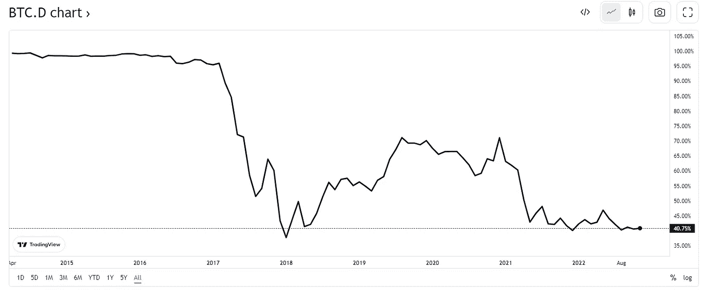

# 比特币优势图表告诉你什么

> 原文：<https://medium.com/coinmonks/what-the-bitcoin-dominance-chart-tells-you-fd52eab1231f?source=collection_archive---------39----------------------->

[https://www.tradingview.com/symbols/BTC.D/](https://www.tradingview.com/symbols/BTC.D/)

比特币绝对是加密世界的大玩家。它拥有所有加密货币中最大的市值，并且比任何其他数字货币都被更多的企业接受。因此，人们怀疑比特币是否正在主宰加密市场也就不足为奇了。

不过，比特币不一定主宰市场有几个原因。第一，有很多…