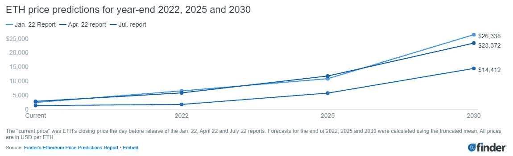
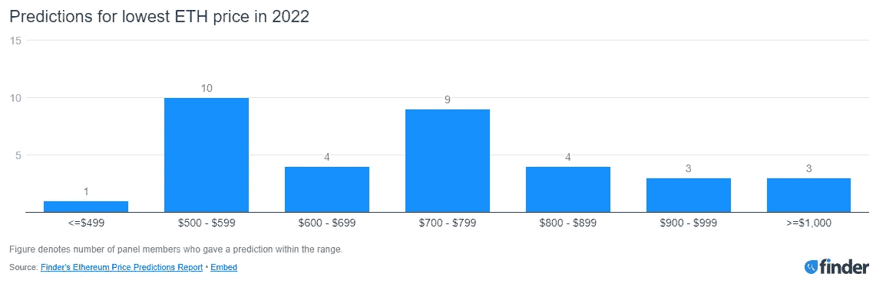
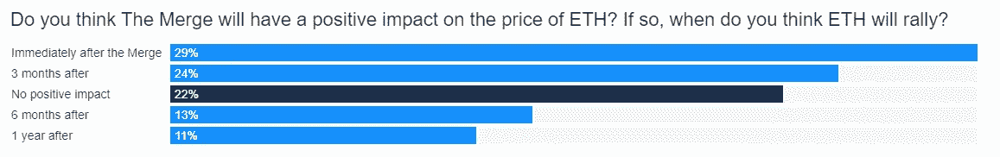
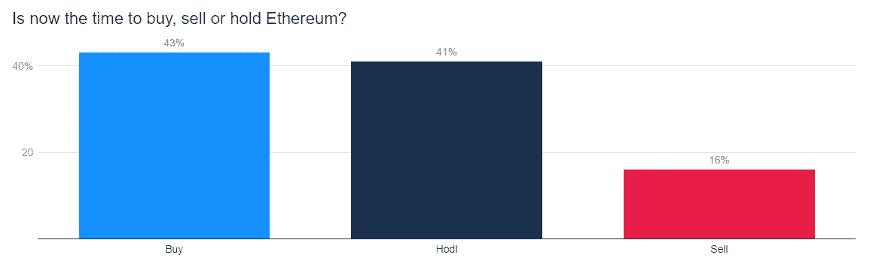
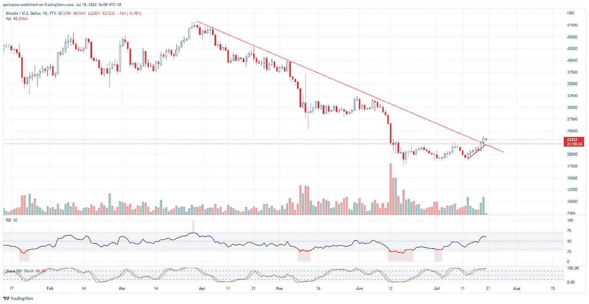
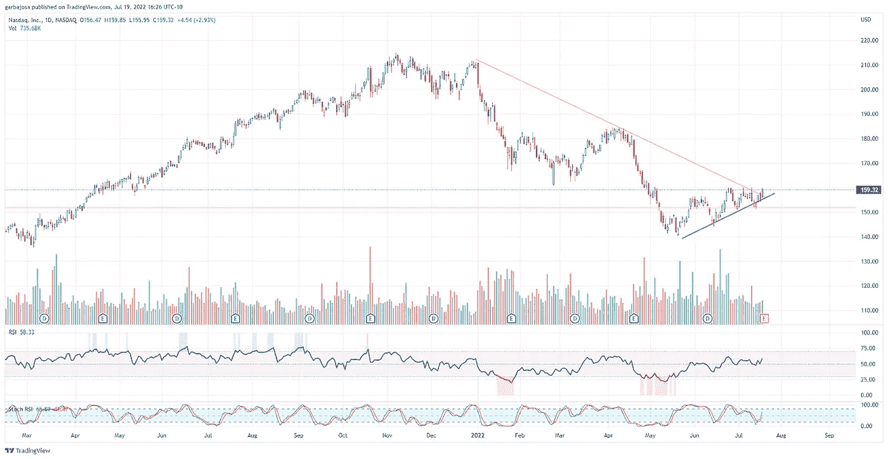
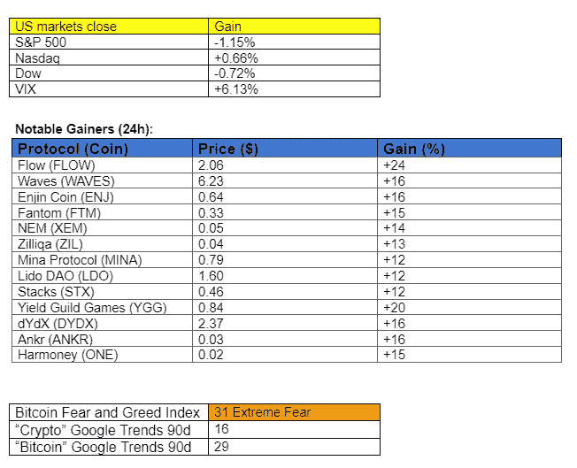

# 专家们关于以太坊价格的说法可能会让你大吃一惊。

> 原文：<https://medium.com/coinmonks/what-the-experts-are-saying-about-ethereum-price-may-surprise-you-1ea2c06a050b?source=collection_archive---------2----------------------->

## 加密每日混合器 7.19.22

## 快速发展的加密市场的每日回顾

Photo by [Ben White](https://unsplash.com/@benwhitephotography?utm_source=medium&utm_medium=referral) on [Unsplash](https://unsplash.com?utm_source=medium&utm_medium=referral)

# 概观

*   专家以太坊价格预测
*   市场更新:加密集会！
*   新加坡的加密打击
*   Aave 与 Pocket Network 合作

早上好，家人，

当我们看到 crypto 精心策划了一场精彩的救援反弹时，不禁要问它是否能继续考虑动荡的宏观环境。

如果我们有一个专家小组来咨询就好了。对我们来说幸运的是，有一种方法可以挖掘这些大人物的观点和预测。

Finder.com 不定期进行调查，收集 50 多名金融科技专家的预测、想法和分析。今天，他们发布了调查结果，涵盖了价格预测的各个方面，并补充了一些意见。7 月 13 日，Finder.com[发布了一份关于比特币的类似报告。](https://www.finder.com/bitcoin-btc-price-prediction)

今天，时事通讯将总结以太坊报告。让我们来挖掘一下专家们的大脑。

> 交易新手？试试[密码交易机器人](/coinmonks/crypto-trading-bot-c2ffce8acb2a)或[复制交易](/coinmonks/top-10-crypto-copy-trading-platforms-for-beginners-d0c37c7d698c)

# 2022 年以太坊(ETH)和比特币的专家价格预测

【2022 年、2025 年和 2030 年的 ETH 价格预测。

本月的报告显示，与之前的调查相比，结果有所缓和，ETH 在年底前达到 1711 美元的共识高点，到 2025 年达到 5739 美元，到 2030 年达到 14412 美元。与 4 月份的报告相比，这是一个重大变化。尽管如此，许多专家预测今年年底价格可能会达到 3000-4000 美元。

**底部价格预测**

专家们在预测 ETH 的低点时喜忧参半，但大多数人认为它在 500-800 美元之间，如下图所示。

**合并对以太坊有好处吗？**

78%的专家认为合并将对 ETH 价格产生积极影响，54%的专家认为影响将在 3 个月后立即发生。

当被问及是否会购买、持有或出售 ETH 时，84%的人认为现在是买入或持有的最佳时机。只有 16%的人不同意。我喜欢这些几率！

**结论**

专家们大多认为，目前购买 ETH 是一件好事，但宏观经济的逆风在过去几个月里大大降低了人们的预期。有趣的是，即使是最有经验的玩家也会很快被感染。值得注意的是，一些专家提到以太坊面临激烈的竞争，可能会失去其作为顶级智能合约平台的统治地位，但其他人认为以太坊将在未来颠覆比特币。

净-净，结果似乎是积极的 ETH 的未来价格，但投资者可能不得不在短期内经受住宏观经济风暴，以达到隧道尽头的光。

# 市场更新🌍

**BTC/USDT**

干得好比特币！比特币今天突破了关键的下跌趋势和权威阻力，使 BTC 在一个月内首次进入 23，000 美元。一个可能的情况是重新测试 22.2 美元的前阻力位。然而，交易量并没有大幅上升，价格将保持波动，无论方向如何。BTC 收盘上涨 4.27%，至 23，396 美元。

*高清*[图表](https://www.tradingview.com/x/D7wrmV7B/)

**BTC。D**

比特币的统治地位(BTC。d)打破了上升趋势，这最终预示着替代硬币的好兆头。此外，这表明投资者有兴趣通过超越比特币来承担更高的风险。BTC。d 目前占 43.08%。

*高分辨率* [*图表*](https://www.tradingview.com/x/SV0owFHE/)

**纳斯达克**

纳斯达克(NDAQ)是传统市场中跟踪科技股的指数，在经历了一个月的下跌后，似乎正在打破三角形格局。目前，加密仍然与科技行业高度相关。最终，我们希望看到两者之间的去相关，但现在，NDAQ 中任何积极的价格行动都对 crypto 有利。

*高清* [*图表*](https://www.tradingview.com/x/X5iOCPha/)

***免费订阅*** ***，抢先获得每日简讯。***

如果你喜欢这份报告，并且认为它值 20 分(0.01 美分)，请点击下面的按钮来支持我的写作。(最多 50 次！)谢谢！

# 新闻观察📰

**新加坡的秘密打击行动。**由于与 Terra、Babel Finance、Vauld exchange 和 3AC 有关的众多问题，新加坡政府希望[增加对零售投资加密的](https://www.bloomberg.com/news/articles/2022-07-19/singapore-plans-a-further-strengthening-of-crypto-regulations?utm_campaign=socialflow-organic&utm_source=twitter&utm_content=crypto&utm_medium=social)限制，与国际监管机构保持一致。

律师不赞成零售。为了减轻责任，该公司的律师在法庭上辩称，Celsius 用户[在接受服务条款时就放弃了对基金的合法权利。为了散户投资者的利益，听到律师们采取这种方式并不令人放心。](https://cryptoslate.com/lawyers-claim-users-gave-their-crypto-to-celsius/)

**新闻花絮**

*   Crypto.com 和比特币基地获得了意大利的监管许可。
*   FBI 在最近的一份报告中警告散户投资者注意与加密相关的欺诈。
*   美国司法部没收了通过黑客手段获得的 50 万朝鲜密码。
*   [列出](https://wublock.substack.com/p/who-lent-money-to-three-arrows-capital)借钱给 3 Arrows Capital 的公司/协议。

# **在协议级⛓**

**丽都道(LDO)开启新一轮投资。**丽都道已经[提出以 1.45 美元的价格出售 LDO 2%股份的提议。投资公司蜻蜓通过购买 1000 万枚解锁的 LDO 代币引领了这种投资可能性。](https://research.lido.fi/t/treasury-diversification-2/2570)

**Aave 与口袋网络合作。** Crypto lending protocol Aave 现在将[使用](https://twitter.com/CryptoFarting/status/1549345954188378112?s=20&t=AtHcangQDztVUbb2m60x2A) Pocket Network 的 44k 节点来访问链上数据，以提高可扩展性和分散性。

**THORChain 让以太坊和币安智能链上的符文令牌退役**。在发现以太坊和币安智能链上的符文包裹代币容易被利用后，跨链分散交易所已经开始逐步淘汰这些代币。该团队将在未来 12 个月内逐步淘汰令牌。

# **NFT &元宇宙更新🐵**

*   **开海茄发射台。** NFT 交易所 OpenSea [在平台上启动了](https://opensea.io/blog/announcements/opensea-solana-launchpad/)其 Solana Launchpad 体验。创作者可以从网站上发起 NFT 在索拉纳区块链的项目。
*   **宇迦实验室警告称，可能会有一场针对受损社交媒体账户的协同攻击**。采取预防措施！

**编剧带**

专家预测，到 2030 年，以太网价格为 1.4 万美元，BTC 价格为 31.4 万美元。总之，这为密码的未来描绘了一幅令人鼓舞的图画。

BTC 和 ETH 是市场上投机性最小的加密货币，在我看来，应该构成任何加密投资组合的很大一部分。所有其他替代硬币都带来了巨大的投机风险。

因此，虽然我不反对购买各种替代硬币(我的投资组合中有很多种)，但我仍然认为长期持有顶级小马是投资者可以采取的最安全、最有效和最安全的策略。

是的，简单又无聊，但从长远来看，我相信你会超过大多数同龄人。

# 加布里

***免费成为*** [***订阅***](https://tradergabi.substack.com/subscribe?) ***的第一个收到每日简讯的人。***

如果你喜欢这份报告，并且认为它值 20 分(0.01 美分)，请点击下面的按钮来支持我的写作。(最多 50 次！)谢谢！

## 在 Twitter 上关注我的每日更新！

*免责声明*

出版商、作家和图表分析师表达的所有观点不应被解释为财务建议，也不一定反映秘密玩笑的观点。出版商、作家和图表制作者可能持有所讨论的代币和资产的头寸。鼓励读者自己做研究。