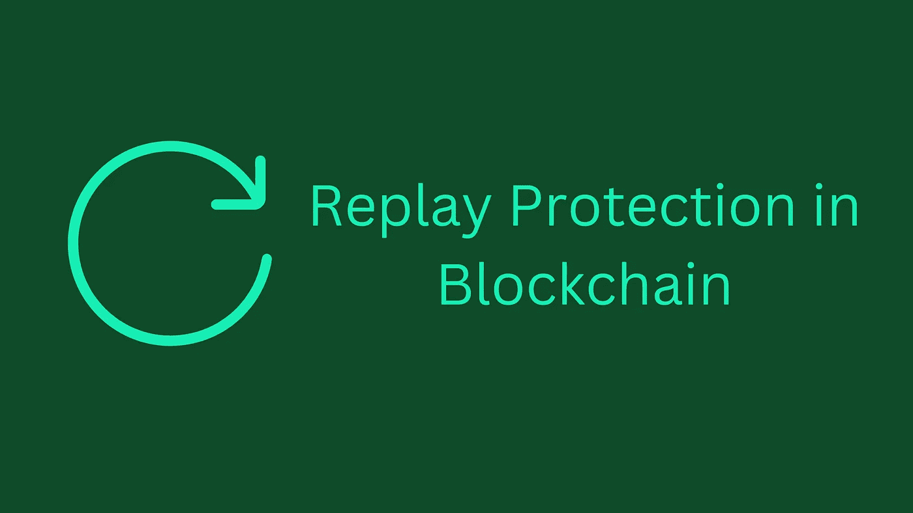
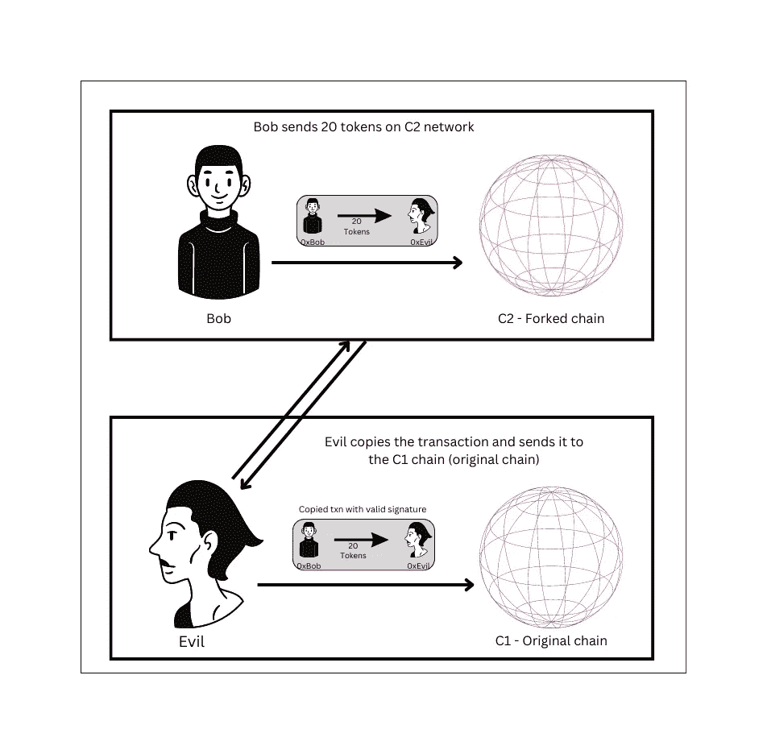

# 重播保护到底是什么？

> 原文：<https://medium.com/coinmonks/what-the-heck-is-replay-protection-aae910f2a3cb?source=collection_archive---------5----------------------->

**合并**！它终于发生了。

[**15537394**](https://etherscan.io/block/15537394) 是以太坊上第一个使用利益一致证明机制验证的区块。

向 PoS 的迁移非常成功，然而，这并不是没有争议的，因为一些偏好 PoW 的矿工决定分叉链并继续使用 PoW 共识机制。

这意味着我们在合并点有一个硬分叉和一个链分裂。

每当这样的链分裂发生时，其他的例子是 ETH & ETC 分裂，BTC & BCH 我们开始听到“**重放保护**”这样的话。

在本文中，我们深入探讨重放攻击，以及防范此类攻击的重要性。

# 什么是重放攻击？

单链中的重放攻击是一种简单的攻击，攻击者可以复制您的有效事务并将其再次发送到网络。导致你的资金被借记两次。

**想象一下这个场景。**

*0xBob* 想要发送 **10 个令牌**给 *0xEvil* 。交易时， *0xBob* 的账户下有 20 个代币。

*0xBob* 向 *0xEvil* 创建 10 个代币的交易，签署该交易，并将其发送到网络。

*0xEvil* 收到 10 个代币，但他是邪恶的，他接受相同的交易并再次将其发送到网络，现在如果链没有处理重放保护，由于 *0xBob* 的帐户中仍有 10 个代币，重放的交易将继续，并且 *0xBob* 将丢失另外 10 个代币。

一般来说，所有的链都通过添加一个序列号 **nonce** 以及处理**重复事务散列**来处理这些类型的情况(没有两个事务可以有相同的散列)。添加了这两样东西后， *0xEvil* 的重放事务将会失败，因为…

*   无效/重复的随机数。
*   重复的事务哈希。

# 交叉链重放攻击

这是事情开始变得有点有趣的地方。当出现硬分叉时，链条会一分为二。

这里，整个状态按原样从原始链复制到分叉链。他们有一个共同的历史，直到分叉点。

这意味着如果 *0xBob* 在原始链上有 20 个令牌，他在分叉链上也将有 20 个令牌。很好，不是吗？

现在，如果分叉链没有添加必要的解决方案(稍后我们将讨论该解决方案是什么)，两个链都将暴露于重放攻击。

这就是分叉链中重放攻击的工作方式，准备好了吗？

继续我们之前的例子。现在， *0xBob* 在 **C1** (原链)上有 **20 个代币**，在 **C2** (叉链)上有 **20 个代币**。

*0xBob* 决定在 **C2** 上发送 **20 个令牌**给 *0xEvil* 。 *0xBob* 签署交易并将其发送到 **C2** 网络。

现在， *0xEvil* being evil 将复制该已签名交易的内容，并提交给原始链 **C1** 。这个从 C2 到 C1 的复制交易将完全有效，它将把 *0xBob* 在 C1 网络上的 20 个令牌转移到 *0xEvil* 。

Cross Chain Replay Attack

这就是交易有效的原因。

让我们假设在链分裂时， *0xBob* 的随机数为 0。当 *0xBob* 在 **C2** 上进行原始交易时，随机数增加到 1。然而， **C1(原始链)**上 *0xBob* 的 nonce 仍然在 **0** 。因此，nonce 为 0**的交易将在那里被接受。**

除此之外，复制的事务的散列在 C1 上也是唯一的，因为原始事务是在 C2 链上提交的。

# 如何防范跨链重放攻击？

现在我们已经了解了重放攻击是如何工作的，让我们看看如何添加重放保护来防御硬分叉后的跨链重放攻击。

这些类型的攻击可以通过以对每个分叉链都是唯一的方式修改交易数据来防止。这可能只是在签名和提交事务之前添加到事务构造中的随机位(随机信息)。

通常，这是通过两种方式完成的，第一种是**强重放保护**，其中一个分叉链将强制更改事务中的一些信息，以使其在网络上有效。

第二种方式是**选择加入回复保护**，用户必须对事务进行手动更改，以确保它们不会被重放。

添加这条附加信息会使事务数据、签名和散列在另一条链上无效。

# 结论

重放攻击通常在链经历硬分叉时开始发挥作用，因此当这样的事件即将发生时，我们开始听到更多关于它们的消息。

在 ETH 和 ETH classic 之间的第一次以太坊分裂中，这成为一个问题，因为 ETH Classic 没有内置重放保护。然而，ETH 社区通过引入一个名为 **ChainID** 的字段解决了这一问题，该字段对每个 EVM 连锁店都是唯一的。

ETHW 社区已经决定使用 ChainID **10001** 。从而自动保护链免受重放攻击。

*大家好，我是* [*拉希尔·谢赫*](https://medium.com/u/42b12d9f05b0?source=post_page-----aae910f2a3cb--------------------------------) *，一名计算机工程师，一名比特币的学生。如果你喜欢这篇文章，请给我一个关注*[*rahil 471*](https://twitter.com/rahil471)*。*

> 交易新手？尝试[加密交易机器人](/coinmonks/crypto-trading-bot-c2ffce8acb2a)或[复制交易](/coinmonks/top-10-crypto-copy-trading-platforms-for-beginners-d0c37c7d698c)