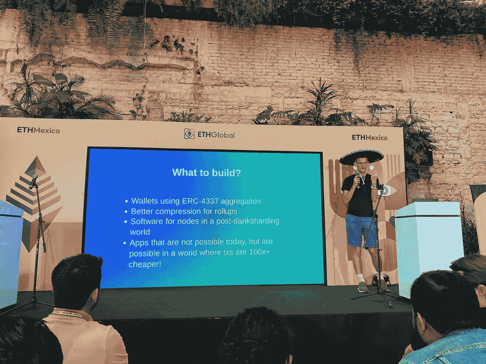

# 下一步要建什么？根据维塔利克的说法

> 原文：<https://medium.com/coinmonks/what-to-build-next-according-to-vitalik-6d726444eb05?source=collection_archive---------2----------------------->

在最近的以太坊活动中，Vitalik Buterin 为下一步的建设提供了建议。

以下是源推文—[https://Twitter . com/TheCryptoClimax/status/1565275354679627777](https://twitter.com/TheCryptoClimax/status/1565275354679627777)

在这篇文章中，我们将探究其中一些的含义。

# **1)钱包使用 ERC-4337**

ERC-4337 是一项旨在实现账户抽象化的提案，该提案将有助于使钱包设计创新更容易、更实用。

更具体地说，这一更改有助于以前的提案允许合同主导的交易，而不需要 EOA 交易，因为它消除了共识层更改的需要。

通过帐户抽象，一个主要的好处是以社会恢复钱包的形式出现。

**社会救助钱包**

在这种情况下，社会恢复钱包是具有增强的 P2P 功能和智能合约参与的多重签名方案。

该设计依赖于“守护者”，这是用户修改钱包和交易的途径。

例如，“监护人”可以是用户指定的个人。例如，如果用户丢失了他们的签名密钥，“监护人”可以介入并签署一个特殊的交易(UX 将与他们签署的任何其他交易没有什么不同)来改变钱包的签名公钥。

这对行业来说是 UX 的一个关键部分。可以理解的是，许多人害怕如果他们失去了他们的签名能力(密码等)，他们可能会失去所有的资金。).

社会恢复钱包提供了一种在因用户失误或黑客攻击而丢失钱包时获取钱包的方法。

监护可以以其他形式出现，比如通过 2FA 模式。这种模式还有其他用途，包括交易终结(撤销、退款)等。

**造什么？这里的含义相当广泛。**

-更好的钱包功能(对主流用户更有吸引力)
-实时+自动社交恢复系统，用于转账、购买、交易、托管等。

这将是未来几年的一个重要变化。

已经有几个钱包实现了某种社会恢复。

Argent Wallet 一般实现，Loopring 有它协议的钱包。

# **2)更好的汇总压缩**

这个有点复杂。我知道一点点关于 ZK 卷，并逐渐试图了解更多。

以下是我认为这个帖子值得一提的内容。

首先，ZK 卷是独立的链和执行环境，不变地处理事务。然后，他们通过智能合约与 L1 连锁店(例如以太坊)进行沟通。

ZK 链通过发送少量信息来更新关于账户和余额的新状态的 L1 协议。具体来说，有效性证明。这些并不是所有的交易数据。相反，有效性证明提供了可用于验证所报告的账户和余额是可证明正确的信息。

在没有实际交易的必要知识的情况下，可以使用有效性证明来证明 ZK 累计链所报告的更新账户和余额是正确的。

ZK 证明被许多人视为不人道的重要一步，应用程序不仅仅局限于密码行业。

本质上，任何可以从可证明正确的信息验证中受益的东西，而不需要知道过程中每一步的细节。以医疗保健为例。

这意味着 L1 链条的好处。以太坊积木有空间限制。交易数据占用空间。最小化事务占用的空间意味着块中有更多的事务空间。

ZK-汇总压缩了事务数据，为数量级释放了更多的空间，每个块有更多的事务，降低了费用，带来了安全好处，等等。

数据压缩减少了数据存储，允许帐户作为索引而不是地址，节省了 28 字节的数据。

遗憾的是，我对这一领域的了解还不足以集思广益，提出新的压缩技术。越来越多聪明的人正在从事这项工作，看看会有什么样的发展将会很有趣。

# **3)后丹麦时代的节点软件**

区块链协议是由运行软件的节点管理的链。分片将一个链分成许多链，以减少拥塞。每条链都独立运行。

Danksharding 是分片，但为即将到来的 L2 卷时代来临后合并。这将增加每个块的可用数据。例如，EIP-4844 讨论了原型 danksharding，它应该将数据可用性提高 10 倍。

节点运行软件。用于分片链的节点软件需要不同。例如，验证器不需要自己存储所有的数据。仅确认数据可用。

这也降低了硬件要求。

有了这些额外的好处，分片将允许用户在个人笔记本电脑或手机上运行以太坊。

我不知道有任何项目是专门开发相关软件的。如果你知道，请让我知道。

# **4)txs 便宜 100 倍以上的应用成为可能**

在这里，你可以让你的想象力自由驰骋。交易吞吐量增加和费用降低会带来什么好处？

以下是我能想到的几个:

1.  完全链上应用。Web3 前端变得越来越模块化。也许有一天，所有的应用程序元素，从 UI 到数据，都完全在链上。几乎无限制的交易将使这变得更容易。
2.  即时消息，大规模的全链消息(仍然可以加密)。
3.  游戏可以从增加的机械、游戏性和资产交易中受益。例如，链上的资产修改。

还有其他的吗？知道为 ZK 世界准备的任何令人兴奋的项目吗？下面让我知道！

如果你觉得这是有益的或有帮助的，请跟随我，[秘密高潮](https://medium.com/u/ac6a6e914928?source=post_page-----6d726444eb05--------------------------------)，更多精彩即将到来！

一定要喜欢并转发下面的第一条推文。
T3【https://Twitter . com/TheCryptoClimax/status/1565274760660992000

我还将开始一个免费的每周时事通讯，提供你在其他地方找不到的内容。

针对整个加密领域所有经验水平的切实可行的见解、研究和技巧。

一定要在下面订阅！

[https://www.getrevue.co/profile/thecryptoclimax](https://www.getrevue.co/profile/thecryptoclimax)

感谢阅读！

> 交易新手？尝试[加密交易机器人](/coinmonks/crypto-trading-bot-c2ffce8acb2a)或[复制交易](/coinmonks/top-10-crypto-copy-trading-platforms-for-beginners-d0c37c7d698c)