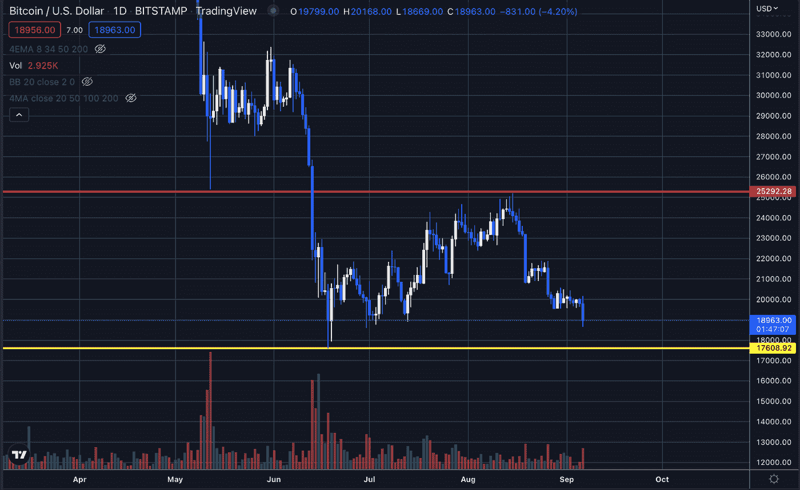

# 对比特币有什么期待？— BTC 价格分析 2022 年 9 月 6 日

> 原文：<https://medium.com/coinmonks/what-to-expect-from-bitcoin-btc-price-analysis-4f6fc6a979af?source=collection_archive---------39----------------------->

比特币 8 月 15 日的最后一个较低高点约为 25200 美元，是一个重要的需求区，现已转化为供应区。这就是为什么过去几周相对较低的交易量带来了巨大的抛售压力。

我们要去哪里？

关注结构上的很重要，这是我们识别流动性区域的方式，我们应该…