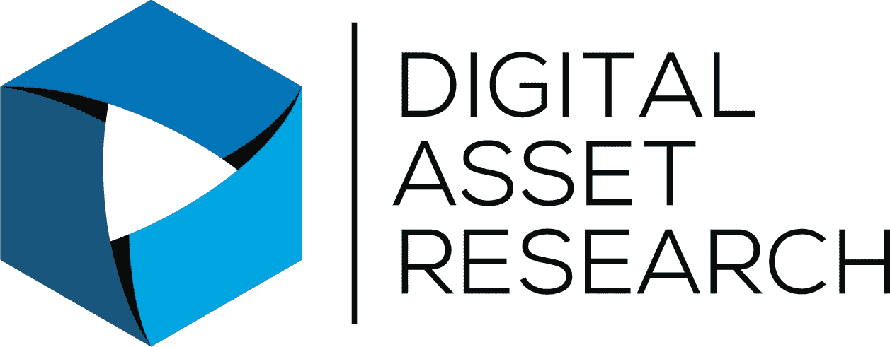
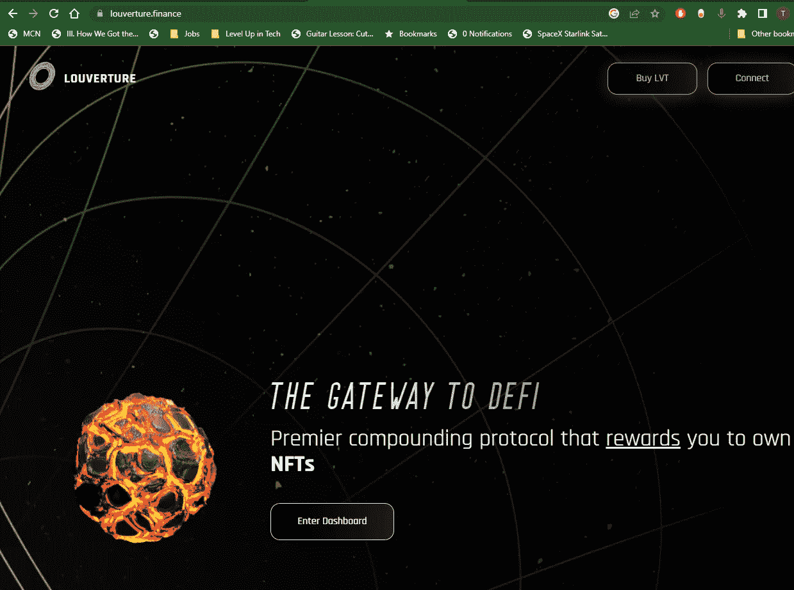
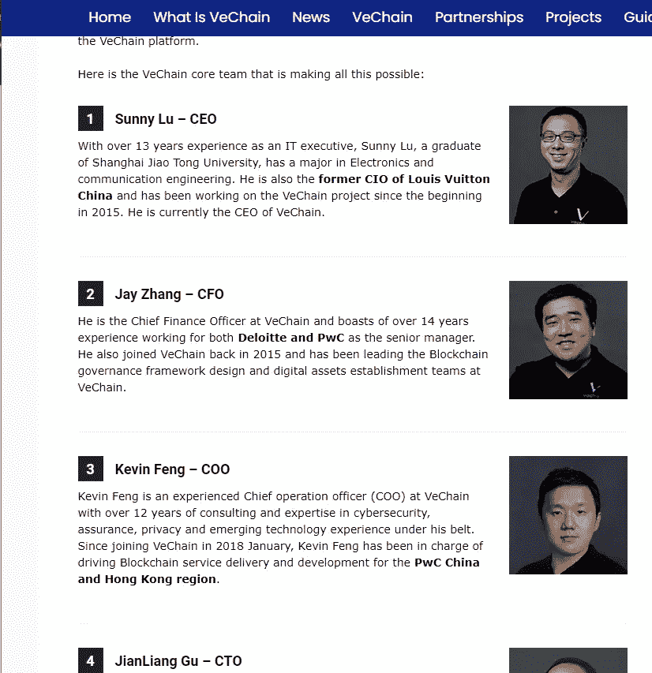
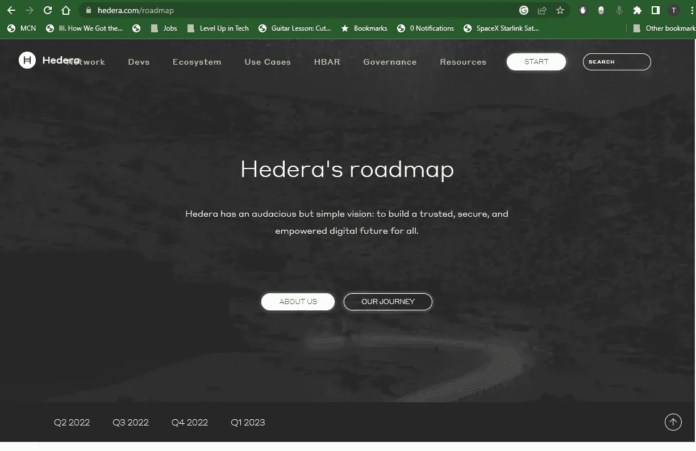
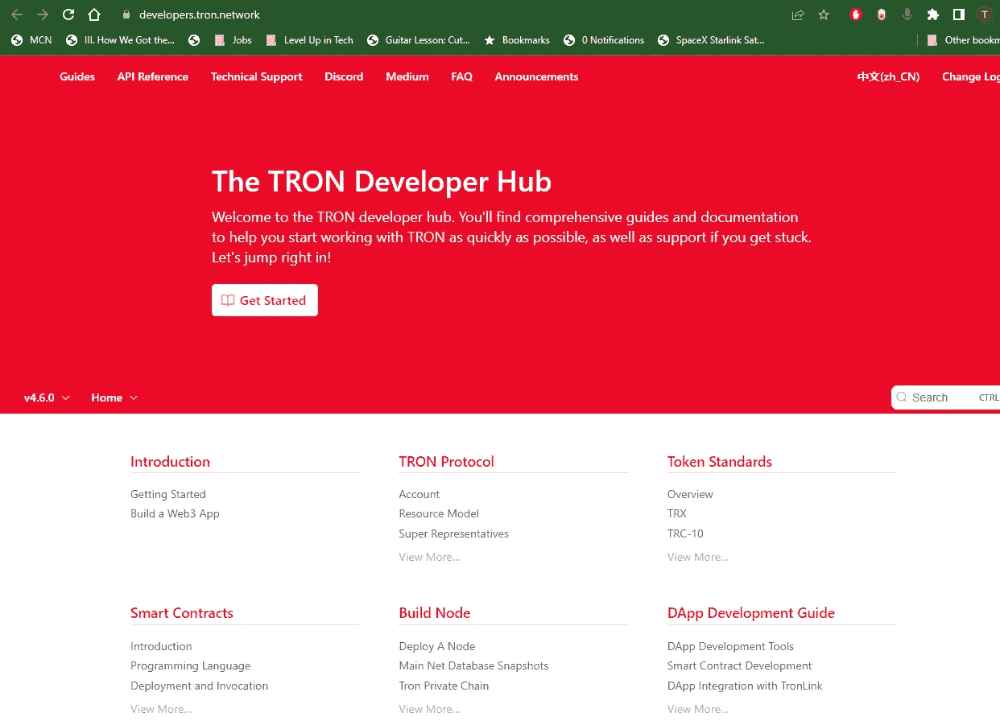
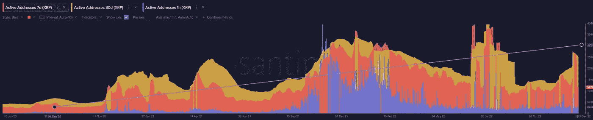
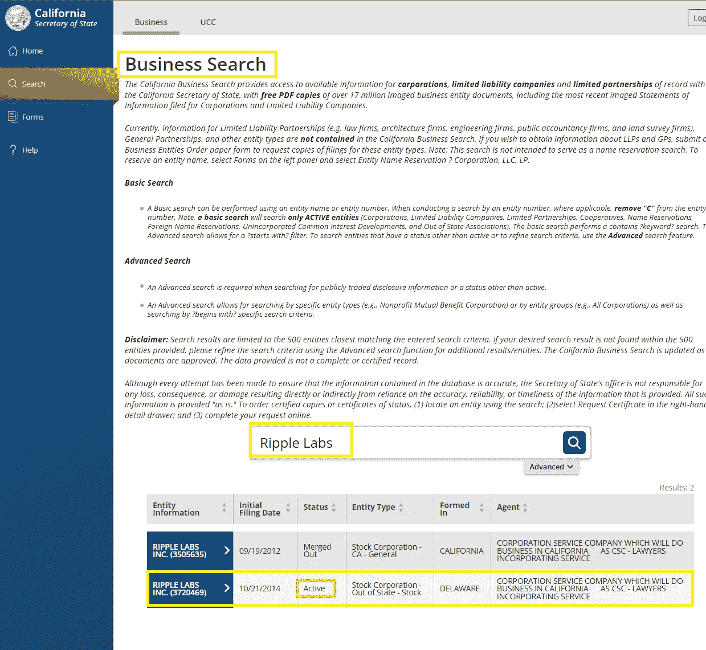
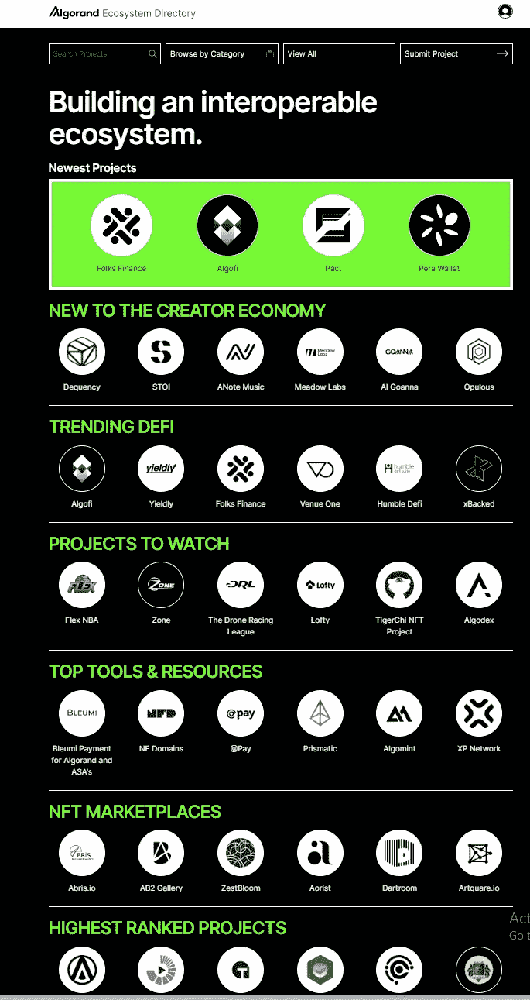

# 购买之前，在加密项目网站上寻找什么

> 原文：<https://medium.com/coinmonks/what-to-look-for-on-a-crypto-project-website-before-you-buy-440c06ec541f?source=collection_archive---------14----------------------->

# 介绍

随着加密货币世界的不断发展和演变，投资者彻底研究和仔细评估他们正在考虑投资的项目非常重要。这个过程的一个关键方面是评估项目的网站。

在本文中，我们将探讨在评估一个加密项目的网站时需要考虑的一些关键因素。

In 2014, OneCoin was established by [Ruja Ignatova](https://en.wikipedia.org/wiki/Ruja_Ignatova) as a crypto business. Later it was found that OneCoin stole 15b in an elaborate Ponzi scheme from thousands of investors. Ruja is still a fugitive-at-large.

# 团队信息

知道谁是项目的幕后推手是很重要的，因为团队的经验和记录可以让你洞察他们成功实现愿景的能力。寻找关键团队成员的简历，以及他们过去在行业中的经验。

Here is a Website for a now defunct the now defunct crypto project Louverture. No Team Information is anywhere to be found and the core team remained anonymous through out the 7 months that the project existed.

Here is the team information for a crypto project VeChain. As you can see they have names, faces, and their real-world experience listed.

# 路标

一个清晰而详细的路线图可以帮助你理解项目的长期愿景和目标，以及他们到目前为止已经取得的进展和他们正在努力实现的里程碑

Hedera Hashgraph has an extensive roadmap listed and a history of previous milestones they have already achieved, which is A+ in my book.

# 技术资料

如果你是一个更技术性的投资者，你可能想深入研究项目的技术细节。查找有关该项目的区块链的信息，包括共识机制及其提供的特定特性和功能。

Tron is crypto project that has extensive technical information on their website

# 社区参与

一个强大而活跃的社区可能是该项目具有持久力的好迹象。在项目的社交媒体渠道和论坛上寻找信息，并了解团队对社区的响应和参与程度。Santiment.app 是一个很好的资源，可以跟踪主要加密项目的“链上”钱包活动。

XRP Active Wallet Addresses have a consistent growth in it’s long-term trend line from 2020-Present

# 法律和法规合规性

对于加密项目来说，以合法和道德的方式运作是很重要的。寻找有关项目符合相关法律法规的信息，以及他们获得的任何第三方审计或认证。

Do a simple search of the project team in open business registries to confirm that they are licensed by government. This doesn’t necessarily mean their business is solid, but it typically does mean that folks in the business had to do a KYC of some sort.

# 伙伴关系和合作

与知名公司或组织的合作和伙伴关系可能是一个好迹象，表明该项目具有吸引力，并在行业内获得认可。寻找项目已经形成的任何伙伴关系或协作的信息。

Algorand keeps an active list of all the known projects in within their L-1 ecosystem. Complete with links to the official project pages and social channels

# 结论

总的来说，一个加密项目的网站可以成为了解项目和做出明智投资决策的宝贵资源。通过花时间仔细评估项目网站上的信息，您可以更好地了解团队、项目的愿景和目标以及他们迄今为止取得的进展。

> 交易新手？试试[加密交易机器人](/coinmonks/crypto-trading-bot-c2ffce8acb2a)或者[复制交易](/coinmonks/top-10-crypto-copy-trading-platforms-for-beginners-d0c37c7d698c)