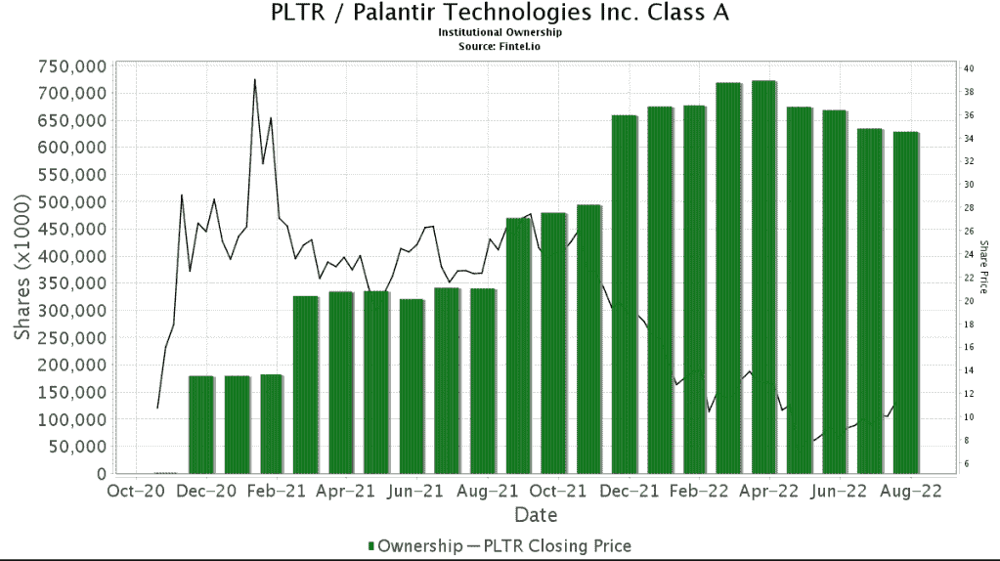

# 帕兰蒂尔的 Q2 2022 年收益值得期待

> 原文：<https://medium.com/coinmonks/what-to-look-out-for-in-palantirs-q2-2022-earnings-127433934f44?source=collection_archive---------21----------------------->

# Q2 2022 指南

收入 4.7 亿英镑(年同比 250 亿美元；5%季度环比)

调整后的营业利润 20%

长期指导中 30%的收入增长

# 技术的

PLTR 股价较历史高点下跌了 75%，今年以来下跌了 38%。从技术角度来看，价格已经将流动性带到了 11.32 以上。现在，我预计价格会走高，以缓解 11.88 的看跌点，甚至在我们看到下跌之前填补 13.52 的公允价值缺口。下周一我们将有收益，我们将看看这一看跌点是否成立。

# 商业

PLTR 一直在迅速扩大其销售团队，特别是在欧洲地区，以应对冠状病毒和物流紧缩导致的供应链中断。PLTR 一直在积极敲定新合同。我们应该看到商业领域的市场份额不断增加，同时客户获取和客户支出强劲。这将有利于长期收入。这将在净美元留存中体现出来。Q1 2022 年净美元留存率为 124%，我预计这一数字将在 130%左右徘徊。商业客户必须增加，以显示被市场接受。Q1 2022 年季度环比变化为+5，所以我希望看到更高的采用率。

# 政府

上个季度，我们看到来自政府部门的 PLTR 收入有所下降。政府收入占总收入的 42%，年增长率仅为 16%。由于政府预算本质上是周期性的，我希望看到政府收入同比增长 50%。相比之下，Q2 2021 年政府收入同比增长 66%。到目前为止，我们已经看到许多关于 PLTR 关闭强大政府合同的新闻，这是一个好迹象。这样，客户总数应该会增加。

# 基本原则

基于股票的薪酬(SBC)是吞噬现有股东股份的因素之一。SBC 是用来在这个竞争激烈的市场上吸引顶尖人才的。随着我们看到欧洲地区的快速扩张，以及密集的招聘，我预计 SBC 将保持高位，错过每股收益指引。

特殊目的收购公司收益整体下降，大部分是未实现亏损。许多成长型股票受到今年早些时候加息的沉重打击。PLTR 也停止了这一计划，表明这一战略在这种高利率环境下不起作用。

我们看到管理层对他们的收入指导(Q2 2022 年预计增长 25%)进行了粉饰。我们可能会看到这个目标可能会被打破，但总的来说，我们不得不质疑为什么他们的指导低于他们 30%的长期收入增长。也就是说，我们在快速扩张和招聘，这意味着 SBC 可能会增加。因此，如果收入的增长无法抵消 SBC 的增长，收益将受到打击。

# 结束语

随着股价暴跌，机构持股比例已降至 35%。因此，PLTR 的股价仍然非常不稳定，因为散户持有大部分股份。由于潜在的宏观经济因素，Palantir 的股价可能会继续下跌。从技术角度来看，我们可以看到一个潜在的牛市陷阱，导致盈利电话。我现在的计划是观望，因为我对整个市场都不看好。如果 PLTR 的股价碰巧涨到 5 美元，即使我仍然看跌，我也会开始买入。

*免责声明:在我发表这篇文章的时候，我在 Palantir 有头寸。请注意，这篇文章不是买卖的信号，只能作为娱乐之用。写这篇文章的时候大概是喝醉了。投资时请做好自己的尽职调查。这是* ***而不是*** *的理财建议。*

*原载于 2022 年 8 月 6 日 http://2minutesliteracy.wordpress.com**的* [*。*](https://2minutesliteracy.wordpress.com/2022/08/06/what-to-look-out-for-in-palantirs-q2-2022-earnings/)

> 加入 Coinmonks [电报频道](https://t.me/coincodecap)和 [Youtube 频道](https://www.youtube.com/c/coinmonks/videos)了解加密交易和投资

# 另外，阅读

*   [加密复制交易平台](/coinmonks/top-10-crypto-copy-trading-platforms-for-beginners-d0c37c7d698c) | [Coinmama 评论](/coinmonks/coinmama-review-ace5641bde6e)
*   [印度的加密交易所](/coinmonks/bitcoin-exchange-in-india-7f1fe79715c9) | [比特币储蓄账户](/coinmonks/bitcoin-savings-account-e65b13f92451)
*   [OKEx vs KuCoin](https://coincodecap.com/okex-kucoin) | [摄氏替代品](https://coincodecap.com/celsius-alternatives) | [如何购买 VeChain](https://coincodecap.com/buy-vechain)
*   [币安期货交易](https://coincodecap.com/binance-futures-trading)|[3 commas vs Mudrex vs eToro](https://coincodecap.com/mudrex-3commas-etoro)
*   [如何购买 Monero](https://coincodecap.com/buy-monero) | [IDEX 评论](https://coincodecap.com/idex-review) | [BitKan 交易机器人](https://coincodecap.com/bitkan-trading-bot)