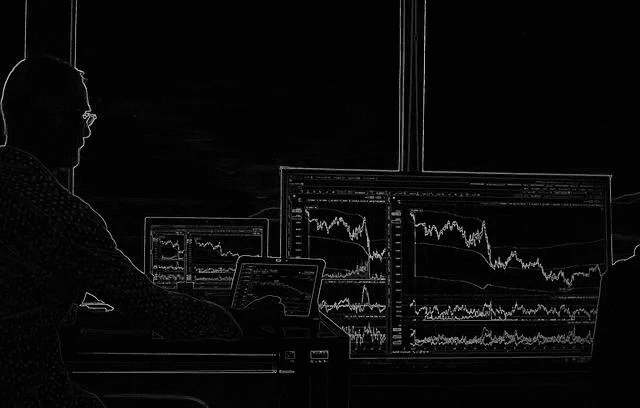

# Bibox Token (BIX)有什么价值？

> 原文：<https://medium.com/coinmonks/what-value-does-the-bibox-token-bix-have-2c7df72e9e49?source=collection_archive---------46----------------------->

奇怪的是，当加密货币交易所崩溃或关闭时，市场先生喜欢加密货币交易平台。

为了解释这一点，CoinMarketCap 估计 **Bibox Token (BIX)** 是 2022 年 7 月 11 日最受欢迎的加密货币。Bibox 自称是第一个 AI(人工智能)[数字资产交易平台](https://www.bibox.com/en)。特别是，Bibox 提供现货网格加密货币交易。

