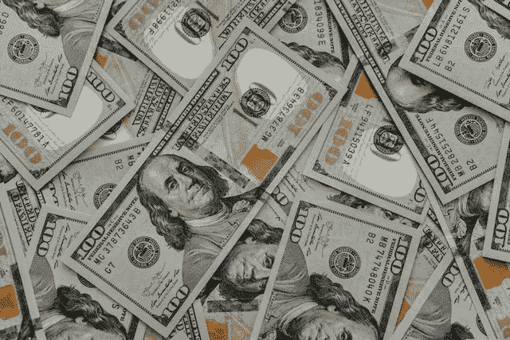

# miMatic (MIMATIC)稳定币有什么价值？

> 原文：<https://medium.com/coinmonks/what-value-does-the-mimatic-mimatic-stablecoin-have-a66fd8a3127?source=collection_archive---------11----------------------->

**MAI (MIMATIC)** 是一种锁定抵押品、非托管的稳定货币。这意味着 MAI 持有者拥有并控制这些基金。

解释一下，他们用批准的抵押品或金库来支持 T2 的模拟银行。被批准的抵押物[包括 **Chainlink(链接)****Curve(CRV)**等静态抵押物](https://docs.mai.finance/stablecoin-economics)，以及[beefi Finance](/geekculture/can-beefy-finance-bifi-make-money-from-multichain-yield-and-compound-interest-market-mad-house-eba4fbc43110)**【BIFI】**[向往金融](https://finematics.medium.com/yearn-finance-and-yfi-token-explained-229d66106b69)**【YFI】**[AAVE](https://finematics.medium.com/yearn-finance-and-yfi-token-explained-229d66106b69)**【AAVE】**等 DeFI 资产。

