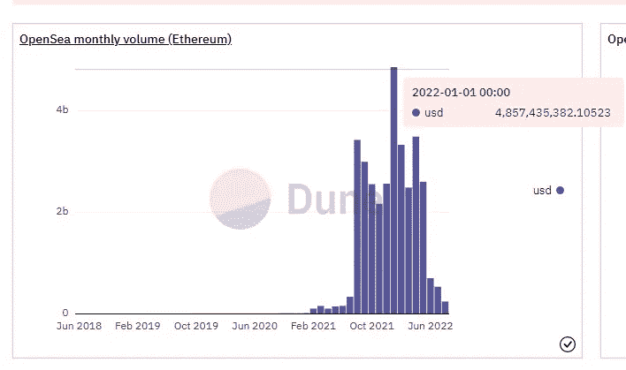
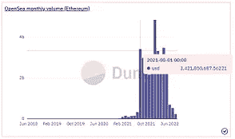
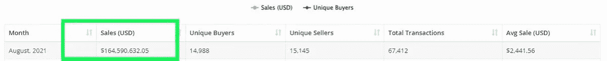
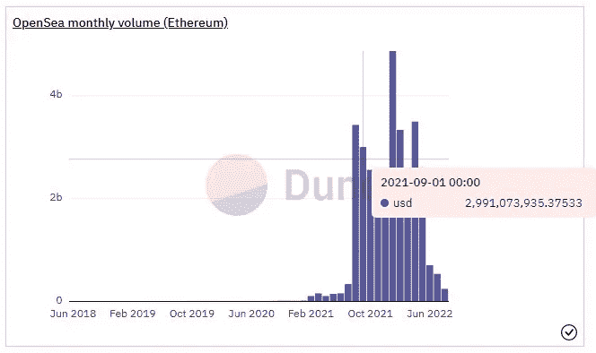
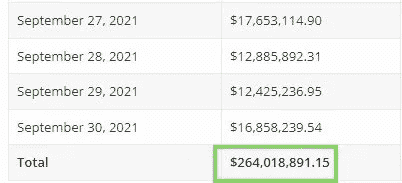
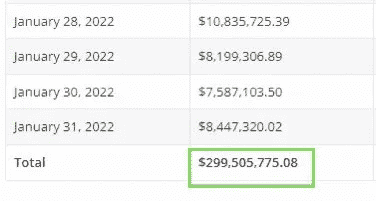
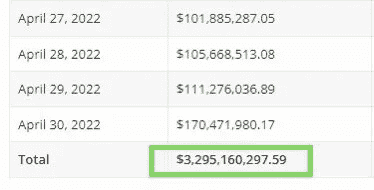
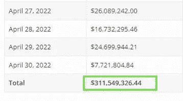

# NFT 交易者最赚钱的月份是哪个月？

> 原文：<https://medium.com/coinmonks/what-was-the-most-profitable-month-for-nft-traders-1de1ff4dc6ff?source=collection_archive---------29----------------------->

NFT 交易者最赚钱的月份是哪个月？

*SOL NFTs 在最大的 NFT 联邦理工学院牛市中表现得好吗？*

让我们来了解一下！

首先，我们经历了这些:
⏺Aug 2021 年:NFT 牛市
⏺January 2022 年:迄今为止最大的 NFT 牛市，交易量超过 40 亿美元
⏺april 2022 年:第二大 NFT 牛市

对 NFT 交易员来说，最赚钱的月份是 1 月 22 日，交易量约为 40 亿美元以上，任何事情都在进行。

Chart: [@richardchen39](http://twitter.com/richardchen39) on [@DuneAnalytics](http://twitter.com/DuneAnalytics)

有趣的是，在任何牛市之前，像新闻/事件这样受欢迎的事情都会发生。例如:
在 2021 年 3 月的 NFT 牛市之前， [@beeple](http://twitter.com/beeple) 标志性的 6900 万美元 NFT 出售成为大量头条新闻和媒体，这引发了人们研究非上市公司的好奇心。

在牛市中，与 SOL NFTs 相比，ETH NFTs 的销量是多少？
—2021 年 8 月:ETH NFTs 创造了约 34 亿美元+美元的交易量
SOL NFT 创造了约 1.64 亿美元。

—2021 年 9 月:虽然 ETH NFTs 的销售额低于 2021 年 8 月(29 亿美元)，但 SOL NFTS 实际上超过了他们自己 2021 年 8 月的销售额。

SOL NFTs 在 9 月 21 日比 2021 年 8 月赚得更多:大约 2 . 64 亿美元。

——2022 年 1 月:ETH NFTs 创造了约 40 亿美元的收入。SOL NFTs 赚了大约 3 亿美元。

—2022 年 4 月:ETH NFTs 的交易额约为 32.9 亿美元。SOL NFTs 在 4 月份赚了 3 . 11 亿美元(比 1 月份还多)。

要点
⚪️$SOL NFTs 有史以来最大的销量是在 2022 年 4 月，而不是像 ETH NFTs 那样在 2022 年 1 月。
⚪️虽然 Jan 在 eth NFTs 的名气更大，但总的来说，这是 NFTs 的一个胜利，因为当时有许多新人第一次听说 NFTs 并进入了这个领域。🟣·索拉纳的 NFT 增长速度比它存在的时间短得多，这令人震惊和惊讶。
🟢溶胶在 2021 年 9 月的销量超过了 2021 年 8 月。
sol 的🟢最大 NFT 牛市按顺序排列:
1)4 月 22 日
2)1 月 22 日
3)10 月 21 日(2.86 亿美元)。

• • •

最后:⚪️联邦理工学院以前在同一时间也有学生，然而，他们的“最大月份”并不总是相同的。2 个例子:
🟢联邦理工学院在 8 月 21 日增产，索尔在 9 月 21 日增产。🟣联邦理工学院在 2012 年 1 月增产，索尔在 4 月 22 日增产。

来源:[@ cryptoslamio](http://twitter.com/cryptoslamio)&[@ dune analytics](http://twitter.com/DuneAnalytics)([@ richardchen 39](http://twitter.com/richardchen39))
感谢阅读！😙

在 Twitter 上关注我，了解更多关于 NFTs 和 web3 的见解:

> 交易新手？尝试[加密交易机器人](/coinmonks/crypto-trading-bot-c2ffce8acb2a)或[复制交易](/coinmonks/top-10-crypto-copy-trading-platforms-for-beginners-d0c37c7d698c)