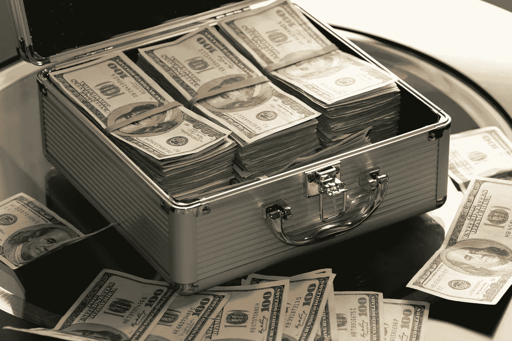

# 按照年龄应该拥有什么财富？

> 原文：<https://medium.com/coinmonks/what-wealth-should-you-have-according-to-your-age-6174986d89dc?source=collection_archive---------52----------------------->

Source photo [Hard Cash on a Briefcase · Free Stock Photo (pexels.com)](https://www.pexels.com/photo/hard-cash-on-a-briefcase-259027/)

一个人到了一定年龄应该拥有多少财富这个问题，没有放之四海而皆准的答案。不同的人有不同的财务目标，什么是足够的财富取决于个人的情况。

> 交易新手？试试[加密交易机器人](/coinmonks/crypto-trading-bot-c2ffce8acb2a)或[复制交易](/coinmonks/top-10-crypto-copy-trading-platforms-for-beginners-d0c37c7d698c)上[最佳加密](/coinmonks/crypto-exchange-dd2f9d6f3769) …